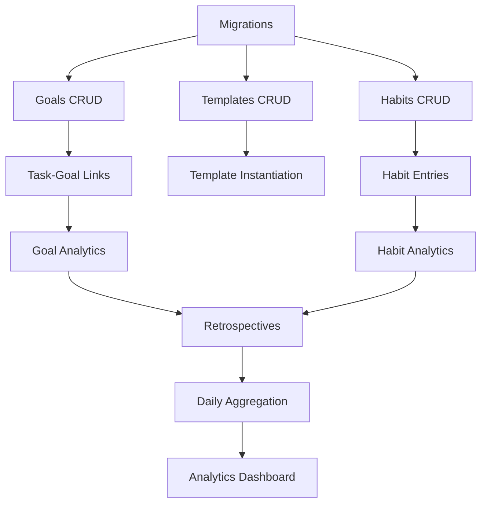

# Lucid Logs - Comprehensive Feature Planning Document

> **Version:** 1.0  
> **Date:** December 7, 2025  
> **Status:** Draft for Review

---

## Executive Summary

This document provides an exhaustive specification for the next set of features for **Lucid Logs** (the Daily Journal App), focusing on four core areas:

1. **Goals, Habits & Metrics** — Flexible goal tracking with positive/negative task impact analysis
2. **Task Templates** — Reusable blueprints for quick task creation
3. **Retrospectives** — Daily auto-generated and custom date-range reflection system
4. **Analytics & Charts** — Rich visualization layer for insights and growth tracking

All features are designed to integrate seamlessly with the existing system:
- **Tasks** with positives/negatives, emotions, and categories
- **100-emotion Yale RULER mood meter** with 6D vectors (V, A, D, I, C, S)
- **SurrealDB** schemaless architecture with record links
- **Go/Gin** backend with handler/service/repository pattern

---

## Table of Contents

1. [Current System Overview](#1-current-system-overview)
2. [Feature Area 1: Goals, Habits & Metrics](#2-feature-area-1-goals-habits--metrics)
3. [Feature Area 2: Task Templates](#3-feature-area-2-task-templates)
4. [Feature Area 3: Retrospectives](#4-feature-area-3-retrospectives)
5. [Feature Area 4: Analytics & Charts](#5-feature-area-4-analytics--charts)
6. [Data Model & Schema](#6-data-model--schema)
7. [API Design](#7-api-design)
8. [Implementation Roadmap](#8-implementation-roadmap)
9. [Appendices](#9-appendices)

---

## 1. Current System Overview

### 1.1 Existing Entities

| Entity | Description | Key Fields |
|--------|-------------|------------|
| **Users** | Authentication & preferences | `email`, `pass`, `is_admin`, `timezone` |
| **Categories** | Task organization | `name`, `color`, `created_by` |
| **Tasks** | Core journal entries | `title`, `journal`, `start_date`, `end_date`, `priority`, `positives`, `negatives`, `emotion_id`, `category` |
| **Emotions** | 100-emotion mood meter | `name`, `emoji`, `quadrant`, `valence`, `arousal`, `dominance`, `intensity`, `certainty`, `social` |
| **Task_Emotions** | Relation: tasks → emotions | `type` (primary/positive/negative), `text` |

### 1.2 Key Patterns

- **Record Links:** `task.category = categories:work123`
- **Schemaless Tables:** Flexible field addition without migrations
- **Multi-tenancy:** `created_by` field for user ownership
- **Soft Delete:** `deleted_at` field for recoverability
- **Emotion Inference:** Server-computed `inferred_emotion` on write

### 1.3 Emotion System (6D Vectors)

Each emotion has research-backed coordinates:
```
E = [Valence, Arousal, Dominance, Intensity, Certainty, Social]
    [-1...+1, -1...+1, -1...+1, 0.1...1.0, -1...+1, -1...+1]
```

**Quadrants:**
- 🟡 **Yellow** — High Energy + Pleasant (Excited, Proud, Confident)
- 🟢 **Green** — Low Energy + Pleasant (Calm, Grateful, Content)
- 🔴 **Red** — High Energy + Unpleasant (Anxious, Frustrated, Stressed)
- 🔵 **Blue** — Low Energy + Unpleasant (Sad, Tired, Lonely)

---

## 2. Feature Area 1: Goals, Habits & Metrics

### 2.1 Goal Types Overview

| Type | Description | Examples |
|------|-------------|----------|
| **One-Time Discrete** | Binary completion | "Finish React course", "Complete trip planning" |
| **One-Time Measurable** | Quantitative target by deadline | "Run 1000km by Dec 31", "Read 10 books this year" |
| **Recurring/Habit** | Repeating pattern | "Drink 3L water daily", "Gym 5x/week" |
| **Epic/Project** | Container for milestones | "Learn Spanish", "Launch side project" |

---

### 2.2 Goals (One-Time)

#### 2.2.1 Goal Model

```typescript
interface Goal {
  id: string;                    // "goals:abc123"
  created_by: string;            // User ownership
  
  // Core Fields
  title: string;                 // "Run 1000km by end of year"
  description?: string;          // Detailed description
  why?: string;                  // "Why does this matter?" - for retros
  
  // Goal Type
  goal_type: "discrete" | "measurable" | "epic";
  
  // Measurable Targets (for measurable type)
  target?: {
    value: number;               // 1000
    unit: string;                // "km", "books", "hours", "sessions"
    current_value: number;       // Auto-computed from linked tasks
  };
  
  // Timeline
  deadline?: datetime;           // Optional end date
  start_date?: datetime;         // When tracking began
  
  // Status & Progress
  status: "not_started" | "in_progress" | "completed" | "abandoned" | "postponed" | "paused";
  completion_date?: datetime;    // When marked complete
  
  // Priority & Value
  priority: 1 | 2 | 3;           // Low/Medium/High
  value_score: 1 | 2 | 3 | 4 | 5; // How meaningful (for retro analysis)
  
  // Organization
  category?: string;             // Link to categories:xyz
  parent_goal?: string;          // For milestones under epics: goals:parent
  life_domain?: string;          // "health", "work", "relationships", "learning", "fun"
  
  // Success Criteria
  success_signal?: string;       // "How will I know it's done?"
  
  // Privacy
  is_private: boolean;           // For sensitive goals
  
  // Metadata
  created_at: datetime;
  updated_at: datetime;
  deleted_at?: datetime;
}
```

#### 2.2.2 Goal Examples (Comprehensive)

**Discrete Goals:**
| Category | Example | Success Signal |
|----------|---------|----------------|
| Learning | Finish React course | Certificate obtained |
| Health | Complete first marathon | Cross finish line |
| Career | Get promoted | Title change effective |
| Entertainment | Finish Breaking Bad | Watch finale |
| Relationships | Plan surprise party for partner | Event happens |
| Finance | Set up emergency fund | 3 months expenses saved |
| Productivity | Clear email inbox to zero | No unread emails |
| Home | Complete kitchen renovation | Final walkthrough done |
| Creative | Publish first blog post | Live on website |
| Self-care | Establish morning routine | 30 days consistent |

**Measurable Goals:**
| Category | Goal | Target | Unit | Deadline |
|----------|------|--------|------|----------|
| Fitness | Run milestone | 1000 | km | Dec 31 |
| Reading | Book challenge | 52 | books | Dec 31 |
| Sleep | Early nights | 20 | days | End of month |
| Hydration | Water intake | 90 | L | End of month (3L/day × 30) |
| Savings | Financial goal | 10000 | $ | Q4 end |
| Steps | Walking goal | 10000 | steps/day avg | Weekly review |
| Learning | Study hours | 100 | hours | Quarter end |
| Social | Call loved ones | 12 | calls | Month end |
| Meditation | Practice time | 30 | hours | Quarter |
| Writing | Word count | 50000 | words | NaNoWriMo |

**Epic Goals (with Milestones):**
```
Epic: Learn Spanish → Conversational Fluency
├── Milestone: Complete Duolingo tree
├── Milestone: Watch 10 movies in Spanish
├── Milestone: 50 conversation sessions
├── Milestone: Pass DELE A2 exam
└── Milestone: Have 30-min conversation with native speaker
```

---

### 2.3 Task ↔ Goal Impact Model

#### 2.3.1 Core Concept

Every task can optionally impact one or more goals:
- **Positive Impact** (+) — Moves user closer to goal
- **Negative Impact** (-) — Moves user away from goal ("anti-goal" action)
- **Neutral** — Related but no progress impact

#### 2.3.2 Impact Relation Schema

```sql
-- TABLE: task_goals (Edge table: tasks → goals)
DEFINE TABLE task_goals TYPE RELATION IN tasks OUT goals PERMISSIONS FULL;

-- Impact type: positive (advances goal), negative (harms goal), neutral
DEFINE FIELD impact_type ON task_goals TYPE string 
  ASSERT $value IN ["positive", "negative", "neutral"];

-- Impact magnitude: how much this task affected the goal (1-5)
DEFINE FIELD impact_magnitude ON task_goals TYPE int 
  ASSERT $value >= 1 AND $value <= 5;

-- Quantity contribution (for measurable goals)
DEFINE FIELD quantity_value ON task_goals TYPE option<float>;
DEFINE FIELD quantity_unit ON task_goals TYPE option<string>;

-- User notes about the impact
DEFINE FIELD notes ON task_goals TYPE option<string>;

-- Auto-detected or user-assigned
DEFINE FIELD source ON task_goals TYPE string DEFAULT "user"
  ASSERT $value IN ["user", "template", "auto_detected"];

DEFINE FIELD created_at ON task_goals TYPE datetime DEFAULT time::now();

-- Indexes for analytics
DEFINE INDEX idx_task_goals_goal ON TABLE task_goals COLUMNS out;
DEFINE INDEX idx_task_goals_impact ON TABLE task_goals COLUMNS out, impact_type;
DEFINE INDEX idx_task_goals_date ON TABLE task_goals COLUMNS created_at;
```

#### 2.3.3 Honest Goal Management Features

> [!IMPORTANT]
> **Design Philosophy:** Encourage honest tracking without judgment. Users should feel safe logging setbacks.

**1. Gentle Anti-Goal Prompts**

When logging a task that might harm a goal:
```
"Stayed up until 2am"
→ System detects: Sleep goal "In bed by 10pm"
→ Gentle prompt: "This might affect your sleep goal. Want to log it?"
   - [ ] Yes, log as setback (negative impact)
   - [ ] Actually, I slept late for a good reason (neutral)
   - [ ] Skip linking
```

**2. Partial Progress Recognition**
```
Goal: "Run 10km"
User logs: "Ran 4km, had to stop due to knee pain"

→ Options:
   - Log 4km as positive progress (40% of target)
   - Add context: "Body needed rest - that's okay"
   - Adjust goal if needed
```

**3. Setback Categories (Non-Judgmental)**
```
When logging negative impact:
→ "What happened?"
   - Life got in the way
   - Made a different choice
   - Lost motivation temporarily
   - External circumstances
   - Just didn't feel like it (and that's okay)
   - Other
```

**4. Learning-Focused Reflection**
```
After logging a setback:
→ "What might help next time?" (optional, free text)
→ "What did this teach you?" (for retros)
```

**5. Privacy Controls for Sensitive Anti-Goals**
- Mark specific task-goal links as private
- Aggregate data visible in analytics without specific details
- "Sensitive mode" for goals like addiction recovery

---

### 2.4 Habits / Recurring Goals

#### 2.4.1 Habit Model

```typescript
interface Habit {
  id: string;                    // "habits:xyz123"
  created_by: string;
  
  // Core Fields
  title: string;                 // "Drink 3L water daily"
  description?: string;
  
  // Habit Type
  habit_type: "frequency" | "quantity" | "time_bound" | "avoidance" | "streak";
  
  // Frequency Configuration
  frequency?: {
    times: number;               // 5
    period: "day" | "week" | "month";  // "week"
    // → "5 times per week"
  };
  
  // Quantity Configuration
  quantity?: {
    target: number;              // 3
    unit: string;                // "L"
    period: "day" | "week" | "month";
    cumulative: boolean;         // Sum vs maintain
  };
  
  // Time-Bound Configuration
  time_bound?: {
    before_time?: string;        // "15:00" (do X before 3pm)
    after_time?: string;         // "06:00" (do X after 6am)
    between?: {
      start: string;
      end: string;
    };
  };
  
  // Avoidance Configuration (invert logic)
  avoidance?: {
    what: string;                // "smoking", "overeating"
    track_slips: boolean;        // Log when you slip
  };
  
  // Streak Configuration
  streak?: {
    min_consecutive_days: number;  // 30
    grace_days: number;            // 1 (can miss 1 day without breaking)
  };
  
  // Schedule
  active_days?: string[];        // ["mon", "tue", "wed", "thu", "fri"] or null for daily
  start_date: datetime;
  end_date?: datetime;           // For temporary habits
  
  // Status
  status: "active" | "paused" | "completed" | "abandoned";
  
  // Streak Tracking (computed)
  current_streak: number;
  longest_streak: number;
  last_completed_date?: datetime;
  grace_days_used: number;
  
  // Phases (advanced)
  phases?: HabitPhase[];
  
  // Links
  category?: string;
  life_domain?: string;
  linked_template?: string;      // Auto-use this template
  
  // Metadata
  created_at: datetime;
  updated_at: datetime;
  deleted_at?: datetime;
}

interface HabitPhase {
  name: string;                  // "Ramp Up", "Maintenance", "Challenge"
  start_day: number;             // Day 1, Day 31, etc.
  target_adjustment?: number;    // Modify target (+1, -1, etc.)
  description?: string;
}
```

#### 2.4.2 Habit Examples (Comprehensive)

**Frequency-Based Habits:**
| Habit | Frequency | Active Days |
|-------|-----------|-------------|
| Go to the gym | 5x / week | Any |
| Call mom | 3x / week | Any |
| Team standup | 5x / week | Mon-Fri |
| Deep work session | 1x / day | Mon-Fri |
| Review weekly goals | 1x / week | Sunday |
| Monthly budget review | 1x / month | 1st of month |

**Quantity-Based Habits:**
| Habit | Target | Unit | Period |
|-------|--------|------|--------|
| Drink water | 3 | L | day |
| Read pages | 30 | pages | day |
| Walk steps | 10000 | steps | day |
| Run distance | 100 | km | month |
| Meditate | 60 | minutes | day |
| Sleep hours | 8 | hours | day |
| Study language | 20 | hours | week |
| Write words | 500 | words | day |

**Time-Bound Habits:**
| Habit | Time Rule |
|-------|-----------|
| Morning routine | Complete before 8:00 AM |
| Take a bath | By 3:00 PM |
| In bed | By 10:00 PM |
| No screens | After 9:00 PM |
| Exercise | Between 6:00 AM and 8:00 AM |
| Lunch break | Between 12:00 PM and 1:00 PM |

**Avoidance Habits:**
| Habit | Tracking |
|-------|----------|
| No smoking | Track slip-ups |
| No overeating | Log when happens |
| No social media | Track total screen time |
| No late-night snacking | After 8pm |
| No negative self-talk | Journal when noticed |
| No procrastination | Track delayed starts |

**Streak Habits:**
| Habit | Target | Grace Days |
|-------|--------|------------|
| Daily journaling | 365 days | 2 |
| No alcohol | 30 days | 0 |
| Morning meditation | 90 days | 1 |
| Consistent sleep schedule | 30 days | 1 |
| Daily gratitude | 100 days | 2 |

#### 2.4.3 Habit ↔ Task Relationship

**Two modes of tracking:**

1. **Active Creation (Template-based)**
   - User creates task from habit's linked template
   - Auto-links to habit with positive impact
   - Example: "Start Meditation" button creates task

2. **Passive Tracking (Pattern Detection)**
   - User logs any task
   - System detects it matches a habit criteria
   - Suggests linking: "This looks like it counts toward 'Exercise 5x/week'"

---

### 2.5 Goal History & Versioning

#### 2.5.1 History Event Model

```typescript
interface GoalHistoryEvent {
  id: string;
  goal_id: string;
  event_type: 
    | "created"
    | "status_changed"
    | "deadline_changed"
    | "target_changed"
    | "title_changed"
    | "priority_changed"
    | "task_added"
    | "task_removed"
    | "scope_changed"
    | "rolled_over"
    | "completed"
    | "abandoned";
  
  // What changed
  field_name?: string;
  old_value?: any;               // JSON serialized
  new_value?: any;               // JSON serialized
  
  // Context
  reason?: string;               // User-provided reason
  triggered_by?: string;         // "user" | "system" | "rollover"
  
  // For retro analysis
  retro_period?: string;         // "2024-W49", "2024-12", etc.
  
  created_at: datetime;
  created_by: string;
}
```

#### 2.5.2 History Tracking Rules

```
CHANGE: Goal deadline extended
RECORD: {
  event_type: "deadline_changed",
  old_value: "2024-12-31",
  new_value: "2025-01-15",
  reason: "Need more time due to holidays",
  retro_period: "2024-12"
}

CHANGE: Goal target increased
RECORD: {
  event_type: "target_changed",
  field_name: "target.value",
  old_value: 500,
  new_value: 800,
  reason: "Feeling confident, raising the bar"
}

ROLLOVER: Goal not completed in period
RECORD: {
  event_type: "rolled_over",
  old_value: { deadline: "2024-12-07", status: "in_progress" },
  new_value: { deadline: "2024-12-14", status: "in_progress" },
  triggered_by: "system"
}
```

---

### 2.6 Metrics System

#### 2.6.1 Metric Types

| Category | Metric | Computation |
|----------|--------|-------------|
| **Task Metrics** | Tasks completed | COUNT(tasks WHERE completed=true) |
| | Tasks created | COUNT(tasks) in period |
| | Tasks per category | GROUP BY category |
| | Average task duration | AVG(end_date - start_date) |
| | Completion rate | completed / created × 100% |
| | Postponement rate | rescheduled / total |
| **Emotion Metrics** | Average mood | Weighted centroid of emotions |
| | Emotional variability | Standard deviation of valence |
| | Quadrant distribution | % time in each quadrant |
| | Dominant emotion | Most frequent emotion |
| | Emotional recovery time | Time from negative → neutral/positive |
| **Habit Metrics** | Success rate | days_met / days_tracked × 100% |
| | Current streak | Consecutive days met |
| | Longest streak | Max historical streak |
| | Time-of-day success | Completion % by hour |
| | Day-of-week success | Completion % by day |
| **Goal Metrics** | Progress percentage | current_value / target × 100% |
| | Positive impact ratio | positive_tasks / total_linked_tasks |
| | Negative impact count | Tasks marked as anti-goal |
| | Time to completion | Actual vs estimated |
| | Goal-category alignment | Time spent on goals by category |
| **Balance Metrics** | Life domain distribution | Time/tasks per domain |
| | Neglected domains | Domains with < X tasks/week |
| | Work-life balance | Work domain / total |
| | Self-care hours | Time in health/wellbeing categories |
| **Honesty Metrics** | Setback logging ratio | negative_impact / positive_impact |
| | Wins vs challenges | positives / negatives in tasks |
| | Reflection frequency | Retros completed / days |
| | Goal adjustment frequency | Changes logged / goals |

#### 2.6.2 Computed Metrics Schema

```sql
-- Pre-computed daily metrics (materialized view pattern)
DEFINE TABLE daily_metrics PERMISSIONS FULL;
DEFINE FIELD user_id ON daily_metrics TYPE string;
DEFINE FIELD date ON daily_metrics TYPE datetime;
DEFINE FIELD metrics ON daily_metrics TYPE object; -- JSON blob

-- Example metrics structure:
-- {
--   tasks: { created: 5, completed: 4, total_duration_mins: 120 },
--   emotions: { avg_valence: 0.3, avg_arousal: 0.1, dominant_quadrant: "green" },
--   habits: { met: 4, missed: 1, streak_updates: [...] },
--   goals: { positive_impacts: 3, negative_impacts: 1 }
-- }

DEFINE INDEX idx_daily_metrics_user_date ON TABLE daily_metrics COLUMNS user_id, date;
```

---

## 3. Feature Area 2: Task Templates

### 3.1 Template Model

```typescript
interface TaskTemplate {
  id: string;                    // "templates:xyz123"
  created_by: string;
  
  // Core Properties
  title: string;                 // "Drink Water"
  description?: string;
  icon?: string;                 // Emoji or icon name
  color?: string;                // Hex color
  
  // Defaults
  default_duration?: number;     // Duration in seconds (e.g., 30 for quick log)
  default_priority?: number;
  default_category?: string;     // Link to category
  
  // Quick Log Settings
  is_quick_log: boolean;         // Show in quick log widget
  quick_log_order?: number;      // Position in quick log list
  
  // Quantity Settings (for trackable templates)
  quantity_enabled: boolean;
  quantity_default?: number;     // Default quantity
  quantity_unit?: string;        // "glasses", "ml", "pages", etc.
  quantity_step?: number;        // Increment/decrement step
  
  // Emotion Defaults
  expected_quadrant?: string;    // "green", "yellow", etc.
  default_emotion_id?: string;   // Typical emotion for this activity
  
  // Goal/Habit Associations
  linked_goals?: string[];       // Auto-link tasks to these goals
  linked_habits?: string[];      // Auto-count toward these habits
  default_impact_type?: string;  // Typically positive/negative for goals
  
  // Positives/Negatives Patterns
  common_positives?: string[];   // Suggested positive items
  common_negatives?: string[];   // Suggested negative items
  
  // Fields to Show
  show_fields: {
    journal: boolean;
    duration: boolean;
    quantity: boolean;
    emotion: boolean;
    positives_negatives: boolean;
    notes: boolean;
    links: boolean;
  };
  
  // Source (for defaults vs user-created)
  is_default: boolean;           // System-provided template
  source_task_id?: string;       // Created from this task
  
  // Usage Stats
  use_count: number;
  last_used_at?: datetime;
  
  // Metadata
  created_at: datetime;
  updated_at: datetime;
  deleted_at?: datetime;
}
```

### 3.2 Default Templates (System-Provided)

| Template | Duration | Quick Log | Quantity | Linked Habit Types |
|----------|----------|-----------|----------|-------------------|
| 💧 **Drink Water** | 30s | ✓ | glasses | Hydration |
| 🏃 **Exercise Session** | 45min | ✗ | minutes | Fitness |
| 🧘 **Meditation** | 15min | ✓ | minutes | Mindfulness |
| 📚 **Reading** | 30min | ✓ | pages | Learning |
| 💼 **Deep Work** | 2hr | ✗ | - | Productivity |
| ☕ **Coffee Break** | 15min | ✓ | - | - |
| 🍽️ **Meal** | 30min | ✓ | - | Nutrition |
| 😴 **Sleep** | 8hr | ✗ | hours | Sleep |
| 📞 **Call Loved One** | 15min | ✓ | - | Connection |
| 🚶 **Walk** | 20min | ✓ | steps | Movement |
| ✍️ **Journaling** | 10min | ✓ | - | Reflection |
| 📝 **Daily Planning** | 10min | ✗ | - | Productivity |
| 🌅 **Morning Routine** | 45min | ✗ | - | Self-care |
| 🌙 **Evening Wind-down** | 30min | ✗ | - | Sleep |
| 💪 **Gym Session** | 60min | ✗ | - | Fitness |
| 🎵 **Practice Music** | 30min | ✓ | minutes | Creative |
| 📱 **Screen Time** | - | ✗ | minutes | Awareness |
| 🚫 **Avoided [X]** | 0s | ✓ | - | Avoidance |

### 3.3 Template → Task Relationship

```sql
-- Tasks store reference to originating template
DEFINE FIELD template_id ON tasks TYPE option<record<templates>>;

-- Query: Get all tasks from a template
SELECT * FROM tasks WHERE template_id = templates:xyz123;

-- Template changes do NOT affect existing tasks
-- Templates are blueprints, not live references
```

### 3.4 Converting Task to Template

```
User selects "Save as Template" on a task:

1. Extract reusable properties:
   - title → template.title
   - duration → template.default_duration
   - category → template.default_category
   - Any linked goals → template.linked_goals

2. User can customize:
   - Make it a quick log
   - Add common positives/negatives patterns
   - Set expected emotional zone

3. Original task.template_id = null (templates come from tasks)
   Future tasks.template_id = new_template.id
```

---

## 4. Feature Area 3: Retrospectives

### 4.1 Retrospective Model

```typescript
interface Retrospective {
  id: string;                    // "retros:xyz123"
  created_by: string;
  
  // Type & Scope
  retro_type: "daily" | "weekly" | "monthly" | "quarterly" | "yearly" | "custom";
  
  // Date Range
  start_date: datetime;
  end_date: datetime;            // Inclusive
  
  // Auto-Generated Content (computed on creation)
  auto_summary: RetroAutoSummary;
  
  // User-Editable Content
  user_content: {
    what_went_well?: string;     // Free text
    what_didnt_go_well?: string;
    what_learned?: string;
    gratitude?: string[];        // List of things grateful for
    proud_of?: string;
    change_tomorrow?: string;
    additional_notes?: string;
  };
  
  // User Adjustments to Auto-Analysis
  adjusted_interpretations?: {
    field: string;
    original: any;
    adjusted: any;
    reason?: string;
  }[];
  
  // Status
  status: "draft" | "completed";
  
  // Metadata
  generated_at: datetime;        // When auto-summary was computed
  created_at: datetime;
  updated_at: datetime;
}

interface RetroAutoSummary {
  // Mood Overview
  mood: {
    average_valence: number;
    average_arousal: number;
    dominant_quadrant: string;
    quadrant_distribution: { yellow: number; green: number; red: number; blue: number };
    notable_spikes: { date: datetime; emotion: string; context?: string }[];
    notable_dips: { date: datetime; emotion: string; context?: string }[];
  };
  
  // Habit Overview
  habits: {
    met: { habit_id: string; name: string; success_rate: number }[];
    partially_met: { habit_id: string; name: string; success_rate: number }[];
    missed: { habit_id: string; name: string; success_rate: number }[];
    streaks: {
      continued: { habit_id: string; name: string; streak: number }[];
      broken: { habit_id: string; name: string; was: number; now: number }[];
      started: { habit_id: string; name: string; streak: number }[];
    };
  };
  
  // Task Overview
  tasks: {
    completed: number;
    postponed: number;
    cancelled: number;
    not_started: number;
    total_duration_hours: number;
    by_category: { category: string; count: number; duration_hours: number }[];
  };
  
  // Goal Impact
  goals: {
    net_impact: { goal_id: string; name: string; positive: number; negative: number }[];
    significantly_advanced: { goal_id: string; name: string; progress_delta: number }[];
    negatively_impacted: { goal_id: string; name: string; reason?: string }[];
  };
  
  // Category Overview
  categories: {
    time_distribution: { category: string; hours: number; percentage: number }[];
    neglected: { category: string; days_since_last_task: number }[];
  };
  
  // AI-Generated Insights (optional future feature)
  insights?: string[];
}
```

### 4.2 User Preference: Daily Retro Time

```typescript
// Extend user preferences
interface UserPreferences {
  // ... existing fields
  
  daily_retro: {
    enabled: boolean;
    time: string;                // "21:00" - 24-hour format
    timezone: string;            // "Asia/Kolkata"
    notification_enabled: boolean;
    auto_generate: boolean;      // Generate even if user doesn't open app
  };
  
  weekly_retro_day?: string;     // "sunday"
  monthly_retro_day?: number;    // 1 (first of month)
}
```

### 4.3 Daily Retrospective Auto-Generation

**Trigger:** User-configured time (e.g., 9 PM) OR manual trigger

**Generation Process:**
```
1. Determine date range: [start of day, current time]

2. Gather Data:
   - All tasks for the day
   - All task_emotions edges
   - All task_goals edges
   - Habit tracking entries
   - Goal progress snapshots

3. Compute Metrics:
   - Mood: Weighted centroid of all emotions
   - Habits: Check each active habit's criteria
   - Tasks: Count by status
   - Goals: Sum positive/negative impacts

4. Generate Summary Bullets:
   - "You completed 7 tasks today"
   - "Average mood: Calm (🟢 Green quadrant)"
   - "4/5 habits met"
   - "Sleep goal negatively impacted (stayed up late)"

5. Create Retro Record with auto_summary populated

6. Notify user (optional)
```

### 4.4 Custom Date-Range Retrospective

**Query Aggregation Patterns:**

```sql
-- Get all tasks in date range
LET $start = <datetime>"2024-12-01T00:00:00Z";
LET $end = <datetime>"2024-12-07T23:59:59Z";

SELECT * FROM tasks 
WHERE created_by = $user_id 
  AND start_date >= $start 
  AND end_date <= $end
  AND deleted_at IS NONE;

-- Get emotion distribution
SELECT 
  ->task_emotions->emotions.quadrant as quadrant,
  count() as count
FROM tasks
WHERE created_by = $user_id 
  AND start_date >= $start
GROUP BY quadrant;

-- Get goal impact summary
SELECT 
  out.id as goal_id,
  out.title as goal_title,
  impact_type,
  count() as count,
  math::sum(impact_magnitude) as total_magnitude
FROM task_goals
WHERE created_at >= $start AND created_at <= $end
  AND in.created_by = $user_id
GROUP BY out, impact_type;
```

### 4.5 Reflection Prompts by Retro Type

| Type | Prompts |
|------|---------|
| **Daily** | What went well? What was challenging? What did you learn? What are you grateful for? One thing to change tomorrow? |
| **Weekly** | Key wins? Biggest challenges? Energy patterns? Goals progress? What to focus on next week? |
| **Monthly** | Major accomplishments? Habits formed/broken? Goal progress? Balance across life domains? Adjustments for next month? |
| **Quarterly** | Progress on big goals? Life areas thriving/struggling? Habits that stuck? Key learnings? Goals for next quarter? |
| **Yearly** | Highlight moments? Growth/changes? Relationships? Career? Health? Goals for next year? Word of the year? |

---

## 5. Feature Area 4: Analytics & Charts

### 5.1 Chart Types Overview

| Category | Chart Type | Data |
|----------|------------|------|
| **Habits** | Calendar Heatmap | Daily completion |
| | Line Chart | Streak over time |
| | Bar Chart | Success rate by day of week |
| | Time-of-Day Heatmap | Completion by hour |
| **Goals** | Progress Bar / Ring | Current vs target |
| | Burndown Chart | Time series to goal |
| | Stacked Bar | Positive vs negative impacts |
| | Milestone Timeline | Epic progress view |
| **Categories** | Pie / Donut Chart | Time distribution |
| | Stacked Area | Category over time |
| | Bar Chart | Tasks per category |
| **Tasks** | Line Chart | Completion trends |
| | Sankey Diagram | Status flow (created → completed/postponed) |
| | Distribution | Duration histograms |
| **Emotions** | Mood Line Chart | Valence over time |
| | Quadrant Heatmap | Time in each quadrant |
| | Hour × Day Heatmap | Mood by time |
| | Radar Chart | Emotion dimensions |
| **Balance** | Radar / Spider Chart | Life domain balance |
| | Stacked Bar | Domain by week |

### 5.2 Specific Chart Specifications

#### 5.2.1 Habit Calendar Heatmap

```
┌────────────────────────────────────────────────────────┐
│  🧘 Meditation - 2024                                   │
├────────────────────────────────────────────────────────┤
│     Jan  Feb  Mar  Apr  May  Jun  Jul  Aug  Sep  Oct   │
│  M  ░▓▓░░▓▓▓▓▓▓░░▓▓▓▓▓▓▓▓░▓▓▓▓...                     │
│  T  ░▓▓▓▓▓▓▓▓▓▓░░▓▓▓▓▓▓▓▓░▓▓▓▓...                     │
│  W  ░▓▓▓░▓▓▓▓▓▓░░▓▓▓▓▓▓▓▓░▓▓▓▓...                     │
│  T  ░▓▓▓▓▓▓▓▓▓▓░░▓▓▓░▓▓▓▓░▓▓▓▓...                     │
│  F  ░▓▓▓▓▓▓▓▓▓▓░░▓▓▓▓▓▓▓▓░▓▓▓▓...                     │
│  S  ░░░░▓▓░░░░▓░░░░░░░░▓▓░▓▓▓▓...                     │
│  S  ░░░░░░░░░░░░░░░░░░░░░░░░░░...                     │
│                                                        │
│  Legend: ░ Missed  ▓ Completed  (darker = longer)      │
│  Current streak: 23 days | Longest: 45 days            │
└────────────────────────────────────────────────────────┘
```

#### 5.2.2 Goal Progress Ring

```
        ┌─────────────┐
       ╱   ▓▓▓▓▓▓▓▓   ╲
      ╱  ▓▓        ▓▓  ╲
     │  ▓▓   340km  ▓▓  │
     │  ▓▓  ──────  ▓▓  │
     │  ▓▓  1000km  ▓▓  │
      ╲  ▓▓        ░░  ╱
       ╲   ░░░░░░░░   ╱
        └─────────────┘
         
        34% Complete
        +15km this week
```

#### 5.2.3 Emotion Hour × Day Heatmap

```
┌──────────────────────────────────────────────────────┐
│  Mood by Time of Day                                  │
├──────────────────────────────────────────────────────┤
│       Mon  Tue  Wed  Thu  Fri  Sat  Sun              │
│  6am   🟢   🟢   🟢   🟢   🟢   🟢   🟢              │
│  9am   🟡   🟡   🟡   🟢   🟡   🟢   🟢              │
│  12pm  🟡   🟢   🟡   🟡   🟡   🟡   🟢              │
│  3pm   🟢   🔴   🟡   🟢   🟢   🟢   🟢              │
│  6pm   🟢   🟢   🟢   🟢   🟢   🟡   🟢              │
│  9pm   🟢   🟢   🔵   🟢   🟡   🟢   🟢              │
│  12am  🔵   🔵   🔵   🔵   🔵   🔵   🔵              │
│                                                       │
│  🟡 Yellow (High Energy+)  🟢 Green (Calm+)           │
│  🔴 Red (Stressed)         🔵 Blue (Low)              │
└──────────────────────────────────────────────────────┘
```

#### 5.2.4 Life Domain Balance Radar

```
                    Health
                      ╱│╲
                    ╱  │  ╲
                  ╱    │    ╲
                ╱      │      ╲
    Relationships ─────┼───── Work
               ╲       │       ╱
                 ╲     │     ╱
                   ╲   │   ╱
                     ╲ │ ╱
                   Learning
                       │
                      Fun
     
     ──── This Week
     ····· Last Week
```

### 5.3 Pre-Computation Strategy

#### 5.3.1 Aggregation Tables

```sql
-- Daily aggregates (updated at end of day or on demand)
DEFINE TABLE agg_daily PERMISSIONS FULL;
DEFINE FIELD user_id ON agg_daily TYPE string;
DEFINE FIELD date ON agg_daily TYPE datetime;
DEFINE FIELD data ON agg_daily TYPE object;
-- {
--   tasks: { total: 5, completed: 4, duration_mins: 180 },
--   emotions: { avg_valence: 0.3, quadrant_counts: {...} },
--   categories: { work: 120, health: 60 },
--   habits: { habit_id: {met: true, value: 3.5} }
-- }

-- Weekly aggregates
DEFINE TABLE agg_weekly PERMISSIONS FULL;
DEFINE FIELD user_id ON agg_weekly TYPE string;
DEFINE FIELD week ON agg_weekly TYPE string;  -- "2024-W49"
DEFINE FIELD data ON agg_weekly TYPE object;

-- Monthly aggregates
DEFINE TABLE agg_monthly PERMISSIONS FULL;
DEFINE FIELD user_id ON agg_monthly TYPE string;
DEFINE FIELD month ON agg_monthly TYPE string;  -- "2024-12"
DEFINE FIELD data ON agg_monthly TYPE object;
```

#### 5.3.2 Background Job Pattern

```go
// Pseudo-code for aggregation worker
func (w *AggregationWorker) RunDailyAggregation(ctx context.Context, userID string, date time.Time) error {
    // 1. Fetch all tasks for the day
    tasks, _ := w.taskRepo.ListByDate(ctx, userID, date)
    
    // 2. Compute metrics
    metrics := computeDailyMetrics(tasks)
    
    // 3. Upsert to agg_daily
    return w.aggRepo.UpsertDaily(ctx, userID, date, metrics)
}
```

### 5.4 Analytics Aligned with Wellbeing

| Insight Type | Focus | Example |
|--------------|-------|---------|
| **Emotional Patterns** | Not just productivity | "Your mood improved after exercise this week" |
| **Recovery** | Resilience tracking | "You bounced back from stress in 2 hours on average" |
| **Balance Warnings** | Neglect detection | "Work category took 80% of your time; Self-care only 5%" |
| **Honest Tracking** | Setback recognition | "You logged 3 setbacks this week - that takes courage" |
| **Growth Trends** | Long-term view | "Your emotional variability has decreased over 3 months" |

---

## 6. Data Model & Schema

### 6.1 New Tables Summary

```sql
-- =============================================================================
-- GOALS (One-time goals and epics)
-- =============================================================================
DEFINE TABLE goals PERMISSIONS FULL;
DEFINE INDEX idx_goals_user ON TABLE goals COLUMNS created_by;
DEFINE INDEX idx_goals_status ON TABLE goals COLUMNS created_by, status;
DEFINE INDEX idx_goals_deadline ON TABLE goals COLUMNS created_by, deadline;

-- =============================================================================
-- HABITS (Recurring goals)
-- =============================================================================
DEFINE TABLE habits PERMISSIONS FULL;
DEFINE INDEX idx_habits_user ON TABLE habits COLUMNS created_by;
DEFINE INDEX idx_habits_status ON TABLE habits COLUMNS created_by, status;

-- =============================================================================
-- HABIT_ENTRIES (Daily tracking entries)
-- =============================================================================
DEFINE TABLE habit_entries PERMISSIONS FULL;
DEFINE FIELD habit_id ON habit_entries TYPE record<habits>;
DEFINE FIELD date ON habit_entries TYPE datetime;
DEFINE FIELD value ON habit_entries TYPE float;           -- Actual value (quantity/time/etc)
DEFINE FIELD met ON habit_entries TYPE bool;              -- Target met?
DEFINE FIELD notes ON habit_entries TYPE option<string>;
DEFINE INDEX idx_habit_entries_habit_date ON TABLE habit_entries COLUMNS habit_id, date;

-- =============================================================================
-- TASK_GOALS (Edge: tasks → goals)
-- =============================================================================
DEFINE TABLE task_goals TYPE RELATION IN tasks OUT goals PERMISSIONS FULL;
DEFINE FIELD impact_type ON task_goals TYPE string ASSERT $value IN ["positive", "negative", "neutral"];
DEFINE FIELD impact_magnitude ON task_goals TYPE int ASSERT $value >= 1 AND $value <= 5;
DEFINE FIELD quantity_value ON task_goals TYPE option<float>;
DEFINE FIELD quantity_unit ON task_goals TYPE option<string>;
DEFINE FIELD notes ON task_goals TYPE option<string>;
DEFINE FIELD source ON task_goals TYPE string DEFAULT "user";
DEFINE FIELD created_at ON task_goals TYPE datetime DEFAULT time::now();
DEFINE INDEX idx_task_goals_goal ON TABLE task_goals COLUMNS out;
DEFINE INDEX idx_task_goals_impact ON TABLE task_goals COLUMNS out, impact_type;

-- =============================================================================
-- GOAL_HISTORY (Versioning events)
-- =============================================================================
DEFINE TABLE goal_history PERMISSIONS FULL;
DEFINE FIELD goal_id ON goal_history TYPE record<goals>;
DEFINE FIELD event_type ON goal_history TYPE string;
DEFINE FIELD field_name ON goal_history TYPE option<string>;
DEFINE FIELD old_value ON goal_history TYPE option<object>;
DEFINE FIELD new_value ON goal_history TYPE option<object>;
DEFINE FIELD reason ON goal_history TYPE option<string>;
DEFINE FIELD created_at ON goal_history TYPE datetime DEFAULT time::now();
DEFINE INDEX idx_goal_history_goal ON TABLE goal_history COLUMNS goal_id;

-- =============================================================================
-- TEMPLATES (Task blueprints)
-- =============================================================================
DEFINE TABLE templates PERMISSIONS FULL;
DEFINE INDEX idx_templates_user ON TABLE templates COLUMNS created_by;
DEFINE INDEX idx_templates_quick_log ON TABLE templates COLUMNS created_by, is_quick_log;

-- =============================================================================
-- RETROSPECTIVES
-- =============================================================================
DEFINE TABLE retrospectives PERMISSIONS FULL;
DEFINE FIELD retro_type ON retrospectives TYPE string 
  ASSERT $value IN ["daily", "weekly", "monthly", "quarterly", "yearly", "custom"];
DEFINE INDEX idx_retros_user_date ON TABLE retrospectives COLUMNS created_by, start_date;
DEFINE INDEX idx_retros_type ON TABLE retrospectives COLUMNS created_by, retro_type;

-- =============================================================================
-- USER_PREFERENCES (Extended)
-- =============================================================================
DEFINE TABLE user_preferences PERMISSIONS FULL;
DEFINE INDEX idx_preferences_user ON TABLE user_preferences COLUMNS user_id UNIQUE;

-- =============================================================================
-- AGGREGATION TABLES (Analytics)
-- =============================================================================
DEFINE TABLE agg_daily PERMISSIONS FULL;
DEFINE INDEX idx_agg_daily ON TABLE agg_daily COLUMNS user_id, date;

DEFINE TABLE agg_weekly PERMISSIONS FULL;
DEFINE INDEX idx_agg_weekly ON TABLE agg_weekly COLUMNS user_id, week;

DEFINE TABLE agg_monthly PERMISSIONS FULL;
DEFINE INDEX idx_agg_monthly ON TABLE agg_monthly COLUMNS user_id, month;
```

### 6.2 Updated Existing Tables

```sql
-- Add template_id to tasks
DEFINE FIELD template_id ON tasks TYPE option<record<templates>>;
DEFINE INDEX idx_tasks_template ON TABLE tasks COLUMNS template_id;
```

---

## 7. API Design

### 7.1 Goals API

| Method | Endpoint | Description | Priority |
|--------|----------|-------------|----------|
| `GET` | `/goals` | List user's goals (filterable) | Core |
| `POST` | `/goals` | Create new goal | Core |
| `GET` | `/goals/:id` | Get goal details | Core |
| `PUT` | `/goals/:id` | Update goal | Core |
| `DELETE` | `/goals/:id` | Soft delete goal | Core |
| `GET` | `/goals/:id/history` | Get goal change history | Nice |
| `GET` | `/goals/:id/tasks` | Get tasks linked to goal | Core |
| `POST` | `/goals/:id/complete` | Mark goal complete | Core |
| `GET` | `/goals/dashboard` | Aggregated goals overview | Core |

**Request/Response Examples:**

```typescript
// POST /goals
{
  title: "Run 1000km this year",
  goal_type: "measurable",
  target: { value: 1000, unit: "km" },
  deadline: "2024-12-31T23:59:59Z",
  priority: 2,
  value_score: 4,
  life_domain: "health"
}

// GET /goals (Query params: status, goal_type, life_domain, deadline_before)
{
  items: [Goal],
  total: 10,
  limit: 20,
  offset: 0,
  has_more: false
}
```

### 7.2 Habits API

| Method | Endpoint | Description | Priority |
|--------|----------|-------------|----------|
| `GET` | `/habits` | List user's habits | Core |
| `POST` | `/habits` | Create new habit | Core |
| `GET` | `/habits/:id` | Get habit details | Core |
| `PUT` | `/habits/:id` | Update habit | Core |
| `DELETE` | `/habits/:id` | Soft delete habit | Core |
| `POST` | `/habits/:id/entries` | Log habit entry | Core |
| `GET` | `/habits/:id/entries` | Get habit entries (date range) | Core |
| `GET` | `/habits/today` | Today's habits with status | Core |
| `GET` | `/habits/streaks` | Streak summary | Nice |

### 7.3 Task-Goal Links API

| Method | Endpoint | Description | Priority |
|--------|----------|-------------|----------|
| `POST` | `/tasks/:id/goals` | Link task to goal(s) | Core |
| `DELETE` | `/tasks/:id/goals/:goalId` | Remove task-goal link | Core |
| `PUT` | `/tasks/:id/goals/:goalId` | Update impact type/magnitude | Core |

### 7.4 Templates API

| Method | Endpoint | Description | Priority |
|--------|----------|-------------|----------|
| `GET` | `/templates` | List templates | Core |
| `POST` | `/templates` | Create template | Core |
| `GET` | `/templates/:id` | Get template | Core |
| `PUT` | `/templates/:id` | Update template | Core |
| `DELETE` | `/templates/:id` | Delete template | Core |
| `GET` | `/templates/defaults` | Get default templates | Core |
| `POST` | `/templates/:id/instantiate` | Create task from template | Core |
| `GET` | `/templates/quick-log` | Get quick log templates | Core |

### 7.5 Retrospectives API

| Method | Endpoint | Description | Priority |
|--------|----------|-------------|----------|
| `GET` | `/retrospectives` | List retrospectives | Core |
| `POST` | `/retrospectives` | Create/generate retro | Core |
| `GET` | `/retrospectives/:id` | Get retro details | Core |
| `PUT` | `/retrospectives/:id` | Update retro content | Core |
| `DELETE` | `/retrospectives/:id` | Delete retro | Core |
| `POST` | `/retrospectives/generate` | Generate for date range | Core |
| `GET` | `/retrospectives/today` | Get today's daily retro | Core |

### 7.6 Analytics API

| Method | Endpoint | Description | Priority |
|--------|----------|-------------|----------|
| `GET` | `/analytics/overview` | Dashboard summary | Core |
| `GET` | `/analytics/habits` | Habit analytics (streaks, success rates) | Core |
| `GET` | `/analytics/goals` | Goal progress overview | Core |
| `GET` | `/analytics/emotions` | Emotion trends | Core |
| `GET` | `/analytics/categories` | Category time distribution | Core |
| `GET` | `/analytics/balance` | Life domain balance | Nice |
| `GET` | `/analytics/heatmaps/:type` | Heatmap data (habits, emotions) | Nice |

### 7.7 User Preferences API

| Method | Endpoint | Description | Priority |
|--------|----------|-------------|----------|
| `GET` | `/users/me/preferences` | Get preferences | Core |
| `PUT` | `/users/me/preferences` | Update preferences | Core |

---

## 8. Implementation Roadmap

### Phase 1: Foundation (Weeks 1-2)

| Task | Priority | Effort |
|------|----------|--------|
| Create migrations for new tables | Core | M |
| Implement Goals CRUD (handler/service/repo) | Core | L |
| Implement Task-Goal linking | Core | M |
| Add `template_id` field to tasks | Core | S |
| Create Templates CRUD | Core | M |
| Seed default templates | Core | S |

### Phase 2: Habits & Tracking (Weeks 3-4)

| Task | Priority | Effort |
|------|----------|--------|
| Implement Habits CRUD | Core | L |
| Implement Habit Entries | Core | M |
| Habit streak calculation logic | Core | M |
| Habit ↔ Task auto-detection | Nice | L |
| Goal history logging | Core | M |

### Phase 3: Retrospectives (Weeks 5-6)

| Task | Priority | Effort |
|------|----------|--------|
| Implement Retros CRUD | Core | M |
| Daily retro auto-generation logic | Core | L |
| User preferences for retro time | Core | S |
| Custom date-range retro generation | Core | L |
| Reflection prompts system | Nice | S |

### Phase 4: Analytics (Weeks 7-8)

| Task | Priority | Effort |
|------|----------|--------|
| Daily aggregation tables & worker | Core | L |
| Analytics API endpoints | Core | M |
| Habit analytics (streaks, heatmaps) | Core | M |
| Goal analytics (progress, impact) | Core | M |
| Emotion analytics | Core | M |
| Life balance analytics | Nice | M |

### Phase 5: Polish & UX (Weeks 9-10)

| Task | Priority | Effort |
|------|----------|--------|
| Template → Task flow | Core | M |
| Quick log widget support | Core | M |
| Goal impact prompts (gentle anti-goal) | Nice | M |
| Honest tracking features | Nice | M |
| Notification triggers (streak warnings, retro reminders) | Nice | L |

### 8.1 Dependency Graph



### 8.2 Quick Wins

1. **Default Templates Seeding** — Immediate value for quick logging
2. **Task-Goal Linking** — Simple relation, high impact
3. **Basic Streak Display** — Motivating with minimal logic
4. **Daily Retro Generation** — Core value prop

### 8.3 Verification Plan

Since this is a planning/specification document for features not yet implemented:

1. **Schema Validation:** After migrations are applied, verify tables exist and indexes are correct using SurrealDB CLI
2. **API Testing:** Integration tests for each endpoint using the existing test patterns
3. **Manual Testing:** Create sample goals, habits, and tasks; verify linking and analytics computation
4. **User Acceptance:** Review with stakeholders before marking features complete

---

## 9. Appendices

### A. Feature Classification Legend

| Label | Meaning |
|-------|---------|
| **Core** | Essential for MVP, must implement |
| **Nice** | Valuable enhancement, implement if time permits |
| **Advanced** | Future consideration, complex or experimental |

### B. Effort Estimates

| Size | Description | Hours |
|------|-------------|-------|
| **S** | Small | 2-4 |
| **M** | Medium | 4-8 |
| **L** | Large | 8-16 |
| **XL** | Extra Large | 16+ |

### C. SurrealDB Query Patterns Reference

```sql
-- Get goal with all linked tasks
SELECT *, <-task_goals<-tasks.* as linked_tasks 
FROM goals:goalid;

-- Get task with all linked goals and impact
SELECT *, ->task_goals.{ impact_type, out.title as goal } as goals 
FROM tasks:taskid;

-- Habit success rate for period
SELECT 
  habit_id,
  count(IF met = true THEN 1 ELSE NONE END) as met_count,
  count() as total,
  (met_count / total) * 100 as success_rate
FROM habit_entries
WHERE date >= $start AND date <= $end
GROUP BY habit_id;

-- Goal positive vs negative impact
SELECT 
  out.title as goal,
  impact_type,
  count() as count
FROM task_goals
WHERE out.created_by = $user
GROUP BY out, impact_type;
```

### D. Life Domains

| Domain | Examples Categories |
|--------|-------------------|
| **Health** | Exercise, Sleep, Nutrition, Medical |
| **Work** | Career, Projects, Meetings, Deep Work |
| **Relationships** | Family, Friends, Partner, Social |
| **Learning** | Courses, Reading, Skills, Languages |
| **Fun** | Hobbies, Entertainment, Travel, Games |
| **Finance** | Savings, Investments, Budgeting |
| **Self-Care** | Meditation, Journaling, Therapy, Rest |
| **Creative** | Art, Music, Writing, Side Projects |

---

## Document History

| Version | Date | Author | Changes |
|---------|------|--------|---------|
| 1.0 | 2024-12-07 | AI Planning | Initial comprehensive draft |

---

> [!TIP]
> **Next Step:** Review this document, prune features as needed, then proceed to implementation starting with Phase 1 migrations and Goals CRUD.
