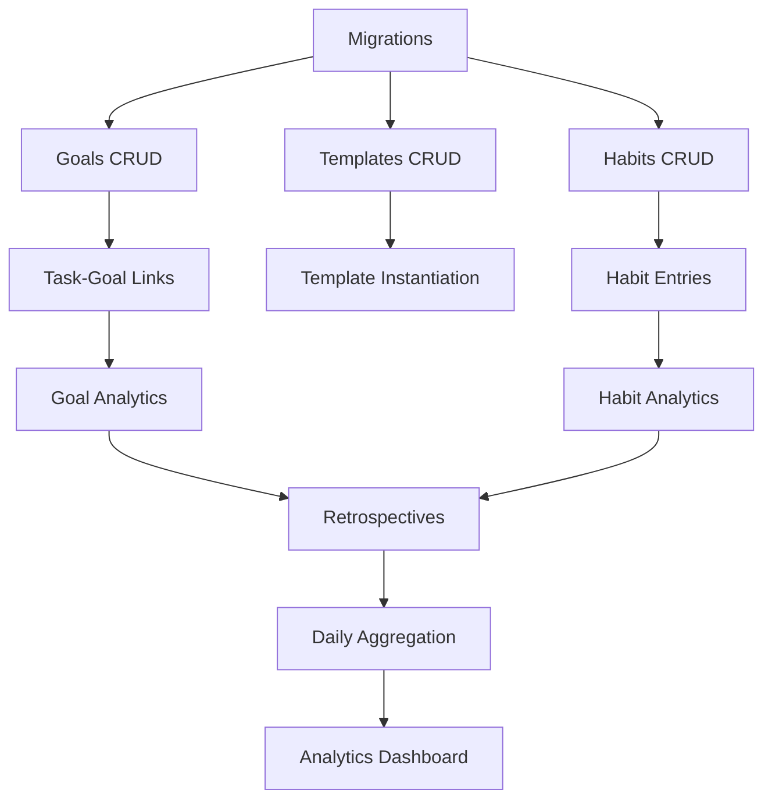
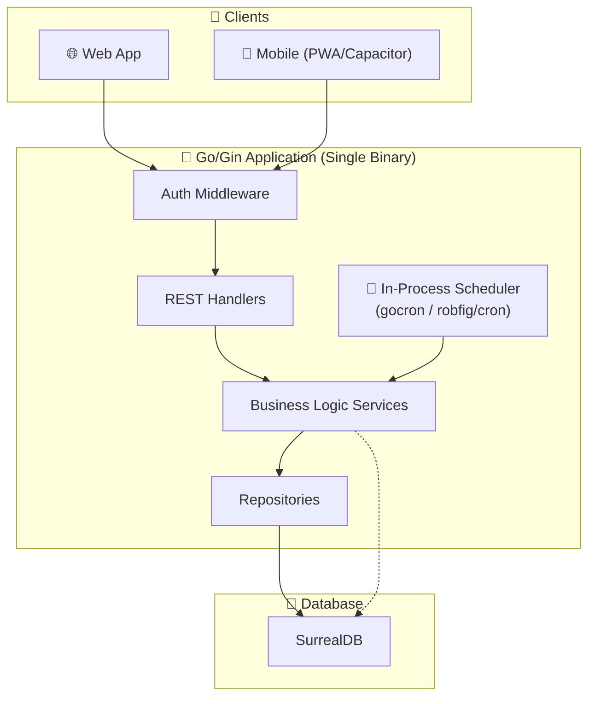
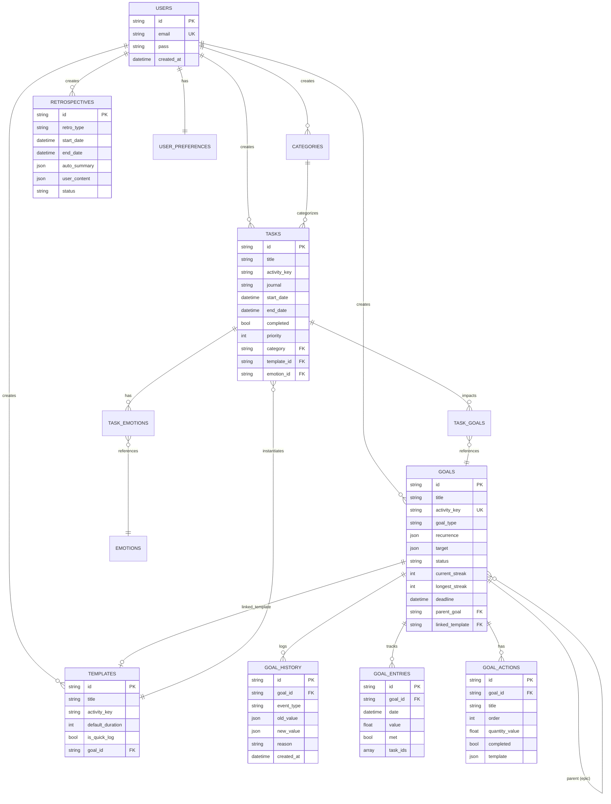
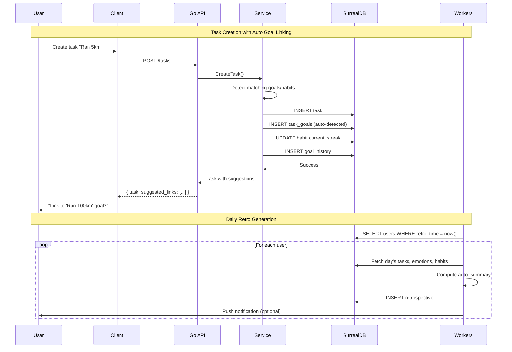
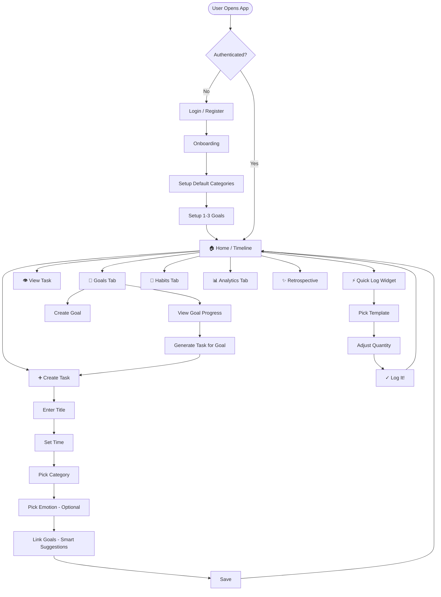
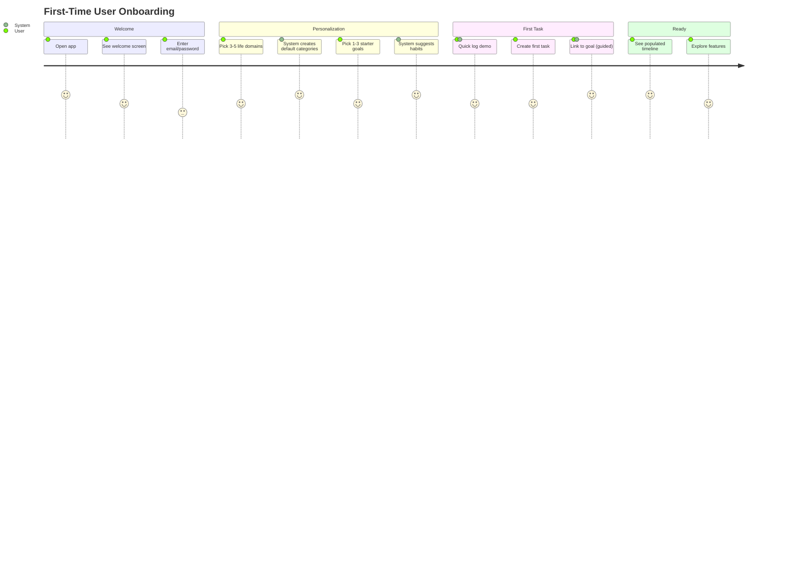
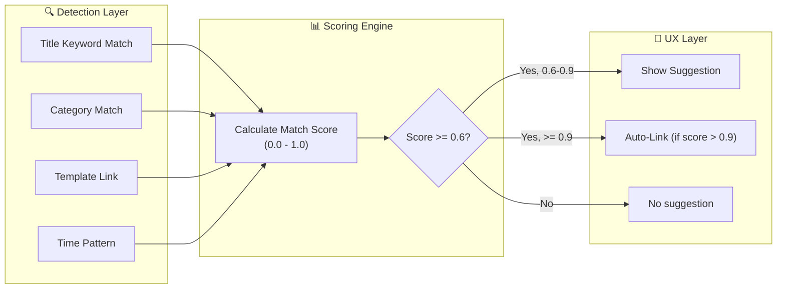
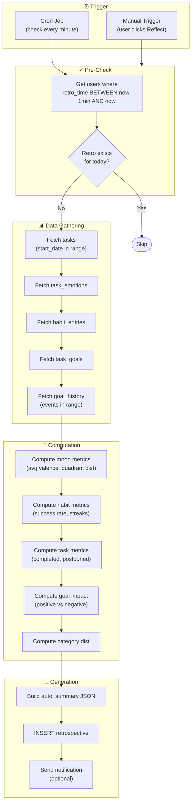
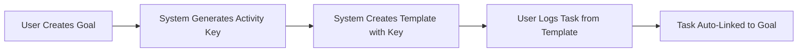
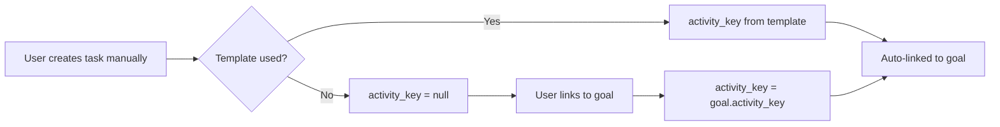

# Lucid Logs - Comprehensive Feature Planning Document

> **Version:** 1.0  
> **Date:** December 7, 2025  
> **Status:** Draft for Review

---

## Executive Summary

This document provides an exhaustive specification for the next set of features for **Lucid Logs** (the Daily Journal App), focusing on four core areas:

1. **Goals, Habits & Metrics** — Flexible goal tracking with positive/negative task impact analysis
2. **Task Templates** — Reusable blueprints for quick task creation
3. **Retrospectives** — Daily auto-generated and custom date-range reflection system
4. **Analytics & Charts** — Rich visualization layer for insights and growth tracking

All features are designed to integrate seamlessly with the existing system:
- **Tasks** with positives/negatives, emotions, and categories
- **100-emotion Yale RULER mood meter** with 6D vectors (V, A, D, I, C, S)
- **SurrealDB** schemaless architecture with record links
- **Go/Gin** backend with handler/service/repository pattern

---

## Table of Contents

### Part I: Feature Specifications

1. [Current System Overview](#1-current-system-overview)
2. [Feature Area 1: Goals, Habits & Metrics](#2-feature-area-1-goals-habits--metrics)
3. [Feature Area 2: Task Templates](#3-feature-area-2-task-templates)
4. [Feature Area 3: Retrospectives](#4-feature-area-3-retrospectives)
5. [Feature Area 4: Analytics & Charts](#5-feature-area-4-analytics--charts)
6. [Data Model & Schema](#6-data-model--schema)
7. [API Design](#7-api-design)
8. [Implementation Roadmap](#8-implementation-roadmap)
9. [Appendices](#9-appendices)

### Part II: Technical Implementation Details

10. [Architecture & System Diagrams](#10-architecture--system-diagrams)
11. [Current UI Flow & User Journey](#11-current-ui-flow--user-journey)
12. [Default Data & Seed System](#12-default-data--seed-system)
13. [Smart Nudging System (Goal-Task Linking)](#13-smart-nudging-system-goal-task-linking)
14. [Technical Retrospective System](#14-technical-retrospective-system)
15. [Minimal User Input Design](#15-minimal-user-input-design)
16. [Auto Task Generation for Goals](#16-auto-task-generation-for-goals)
17. [Extended Charts & Matrices](#17-extended-charts--matrices)
18. [Goal Activity Logging (Timeline)](#18-goal-activity-logging-timeline)

---

## 1. Current System Overview

### 1.1 Existing Entities

| Entity | Description | Key Fields |
|--------|-------------|------------|
| **Users** | Authentication & preferences | `email`, `pass`, `is_admin`, `timezone` |
| **Categories** | Task organization | `name`, `color`, `created_by` |
| **Tasks** | Core journal entries | `title`, `journal`, `start_date`, `end_date`, `priority`, `positives`, `negatives`, `emotion_id`, `category` |
| **Emotions** | 100-emotion mood meter | `name`, `emoji`, `quadrant`, `valence`, `arousal`, `dominance`, `intensity`, `certainty`, `social` |
| **Task_Emotions** | Relation: tasks → emotions | `type` (primary/positive/negative), `text` |

### 1.2 Key Patterns

- **Record Links:** `task.category = categories:work123`
- **Schemaless Tables:** Flexible field addition without migrations
- **Multi-tenancy:** `created_by` field for user ownership
- **Soft Delete:** `deleted_at` field for recoverability
- **Emotion Inference:** Server-computed `inferred_emotion` on write

### 1.3 Emotion System (6D Vectors)

Each emotion has research-backed coordinates:
```
E = [Valence, Arousal, Dominance, Intensity, Certainty, Social]
    [-1...+1, -1...+1, -1...+1, 0.1...1.0, -1...+1, -1...+1]
```

**Quadrants:**
- 🟡 **Yellow** — High Energy + Pleasant (Excited, Proud, Confident)
- 🟢 **Green** — Low Energy + Pleasant (Calm, Grateful, Content)
- 🔴 **Red** — High Energy + Unpleasant (Anxious, Frustrated, Stressed)
- 🔵 **Blue** — Low Energy + Unpleasant (Sad, Tired, Lonely)

---

## 2. Feature Area 1: Goals & Metrics

> [!NOTE]
> **Unified Model:** Goals and habits are the same entity. A habit is simply a goal with `recurrence` set. This simplifies the data model, reduces code duplication, and matches how we naturally think about goals.

### 2.1 Goal Types Overview

| Type | Recurrence | Target | Examples |
|------|------------|--------|----------|
| **One-Time Discrete** | `null` | `null` | "Finish React course", "Plan trip" |
| **One-Time Measurable** | `null` | `{value, unit}` | "Run 1000km by Dec 31", "Read 10 books" |
| **Recurring (Habit)** | `{frequency, period}` | optional | "Gym 5x/week", "Drink 3L water daily" |
| **Avoidance** | `{frequency: 1, period: "day"}` | `null` | "No junk food", "No smoking" |
| **Epic/Project** | `null` | `null` | "Learn Spanish" (has child milestones) |

---

### 2.2 Unified Goal Model

```typescript
interface Goal {
  id: string;                    // "goals:abc123"
  created_by: string;            // User ownership
  
  // =========================================================================
  // CORE FIELDS
  // =========================================================================
  title: string;                 // "Run 1000km" or "Exercise 5x/week"
  description?: string;          // Detailed description
  why?: string;                  // "Why does this matter?" - for retros
  icon?: string;                 // Emoji or icon
  color?: string;                // Hex color for UI
  
  // =========================================================================
  // GOAL TYPE
  // =========================================================================
  goal_type: "discrete" | "measurable" | "epic" | "avoidance";
  
  // =========================================================================
  // RECURRENCE (null = one-time goal, populated = recurring/habit)
  // =========================================================================
  recurrence?: {
    frequency: number;           // 5 (times per period)
    period: "day" | "week" | "month";  // → "5x per week"
    active_days?: string[];      // ["mon", "tue", "wed", "thu", "fri"] or null for all
    
    // Time constraints (optional)
    before_time?: string;        // "22:00" (complete before 10pm)
    after_time?: string;         // "06:00" (complete after 6am)
    
    // Streak settings
    grace_days?: number;         // 1 = can miss 1 day without breaking streak
  };
  
  // =========================================================================
  // TARGET (for measurable goals)
  // =========================================================================
  target?: {
    value: number;               // 1000 or 3
    unit: string;                // "km", "L", "pages", "minutes"
    current_value: number;       // Auto-computed from linked tasks
    per_period?: boolean;        // true = "3L per day", false = "1000km total"
  };
  
  // =========================================================================
  // TIMELINE
  // =========================================================================
  start_date?: datetime;         // When tracking began
  deadline?: datetime;           // For one-time goals (optional)
  
  // =========================================================================
  // STATUS & PROGRESS
  // =========================================================================
  status: "active" | "completed" | "paused" | "abandoned";
  completion_date?: datetime;    // When marked complete
  
  // =========================================================================
  // STREAK TRACKING (computed, for recurring goals)
  // =========================================================================
  current_streak: number;        // 23 days
  longest_streak: number;        // 45 days
  last_completed_date?: datetime;
  grace_days_used: number;       // How many grace days used in current streak
  
  // =========================================================================
  // ORGANIZATION
  // =========================================================================
  priority: 1 | 2 | 3;           // Low/Medium/High
  value_score: 1 | 2 | 3 | 4 | 5; // How meaningful (for retro analysis)
  category?: string;             // Link to categories:xyz
  parent_goal?: string;          // For milestones under epics: goals:parent
  life_domain?: string;          // "health", "work", "relationships", "learning"
  
  // =========================================================================
  // SUCCESS CRITERIA
  // =========================================================================
  success_signal?: string;       // "How will I know it's done?"
  
  // =========================================================================
  // LINKED TEMPLATE (for quick logging)
  // =========================================================================
  linked_template?: string;      // templates:xyz - auto-created for habits
  
  // =========================================================================
  // PRIVACY
  // =========================================================================
  is_private: boolean;           // For sensitive goals
  
  // =========================================================================
  // METADATA
  // =========================================================================
  created_at: datetime;
  updated_at: datetime;
  deleted_at?: datetime;
}
```

### 2.3 Goal Actions (Subtasks / Action Templates)

> **Goal Actions** are reusable action items or subtasks for a goal. For one-time goals, these are the steps to complete it. For recurring goals, these are the activities that count toward the goal.

```typescript
interface GoalAction {
  id: string;                    // "goal_actions:xyz"
  goal_id: string;               // Parent goal
  
  // Action Definition
  title: string;                 // "Complete Module 3" or "Run 5km"
  description?: string;
  order: number;                 // Display order
  
  // For Measurable Goals: How much this action contributes
  quantity_value?: number;       // 5
  quantity_unit?: string;        // "km"
  
  // Task Template (optional) - for quick logging
  template?: {
    default_duration?: number;   // 30 minutes
    default_emotion_id?: string;
    show_fields: {
      journal: boolean;
      duration: boolean;
      quantity: boolean;
      emotion: boolean;
    };
  };
  
  // Status (for one-time goals only)
  completed: boolean;
  completed_at?: datetime;
  
  // Metadata
  created_at: datetime;
}
```

**Example: One-Time Goal with Actions (Subtasks)**

```
Goal: "Finish React Course" (discrete)
├── Action: "Complete Module 1: Intro" ✓
├── Action: "Complete Module 2: Components" ✓
├── Action: "Complete Module 3: Hooks" [in progress]
├── Action: "Complete Module 4: State Management"
├── Action: "Build Final Project"
└── Action: "Pass Certification Exam"
```

**Example: Recurring Goal with Actions (Templates)**

```
Goal: "Exercise 5x/week" (recurring)
├── Action: "Go for a run" → Quick Log (30 min, Health category)
├── Action: "Gym session" → Quick Log (60 min, Health category)
├── Action: "Yoga class" → Quick Log (45 min, Self-care category)
└── Action: "Home workout" → Quick Log (20 min, Health category)

Each action can be logged as a task with one tap.
```

### 2.4 Goal Examples (Unified)

| Goal | Type | Recurrence | Target | Actions |
|------|------|------------|--------|---------|
| Finish React course | discrete | - | - | 6 module subtasks |
| Run 1000km by Dec | measurable | - | 1000km | "Go for a run" template |
| Gym 5x/week | measurable | 5x/week | - | "Gym session" template |
| Drink 3L water daily | measurable | 1x/day | 3L/day | "Drink water" template |
| No junk food | avoidance | 1x/day | - | "Ate junk food" (slip tracker) |
| Learn Spanish | epic | - | - | 4 milestone goals |
| Sleep by 10pm | discrete | 1x/day, before 22:00 | - | Auto-detected from tasks |
| Call mom 3x/week | discrete | 3x/week | - | "Call mom" template |

### 2.5 Goal Entries (Daily Tracking)

For recurring goals, track daily completion:

```typescript
interface GoalEntry {
  id: string;
  goal_id: string;               // Parent goal
  date: datetime;                // Which day
  
  // Completion data
  value?: number;                // Actual quantity (for measurable)
  met: boolean;                  // Target met for this period?
  
  // Which tasks contributed
  task_ids: string[];            // ["tasks:abc", "tasks:def"]
  
  // Notes
  notes?: string;
  
  created_at: datetime;
}
```

**Example Entries for "Drink 3L water daily":**
```
Dec 5: { value: 3.5, met: true, tasks: ["tasks:water1", "tasks:water2"] }
Dec 6: { value: 2.0, met: false, notes: "Busy day, forgot" }
Dec 7: { value: 3.0, met: true }
```

---

### 2.6 Goal History & Versioning

#### 2.6.1 History Event Model

```typescript
interface GoalHistoryEvent {
  id: string;
  goal_id: string;
  event_type: 
    | "created"
    | "status_changed"
    | "deadline_changed"
    | "target_changed"
    | "title_changed"
    | "priority_changed"
    | "task_added"
    | "task_removed"
    | "scope_changed"
    | "rolled_over"
    | "completed"
    | "abandoned";
  
  // What changed
  field_name?: string;
  old_value?: any;               // JSON serialized
  new_value?: any;               // JSON serialized
  
  // Context
  reason?: string;               // User-provided reason
  triggered_by?: string;         // "user" | "system" | "rollover"
  
  // For retro analysis
  retro_period?: string;         // "2024-W49", "2024-12", etc.
  
  created_at: datetime;
  created_by: string;
}
```

#### 2.6.2 History Tracking Rules

```
CHANGE: Goal deadline extended
RECORD: {
  event_type: "deadline_changed",
  old_value: "2024-12-31",
  new_value: "2025-01-15",
  reason: "Need more time due to holidays",
  retro_period: "2024-12"
}

CHANGE: Goal target increased
RECORD: {
  event_type: "target_changed",
  field_name: "target.value",
  old_value: 500,
  new_value: 800,
  reason: "Feeling confident, raising the bar"
}

ROLLOVER: Goal not completed in period
RECORD: {
  event_type: "rolled_over",
  old_value: { deadline: "2024-12-07", status: "in_progress" },
  new_value: { deadline: "2024-12-14", status: "in_progress" },
  triggered_by: "system"
}
```

---

### 2.7 Metrics System

#### 2.7.1 Metric Types

| Category | Metric | Computation |
|----------|--------|-------------|
| **Task Metrics** | Tasks completed | COUNT(tasks WHERE completed=true) |
| | Tasks created | COUNT(tasks) in period |
| | Tasks per category | GROUP BY category |
| | Average task duration | AVG(end_date - start_date) |
| | Completion rate | completed / created × 100% |
| | Postponement rate | rescheduled / total |
| **Emotion Metrics** | Average mood | Weighted centroid of emotions |
| | Emotional variability | Standard deviation of valence |
| | Quadrant distribution | % time in each quadrant |
| | Dominant emotion | Most frequent emotion |
| | Emotional recovery time | Time from negative → neutral/positive |
| **Habit Metrics** | Success rate | days_met / days_tracked × 100% |
| | Current streak | Consecutive days met |
| | Longest streak | Max historical streak |
| | Time-of-day success | Completion % by hour |
| | Day-of-week success | Completion % by day |
| **Goal Metrics** | Progress percentage | current_value / target × 100% |
| | Positive impact ratio | positive_tasks / total_linked_tasks |
| | Negative impact count | Tasks marked as anti-goal |
| | Time to completion | Actual vs estimated |
| | Goal-category alignment | Time spent on goals by category |
| **Balance Metrics** | Life domain distribution | Time/tasks per domain |
| | Neglected domains | Domains with < X tasks/week |
| | Work-life balance | Work domain / total |
| | Self-care hours | Time in health/wellbeing categories |
| **Honesty Metrics** | Setback logging ratio | negative_impact / positive_impact |
| | Wins vs challenges | positives / negatives in tasks |
| | Reflection frequency | Retros completed / days |
| | Goal adjustment frequency | Changes logged / goals |

#### 2.6.2 Computed Metrics Schema

```sql
-- Pre-computed daily metrics (materialized view pattern)
DEFINE TABLE daily_metrics PERMISSIONS FULL;
DEFINE FIELD user_id ON daily_metrics TYPE string;
DEFINE FIELD date ON daily_metrics TYPE datetime;
DEFINE FIELD metrics ON daily_metrics TYPE object; -- JSON blob

-- Example metrics structure:
-- {
--   tasks: { created: 5, completed: 4, total_duration_mins: 120 },
--   emotions: { avg_valence: 0.3, avg_arousal: 0.1, dominant_quadrant: "green" },
--   habits: { met: 4, missed: 1, streak_updates: [...] },
--   goals: { positive_impacts: 3, negative_impacts: 1 }
-- }

DEFINE INDEX idx_daily_metrics_user_date ON TABLE daily_metrics COLUMNS user_id, date;
```

---

## 3. Feature Area 2: Task Templates

### 3.1 Template Model

```typescript
interface TaskTemplate {
  id: string;                    // "templates:xyz123"
  created_by: string;
  
  // Core Properties
  title: string;                 // "Drink Water"
  description?: string;
  icon?: string;                 // Emoji or icon name
  color?: string;                // Hex color
  
  // Defaults
  default_duration?: number;     // Duration in seconds (e.g., 30 for quick log)
  default_priority?: number;
  default_category?: string;     // Link to category
  
  // Quick Log Settings
  is_quick_log: boolean;         // Show in quick log widget
  quick_log_order?: number;      // Position in quick log list
  
  // Quantity Settings (for trackable templates)
  quantity_enabled: boolean;
  quantity_default?: number;     // Default quantity
  quantity_unit?: string;        // "glasses", "ml", "pages", etc.
  quantity_step?: number;        // Increment/decrement step
  
  // Emotion Defaults
  expected_quadrant?: string;    // "green", "yellow", etc.
  default_emotion_id?: string;   // Typical emotion for this activity
  
  // Goal/Habit Associations
  linked_goals?: string[];       // Auto-link tasks to these goals
  linked_habits?: string[];      // Auto-count toward these habits
  default_impact_type?: string;  // Typically positive/negative for goals
  
  // Positives/Negatives Patterns
  common_positives?: string[];   // Suggested positive items
  common_negatives?: string[];   // Suggested negative items
  
  // Fields to Show
  show_fields: {
    journal: boolean;
    duration: boolean;
    quantity: boolean;
    emotion: boolean;
    positives_negatives: boolean;
    notes: boolean;
    links: boolean;
  };
  
  // Source (for defaults vs user-created)
  is_default: boolean;           // System-provided template
  source_task_id?: string;       // Created from this task
  
  // Usage Stats
  use_count: number;
  last_used_at?: datetime;
  
  // Metadata
  created_at: datetime;
  updated_at: datetime;
  deleted_at?: datetime;
}
```

### 3.2 Default Templates (System-Provided)

| Template | Duration | Quick Log | Quantity | Linked Habit Types |
|----------|----------|-----------|----------|-------------------|
| 💧 **Drink Water** | 30s | ✓ | glasses | Hydration |
| 🏃 **Exercise Session** | 45min | ✗ | minutes | Fitness |
| 🧘 **Meditation** | 15min | ✓ | minutes | Mindfulness |
| 📚 **Reading** | 30min | ✓ | pages | Learning |
| 💼 **Deep Work** | 2hr | ✗ | - | Productivity |
| ☕ **Coffee Break** | 15min | ✓ | - | - |
| 🍽️ **Meal** | 30min | ✓ | - | Nutrition |
| 😴 **Sleep** | 8hr | ✗ | hours | Sleep |
| 📞 **Call Loved One** | 15min | ✓ | - | Connection |
| 🚶 **Walk** | 20min | ✓ | steps | Movement |
| ✍️ **Journaling** | 10min | ✓ | - | Reflection |
| 📝 **Daily Planning** | 10min | ✗ | - | Productivity |
| 🌅 **Morning Routine** | 45min | ✗ | - | Self-care |
| 🌙 **Evening Wind-down** | 30min | ✗ | - | Sleep |
| 💪 **Gym Session** | 60min | ✗ | - | Fitness |
| 🎵 **Practice Music** | 30min | ✓ | minutes | Creative |
| 📱 **Screen Time** | - | ✗ | minutes | Awareness |
| 🚫 **Avoided [X]** | 0s | ✓ | - | Avoidance |

### 3.3 Template → Task Relationship

```sql
-- Tasks store reference to originating template
DEFINE FIELD template_id ON tasks TYPE option<record<templates>>;

-- Query: Get all tasks from a template
SELECT * FROM tasks WHERE template_id = templates:xyz123;

-- Template changes do NOT affect existing tasks
-- Templates are blueprints, not live references
```

### 3.4 Converting Task to Template

```
User selects "Save as Template" on a task:

1. Extract reusable properties:
   - title → template.title
   - duration → template.default_duration
   - category → template.default_category
   - Any linked goals → template.linked_goals

2. User can customize:
   - Make it a quick log
   - Add common positives/negatives patterns
   - Set expected emotional zone

3. Original task.template_id = null (templates come from tasks)
   Future tasks.template_id = new_template.id
```

---

## 4. Feature Area 3: Retrospectives

### 4.1 Retrospective Model

```typescript
interface Retrospective {
  id: string;                    // "retros:xyz123"
  created_by: string;
  
  // Type & Scope
  retro_type: "daily" | "weekly" | "monthly" | "quarterly" | "yearly" | "custom";
  
  // Date Range
  start_date: datetime;
  end_date: datetime;            // Inclusive
  
  // Auto-Generated Content (computed on creation)
  auto_summary: RetroAutoSummary;
  
  // User-Editable Content
  user_content: {
    what_went_well?: string;     // Free text
    what_didnt_go_well?: string;
    what_learned?: string;
    gratitude?: string[];        // List of things grateful for
    proud_of?: string;
    change_tomorrow?: string;
    additional_notes?: string;
  };
  
  // User Adjustments to Auto-Analysis
  adjusted_interpretations?: {
    field: string;
    original: any;
    adjusted: any;
    reason?: string;
  }[];
  
  // Status
  status: "draft" | "completed";
  
  // Metadata
  generated_at: datetime;        // When auto-summary was computed
  created_at: datetime;
  updated_at: datetime;
}

interface RetroAutoSummary {
  // Mood Overview
  mood: {
    average_valence: number;
    average_arousal: number;
    dominant_quadrant: string;
    quadrant_distribution: { yellow: number; green: number; red: number; blue: number };
    notable_spikes: { date: datetime; emotion: string; context?: string }[];
    notable_dips: { date: datetime; emotion: string; context?: string }[];
  };
  
  // Habit Overview
  habits: {
    met: { habit_id: string; name: string; success_rate: number }[];
    partially_met: { habit_id: string; name: string; success_rate: number }[];
    missed: { habit_id: string; name: string; success_rate: number }[];
    streaks: {
      continued: { habit_id: string; name: string; streak: number }[];
      broken: { habit_id: string; name: string; was: number; now: number }[];
      started: { habit_id: string; name: string; streak: number }[];
    };
  };
  
  // Task Overview
  tasks: {
    completed: number;
    postponed: number;
    cancelled: number;
    not_started: number;
    total_duration_hours: number;
    by_category: { category: string; count: number; duration_hours: number }[];
  };
  
  // Goal Impact
  goals: {
    net_impact: { goal_id: string; name: string; positive: number; negative: number }[];
    significantly_advanced: { goal_id: string; name: string; progress_delta: number }[];
    negatively_impacted: { goal_id: string; name: string; reason?: string }[];
  };
  
  // Category Overview
  categories: {
    time_distribution: { category: string; hours: number; percentage: number }[];
    neglected: { category: string; days_since_last_task: number }[];
  };
  
  // AI-Generated Insights (optional future feature)
  insights?: string[];
}
```

### 4.2 User Preference: Daily Retro Time

```typescript
// Extend user preferences
interface UserPreferences {
  // ... existing fields
  
  daily_retro: {
    enabled: boolean;
    time: string;                // "21:00" - 24-hour format
    timezone: string;            // "Asia/Kolkata"
    notification_enabled: boolean;
    auto_generate: boolean;      // Generate even if user doesn't open app
  };
  
  weekly_retro_day?: string;     // "sunday"
  monthly_retro_day?: number;    // 1 (first of month)
}
```

### 4.3 Daily Retrospective Auto-Generation

**Trigger:** User-configured time (e.g., 9 PM) OR manual trigger

**Generation Process:**
```
1. Determine date range: [start of day, current time]

2. Gather Data:
   - All tasks for the day
   - All task_emotions edges
   - All task_goals edges
   - Habit tracking entries
   - Goal progress snapshots

3. Compute Metrics:
   - Mood: Weighted centroid of all emotions
   - Habits: Check each active habit's criteria
   - Tasks: Count by status
   - Goals: Sum positive/negative impacts

4. Generate Summary Bullets:
   - "You completed 7 tasks today"
   - "Average mood: Calm (🟢 Green quadrant)"
   - "4/5 habits met"
   - "Sleep goal negatively impacted (stayed up late)"

5. Create Retro Record with auto_summary populated

6. Notify user (optional)
```

### 4.4 Custom Date-Range Retrospective

**Query Aggregation Patterns:**

```sql
-- Get all tasks in date range
LET $start = <datetime>"2024-12-01T00:00:00Z";
LET $end = <datetime>"2024-12-07T23:59:59Z";

SELECT * FROM tasks 
WHERE created_by = $user_id 
  AND start_date >= $start 
  AND end_date <= $end
  AND deleted_at IS NONE;

-- Get emotion distribution
SELECT 
  ->task_emotions->emotions.quadrant as quadrant,
  count() as count
FROM tasks
WHERE created_by = $user_id 
  AND start_date >= $start
GROUP BY quadrant;

-- Get goal impact summary
SELECT 
  out.id as goal_id,
  out.title as goal_title,
  impact_type,
  count() as count,
  math::sum(impact_magnitude) as total_magnitude
FROM task_goals
WHERE created_at >= $start AND created_at <= $end
  AND in.created_by = $user_id
GROUP BY out, impact_type;
```

### 4.5 Reflection Prompts by Retro Type

| Type | Prompts |
|------|---------|
| **Daily** | What went well? What was challenging? What did you learn? What are you grateful for? One thing to change tomorrow? |
| **Weekly** | Key wins? Biggest challenges? Energy patterns? Goals progress? What to focus on next week? |
| **Monthly** | Major accomplishments? Habits formed/broken? Goal progress? Balance across life domains? Adjustments for next month? |
| **Quarterly** | Progress on big goals? Life areas thriving/struggling? Habits that stuck? Key learnings? Goals for next quarter? |
| **Yearly** | Highlight moments? Growth/changes? Relationships? Career? Health? Goals for next year? Word of the year? |

---

## 5. Feature Area 4: Analytics & Charts — "Visualizing Life"

> [!NOTE]
> This section is the comprehensive reference for all analytics, metrics, and visualizations. All formulas are research-backed where applicable, utilizing the 6D emotion vectors from EMOTION_RESEARCH.md.

---

### 5.1 Core Metrics (The "Pulse")

These metrics are calculated daily/weekly to give users a quick health check.

#### 5.1.1 Productivity Metrics

| Metric | Description | Formula | Data Source |
|--------|-------------|---------|-------------|
| **Task Completion Rate** | % of planned tasks completed | `(completed / (completed + abandoned + postponed)) × 100` | `tasks` |
| **Focus Score** | Quality of time based on work type | `Σ(duration × weight) / total_duration`<br>Weights: Deep Work=1.5, Shallow=0.5 | `tasks (tags)` |
| **Velocity** | Tasks completed per period | `COUNT(completed_tasks) / days` | `tasks` |
| **Avg Task Duration** | Mean time per task | `AVG(end_date - start_date)` | `tasks` |
| **Peak Productivity Hour** | Most productive time of day | `MODE(hour(start_date) WHERE completed=true)` | `tasks` |

**SurrealDB Query — Daily Productivity:**
```sql
LET $user = $auth.id;
LET $today = time::floor(time::now(), 1d);

SELECT 
    count(IF completed = true THEN 1 ELSE NONE END) as completed,
    count(IF status = "postponed" THEN 1 ELSE NONE END) as postponed,
    count(IF status = "abandoned" THEN 1 ELSE NONE END) as abandoned,
    math::sum(duration::secs(end_date - start_date)) as total_seconds,
    (completed / (completed + postponed + abandoned)) * 100 as completion_rate
FROM tasks
WHERE created_by = $user 
  AND time::floor(start_date, 1d) = $today
  AND deleted_at IS NONE;
```

---

#### 5.1.2 Emotional Metrics (from 6D Vectors)

| Metric | Description | Formula | Range |
|--------|-------------|---------|-------|
| **Average Valence** | General pleasantness | `AVG(valence)` | -1 to +1 |
| **Average Arousal** | General energy level | `AVG(arousal)` | -1 to +1 |
| **Mood Stability** | Volatility of emotions | `1 - STD_DEV(valence)`<br>Lower STD = more stable | 0 to 1 |
| **Emotional Diversity** | Richness of experience | Shannon Entropy: `H = -Σ(p × log₂(p))`<br>where p = frequency of each emotion | 0 to log₂(100) |
| **Resilience Score** | Recovery speed from negative | `AVG(time to valence > 0 after valence < -0.5)` | Minutes |
| **Dissonance Score** | Internal emotional conflict | `cos⁻¹(dot(pos_centroid, neg_centroid)) / π`<br>when both positive AND negative emotions logged | 0 to 1 |

**SurrealDB Query — Weekly Emotion Summary:**
```sql
LET $week_start = time::floor(time::now(), 1w);

SELECT 
    math::mean(->task_emotions->emotions.valence) as avg_valence,
    math::mean(->task_emotions->emotions.arousal) as avg_arousal,
    math::stddev(->task_emotions->emotions.valence) as valence_volatility,
    ->task_emotions->emotions.quadrant as quadrant,
    count() as count
FROM tasks
WHERE created_by = $auth.id
  AND start_date >= $week_start
GROUP BY quadrant;
```

**Resilience Calculation (Go):**
```go
func calculateResilience(logs []EmotionLog) float64 {
    var recoveryTimes []float64
    inNegative := false
    var negativeStart time.Time
    
    for _, log := range logs {
        if log.Valence < -0.5 && !inNegative {
            inNegative = true
            negativeStart = log.Time
        } else if log.Valence > 0 && inNegative {
            recovery := log.Time.Sub(negativeStart).Minutes()
            recoveryTimes = append(recoveryTimes, recovery)
            inNegative = false
        }
    }
    
    if len(recoveryTimes) == 0 {
        return 0 // No negative states or still in one
    }
    return mean(recoveryTimes)
}
```

---

#### 5.1.3 Goal & Streak Metrics

| Metric | Description | Formula |
|--------|-------------|---------|
| **Current Streak** | Consecutive days goal was met | See streak algorithm below |
| **Longest Streak** | Historical best | `MAX(streak_history)` |
| **Streak Robustness** | Streak weighted by difficulty | `streak × difficulty_factor` |
| **Goal Progress %** | Current / Target | `(current_value / target.value) × 100` |
| **Days on Target** | % of days goal met | `(days_met / total_tracked_days) × 100` |
| **Pace to Goal** | On track for deadline? | `current_value >= (target.value × days_elapsed / total_days)` |

**Streak Calculation Algorithm (with Grace Days):**

```go
// internal/features/goals/streak.go

type StreakCalculator struct {
    db *surrealdb.DB
}

func (s *StreakCalculator) CalculateStreak(ctx context.Context, goalID string) (int, int, error) {
    // Get goal with recurrence settings
    goal, _ := s.getGoal(ctx, goalID)
    
    // Get all entries sorted by date DESC
    entries, _ := s.getEntries(ctx, goalID)
    if len(entries) == 0 {
        return 0, 0, nil
    }
    
    graceDays := 0
    if goal.Recurrence != nil && goal.Recurrence.GraceDays != nil {
        graceDays = *goal.Recurrence.GraceDays
    }
    
    streak := 0
    longestStreak := 0
    currentGraceUsed := 0
    
    today := time.Now().Truncate(24 * time.Hour)
    expectedDate := today
    
    // Walk backwards through expected dates
    for {
        // Skip non-active days (if goal has active_days set)
        if !s.isActiveDay(goal, expectedDate) {
            expectedDate = expectedDate.Add(-24 * time.Hour)
            continue
        }
        
        // Find entry for this date
        entry := s.findEntry(entries, expectedDate)
        
        if entry != nil && entry.Met {
            streak++
            currentGraceUsed = 0 // Reset grace on success
        } else if currentGraceUsed < graceDays {
            // Use a grace day
            currentGraceUsed++
            // Streak continues but doesn't increment
        } else {
            // Streak broken
            break
        }
        
        expectedDate = expectedDate.Add(-24 * time.Hour)
        
        // Don't go before goal start date
        if goal.StartDate != nil && expectedDate.Before(*goal.StartDate) {
            break
        }
        
        // Safety limit
        if streak > 365*5 {
            break
        }
    }
    
    // Update longest if current exceeds it
    if streak > goal.LongestStreak {
        longestStreak = streak
    } else {
        longestStreak = goal.LongestStreak
    }
    
    return streak, longestStreak, nil
}

func (s *StreakCalculator) isActiveDay(goal *Goal, date time.Time) bool {
    if goal.Recurrence == nil || goal.Recurrence.ActiveDays == nil {
        return true // All days active
    }
    
    dayName := strings.ToLower(date.Weekday().String()[:3]) // "mon", "tue", etc.
    for _, activeDay := range goal.Recurrence.ActiveDays {
        if activeDay == dayName {
            return true
        }
    }
    return false
}
```

**SurrealDB Query — Goal Progress with Streak:**
```sql
SELECT 
    id,
    title,
    target.value as target_value,
    target.current_value as current_value,
    (target.current_value / target.value) * 100 as progress_percent,
    current_streak,
    longest_streak,
    status,
    deadline,
    -- Days remaining calculation
    IF deadline IS NOT NONE THEN 
        duration::days(deadline - time::now()) 
    END as days_remaining,
    -- Pace check: are we on track?
    IF deadline IS NOT NONE AND target.value > 0 THEN
        LET $total_days = duration::days(deadline - start_date);
        LET $elapsed_days = duration::days(time::now() - start_date);
        LET $expected_progress = target.value * $elapsed_days / $total_days;
        target.current_value >= $expected_progress
    END as on_pace
FROM goals
WHERE created_by = $auth.id AND status = "active";
```

---

### 5.2 Activity Matching System

> [!IMPORTANT]
> **V1 Simplification:** Instead of the hierarchical tag system below, V1 uses **Activity Keys** — simple unique identifiers that auto-link tasks to goals. See **Section 19** for the V1 implementation. The tag system below is preserved for V2 when more flexible matching is needed.

#### 5.2.1 V1: Activity Key Matching (Simple)

**Core Principle:** Goals define an `activity_key`, templates inherit it, tasks get it automatically.

```typescript
interface Task {
  // ... existing fields ...
  
  // Activity Key: inherited from template or set when linked to goal
  activity_key?: string;       // "drink_water", "exercise", "read_30_pages"
  
  // Universal quantity (optional)
  quantity?: {
    value: number;           // 500
    unit: string;            // "ml", "reps", "km", "minutes", "pages"
  };
}

interface Goal {
  // ... existing fields ...
  
  // Activity Key: unique identifier for this goal's activity
  activity_key: string;        // Auto-generated from title: "drink_3l_water_daily"
  
  // Linked template (auto-created)
  linked_template?: string;    // Template ID for quick logging
}
```

#### 5.2.2 V2: Hierarchical Tags (Future Enhancement)

Tags follow a colon-separated hierarchy. A goal can match at any level:

```
drink                    ← Matches ALL drinks
├── drink:water          ← Matches only water
├── drink:tea            
├── drink:coffee         
└── drink:juice          

exercise                 ← Matches ALL exercise
├── exercise:running     
├── exercise:swimming    
├── exercise:cycling     
└── exercise:gym         

read                     ← Matches ALL reading
├── read:book            
├── read:article         
└── read:research        

social                   ← Matches ALL social
├── social:family        
├── social:friends       
├── social:work          
└── social:strangers     
```

**Matching Examples:**

| Goal | Match Tags | Task Tags | Matches? |
|------|------------|-----------|----------|
| "Drink 3L water daily" | `["drink:water"]` | `["drink", "drink:water"]` | ✅ Yes |
| "Drink 3L any liquid" | `["drink"]` | `["drink", "drink:tea"]` | ✅ Yes |
| "Exercise 5x/week" | `["exercise"]` | `["exercise", "exercise:running"]` | ✅ Yes |
| "Run 10km/week" | `["exercise:running"]` | `["exercise", "exercise:swimming"]` | ❌ No |

#### 5.2.3 Tag Inheritance (Auto-Applied)

When user selects a child tag, parent tags are auto-added:

```go
func applyTagInheritance(tags []string) []string {
    result := make(map[string]bool)
    
    for _, tag := range tags {
        result[tag] = true
        
        // Add parent tags
        parts := strings.Split(tag, ":")
        for i := 1; i < len(parts); i++ {
            parent := strings.Join(parts[:i], ":")
            result[parent] = true
        }
    }
    
    return keys(result)
}

// Example:
// Input:  ["drink:water"]
// Output: ["drink", "drink:water"]

// Input:  ["exercise:gym:weights"]
// Output: ["exercise", "exercise:gym", "exercise:gym:weights"]
```

#### 5.2.4 Common Tag Taxonomy (Seed Data)

```go
var CommonTags = []TagDefinition{
    // Health & Fitness
    {Tag: "exercise", Label: "Exercise", Icon: "🏃", Children: []string{
        "exercise:running", "exercise:swimming", "exercise:cycling", 
        "exercise:gym", "exercise:yoga", "exercise:walking", "exercise:sports",
    }},
    {Tag: "drink", Label: "Drink", Icon: "🥤", Children: []string{
        "drink:water", "drink:tea", "drink:coffee", "drink:juice", "drink:smoothie",
    }},
    {Tag: "eat", Label: "Eat", Icon: "🍽️", Children: []string{
        "eat:meal", "eat:snack", "eat:healthy", "eat:junk",
    }},
    {Tag: "sleep", Label: "Sleep", Icon: "😴", Children: []string{
        "sleep:night", "sleep:nap",
    }},
    {Tag: "medication", Label: "Medication", Icon: "💊", Children: []string{
        "medication:vitamin", "medication:prescription",
    }},
    
    // Productivity
    {Tag: "work", Label: "Work", Icon: "💼", Children: []string{
        "work:deep", "work:shallow", "work:meeting", "work:email",
    }},
    {Tag: "learn", Label: "Learn", Icon: "📚", Children: []string{
        "learn:read", "learn:course", "learn:practice", "learn:research",
    }},
    {Tag: "create", Label: "Create", Icon: "🎨", Children: []string{
        "create:write", "create:code", "create:design", "create:music",
    }},
    
    // Relationships
    {Tag: "social", Label: "Social", Icon: "👥", Children: []string{
        "social:family", "social:friends", "social:partner", "social:colleagues",
    }},
    {Tag: "communicate", Label: "Communicate", Icon: "💬", Children: []string{
        "communicate:call", "communicate:text", "communicate:email", "communicate:meet",
    }},
    
    // Self-care
    {Tag: "mindfulness", Label: "Mindfulness", Icon: "🧘", Children: []string{
        "mindfulness:meditate", "mindfulness:breathe", "mindfulness:journal",
    }},
    {Tag: "hygiene", Label: "Hygiene", Icon: "🚿", Children: []string{
        "hygiene:shower", "hygiene:teeth", "hygiene:skincare",
    }},
    
    // Finance
    {Tag: "finance", Label: "Finance", Icon: "💰", Children: []string{
        "finance:save", "finance:spend", "finance:invest", "finance:budget",
    }},
    
    // Avoidance (negative tracking)
    {Tag: "avoid", Label: "Avoid", Icon: "🚫", Children: []string{
        "avoid:smoking", "avoid:alcohol", "avoid:junkfood", "avoid:social_media",
    }},
}
```

---

### 5.3 Goal Success Conditions

#### 5.3.1 Condition Types

| Type | Field | Operators | Example |
|------|-------|-----------|---------|
| **Quantity** | `quantity.value` | `>=`, `<=`, `>`, `<`, `=` | "Drink >= 3 L water" |
| **Frequency** | `count` | `>=`, `<=`, `=`, `between` | "Exercise 4-6 times/week" |
| **Duration** | `duration` | `>=`, `<=`, `>`, `<` | "Meditate >= 30 min" |
| **Time** | `start_time` | `before`, `after`, `between` | "Gym before 8am" |
| **Streak** | `streak` | `>=`, `>` | "Maintain 7+ day streak" |
| **Boolean** | `completed` | `=` | "Did it? yes/no" |

#### 5.3.2 Condition Schema

```typescript
interface Condition {
  // What to measure
  field: "quantity" | "frequency" | "duration" | "time" | "streak" | "completed";
  
  // Comparison operator
  operator: ">=" | "<=" | ">" | "<" | "=" | "!=" | "between" | "before" | "after";
  
  // Target value(s)
  value: number | string | [number, number];  // [min, max] for "between"
  
  // Unit (for quantity/duration)
  unit?: string;  // "km", "L", "min", "reps"
  
  // Which tags this condition applies to (optional, inherits from goal if not set)
  match_tags?: string[];
}
```

#### 5.3.3 Composite Conditions with AND/OR Logic

```typescript
interface GoalConditions {
  // Logic operator
  logic: "AND" | "OR";
  
  // Nested conditions or condition groups
  items: (Condition | GoalConditions)[];
}

// Example: "(Run 10km AND do 50 pushups) OR (Swim 20km)"
const example: GoalConditions = {
  logic: "OR",
  items: [
    {
      logic: "AND",
      items: [
        { field: "quantity", operator: ">=", value: 10, unit: "km", match_tags: ["exercise:running"] },
        { field: "quantity", operator: ">=", value: 50, unit: "reps", match_tags: ["exercise:pushups"] }
      ]
    },
    { field: "quantity", operator: ">=", value: 20, unit: "km", match_tags: ["exercise:swimming"] }
  ]
};
```

#### 5.3.4 Visual Condition Builder (Non-Programmer Friendly)

```
┌─────────────────────────────────────────────────────────────────────┐
│ 🎯 Goal: Weekly Fitness                                             │
├─────────────────────────────────────────────────────────────────────┤
│                                                                      │
│  Success when:                                                       │
│                                                                      │
│  ┌─── ALL of these (AND) ───────────────────────────────────────┐   │
│  │                                                               │   │
│  │  [🏃 Running  ▼] [distance ▼] [>= ▼] [10  ] [km  ▼]    [✕]  │   │
│  │                                                               │   │
│  │  [💪 Pushups ▼] [count    ▼] [>= ▼] [50  ] [reps▼]    [✕]  │   │
│  │                                                               │   │
│  │  [+ Add condition]                                            │   │
│  └───────────────────────────────────────────────────────────────┘   │
│                                                                      │
│                    ────────── OR ──────────                          │
│                                                                      │
│  ┌─── ANY of these (OR) ────────────────────────────────────────┐   │
│  │                                                               │   │
│  │  [🏊 Swimming ▼] [distance ▼] [>= ▼] [20  ] [km  ▼]    [✕]  │   │
│  │                                                               │   │
│  │  [+ Add condition]                                            │   │
│  └───────────────────────────────────────────────────────────────┘   │
│                                                                      │
│  [+ Add another group]                                               │
│                                                                      │
│  ┌─────────────────────────────────────────────────────────────────┐│
│  │ 📖 Plain English:                                               ││
│  │ "Complete (10km running AND 50 pushups) OR 20km swimming"       ││
│  └─────────────────────────────────────────────────────────────────┘│
│                                                                      │
│                                          [Save Goal →]               │
└─────────────────────────────────────────────────────────────────────┘
```

**Key UX Principles:**
1. **Visual grouping** — Boxes for AND groups, OR separator between them
2. **Dropdowns** — All fields are selectable, no typing required
3. **Plain English** — Always show human-readable interpretation
4. **Progressive disclosure** — Start simple, complexity is opt-in
5. **Tag autocomplete** — Type "drink" → shows drink:water, drink:tea, etc.

#### 5.3.5 Condition Evaluation Engine (Go)

```go
// internal/features/goals/conditions.go

type ConditionEvaluator struct {
    db *surrealdb.DB
}

func (e *ConditionEvaluator) Evaluate(ctx context.Context, goal *Goal, period Period) (bool, map[string]interface{}) {
    results := make(map[string]interface{})
    
    // Get all tasks matching goal's tags in this period
    tasks, _ := e.getMatchingTasks(ctx, goal.MatchTags, goal.MatchMode, period)
    
    // Evaluate root conditions
    met := e.evaluateConditions(ctx, goal.Conditions, tasks, results)
    
    return met, results
}

func (e *ConditionEvaluator) evaluateConditions(ctx context.Context, conds GoalConditions, tasks []Task, results map[string]interface{}) bool {
    if conds.Logic == "AND" {
        for _, item := range conds.Items {
            if !e.evaluateItem(ctx, item, tasks, results) {
                return false
            }
        }
        return true
    } else { // OR
        for _, item := range conds.Items {
            if e.evaluateItem(ctx, item, tasks, results) {
                return true
            }
        }
        return false
    }
}

func (e *ConditionEvaluator) evaluateItem(ctx context.Context, item interface{}, tasks []Task, results map[string]interface{}) bool {
    switch v := item.(type) {
    case Condition:
        return e.evaluateSingleCondition(ctx, v, tasks, results)
    case GoalConditions:
        return e.evaluateConditions(ctx, v, tasks, results)
    }
    return false
}

func (e *ConditionEvaluator) evaluateSingleCondition(ctx context.Context, c Condition, tasks []Task, results map[string]interface{}) bool {
    // Filter tasks by condition's specific tags (if any)
    filtered := tasks
    if len(c.MatchTags) > 0 {
        filtered = filterByTags(tasks, c.MatchTags)
    }
    
    var actual float64
    
    switch c.Field {
    case "quantity":
        actual = sumQuantity(filtered, c.Unit)
    case "frequency":
        actual = float64(len(filtered))
    case "duration":
        actual = sumDuration(filtered)
    case "time":
        return checkTimeConstraint(filtered, c.Operator, c.Value.(string))
    case "streak":
        actual = float64(e.calculateStreak(ctx, filtered))
    case "completed":
        actual = boolToFloat(len(filtered) > 0)
    }
    
    results[c.Field] = actual
    return compare(actual, c.Operator, c.Value)
}

func compare(actual float64, op string, target interface{}) bool {
    switch op {
    case ">=":
        return actual >= toFloat(target)
    case "<=":
        return actual <= toFloat(target)
    case ">":
        return actual > toFloat(target)
    case "<":
        return actual < toFloat(target)
    case "=":
        return actual == toFloat(target)
    case "between":
        bounds := target.([2]float64)
        return actual >= bounds[0] && actual <= bounds[1]
    }
    return false
}
```

---

### 5.4 Task Creation Without Goal (Tag Selection)

When creating a task directly (no goal context), user can optionally select tags:

```
┌─────────────────────────────────────────────────────────────┐
│ Log Task                                                     │
├─────────────────────────────────────────────────────────────┤
│                                                              │
│  What did you do?                                            │
│  [Had some green tea__________________________]              │
│                                                              │
│  Tags (optional):                                            │
│  ┌─────────────────────────────────────────────────────────┐│
│  │ 🥤 Drink ▼                                              ││
│  │   ├── 💧 Water                                          ││
│  │   ├── 🍵 Tea        ← [Selected]                        ││
│  │   ├── ☕ Coffee                                         ││
│  │   └── 🧃 Juice                                          ││
│  └─────────────────────────────────────────────────────────┘│
│                                                              │
│  Quantity (optional):                                        │
│  [500] [ml ▼]                                                │
│                                                              │
│  🎯 Matches goals:                                           │
│  ├── "Drink 3L daily" → +500ml (auto-linked)                │
│  └── "Stay hydrated" → +1 (auto-linked)                     │
│                                                              │
│                                       [Save Task →]          │
└─────────────────────────────────────────────────────────────┘
```

**Smart Features:**
1. **Tag autocomplete** — Type "tea" → suggests ["drink:tea"]
2. **Recent tags** — Shows user's frequently used tags first
3. **Auto-link preview** — Shows which goals will be affected BEFORE saving
4. **Quantity unit suggestion** — Based on selected tag (drink → ml/L, exercise → min/km)

---

### 5.5 Life Scenario Coverage Matrix

This tag system covers ALL life scenarios:

| Life Domain | Parent Tag | Child Tags | Quantity Units |
|-------------|------------|------------|----------------|
| **Hydration** | `drink` | water, tea, coffee, juice, soda | ml, L, cups |
| **Nutrition** | `eat` | meal, snack, healthy, junk, fruit, vegetable | calories, portions |
| **Exercise** | `exercise` | running, swimming, cycling, gym, yoga, walking | km, miles, min, reps |
| **Sleep** | `sleep` | night, nap | hours, min |
| **Work** | `work` | deep, shallow, meeting, email, planning | hours, min, tasks |
| **Learning** | `learn` | read, course, practice, study, research | pages, chapters, hours |
| **Social** | `social` | family, friends, partner, colleagues | hours, calls, meetings |
| **Finance** | `finance` | save, spend, invest, budget | $, %, transactions |
| **Self-care** | `mindfulness` | meditate, breathe, journal, gratitude | min, entries |
| **Health** | `medication` | vitamin, prescription, supplement | doses, pills |
| **Hygiene** | `hygiene` | shower, teeth, skincare | times |
| **Creativity** | `create` | write, code, design, music, art | words, hours, pieces |
| **Avoidance** | `avoid` | smoking, alcohol, junkfood, screen | occurrences |
| **Home** | `home` | clean, organize, repair, garden | hours, tasks |
| **Commute** | `travel` | walk, drive, transit, bike | km, min |

**Custom Tags:** Users can create ANY custom tag for unique scenarios:
```
my_habit:morning_routine
my_habit:evening_wind_down
project:side_hustle
```

---

### 5.6 Task → Goal Auto-Linking Flow

```
User logs: "Morning run - 5km"
    ├── title: "Morning run"
    ├── tags: ["exercise", "exercise:running"]  ← auto-inherited
    ├── quantity: { value: 5, unit: "km" }
    └── start_time: 07:30

System evaluates all active goals:

Goal 1: "Run 10km/week"
    ├── match_tags: ["exercise:running"]
    ├── conditions: [{ field: "quantity", op: ">=", value: 10, unit: "km" }]
    └── ✅ MATCH: Tag matches, quantity contributes +5km

Goal 2: "Exercise 5x/week"  
    ├── match_tags: ["exercise"]  
    ├── conditions: [{ field: "frequency", op: ">=", value: 5 }]
    └── ✅ MATCH: Parent tag matches, frequency contributes +1

Goal 3: "Gym before 8am"
    ├── match_tags: ["exercise:gym"]
    ├── conditions: [{ field: "time", op: "before", value: "08:00" }]
    └── ❌ NO MATCH: Tag doesn't match (running ≠ gym)

Goal 4: "Drink 3L water"
    ├── match_tags: ["drink:water"]
    └── ❌ NO MATCH: Tag doesn't match

Auto-creates task_goals edges:
    ├── task -> goal1 { quantity: 5, unit: "km" }
    └── task -> goal2 { count: 1 }
```


### 5.7 UX: Simplified Exercise Goal Example

> [!TIP]
> **User's Mental Model:** "I want to exercise regularly" — NOT "I need 4 separate goals"

#### 5.7.1 Smart Goal Creation Flow

```
User types: "Exercise regularly"

System presents:
┌─────────────────────────────────────────────────────────────┐
│  🏃 Exercise Goal Setup                                      │
├─────────────────────────────────────────────────────────────┤
│                                                              │
│  How often do you want to exercise?                          │
│  ┌─────────────────────────────────────────────────────────┐│
│  │  [4] to [6] times per [week ▼]                          ││
│  └─────────────────────────────────────────────────────────┘│
│                                                              │
│  What activities count? (optional)                           │
│  ┌─────────────────────────────────────────────────────────┐│
│  │  [+] Add activity...                                    ││
│  │  ► Running     [Track distance?] [Y] _____ mi/km        ││
│  │  ► Pushups     [Track count?]    [Y] _____ reps         ││
│  │  ► Gym session [Track duration?] [N]                    ││
│  │  ► Yoga        [Track duration?] [Y] _____ min          ││
│  └─────────────────────────────────────────────────────────┘│
│                                                              │
│  Time constraint? (optional)                                 │
│  ┌─────────────────────────────────────────────────────────┐│
│  │  [✓] Complete by [08:00] AM                             ││
│  └─────────────────────────────────────────────────────────┘│
│                                                              │
│  Rest days?                                                  │
│  ┌─────────────────────────────────────────────────────────┐│
│  │  [Mon] [Tue] [Wed] [Thu] [Fri] [Sat] [Sun]              ││
│  │   ✓     ✓     ✓     ✓     ✓     ✓    OFF               ││
│  └─────────────────────────────────────────────────────────┘│
│                                                              │
│                              [Create Goal →]                 │
└─────────────────────────────────────────────────────────────┘
```

**Result:** System creates ONE goal with GoalActions:

```json
{
  "title": "Exercise Regularly",
  "goal_type": "measurable",
  "recurrence": {
    "frequency": 4,
    "max_frequency": 6,
    "period": "week",
    "active_days": ["mon", "tue", "wed", "thu", "fri", "sat"],
    "before_time": "08:00"
  },
  "goal_actions": [
    { "title": "Running", "quantity_unit": "miles", "template": {...} },
    { "title": "Pushups", "quantity_unit": "reps", "template": {...} },
    { "title": "Gym session", "template": {...} },
    { "title": "Yoga", "quantity_unit": "minutes", "template": {...} }
  ]
}
```

#### 5.7.2 Quick Log UI on Goal Card

Every goal card in the UI shows a **➕ button** for quick logging:

```
┌─────────────────────────────────────────┐
│ 🏃 Exercise Regularly                   │
│ 3/4-6 this week • Streak: 12 days      │
│                                         │
│ [🏃 Run] [💪 Pushups] [🏋️ Gym] [🧘 Yoga] │ ← Quick log buttons
│                                   [➕]   │ ← Add custom activity
│                                         │
│ ████████░░ 75% on pace                  │
└─────────────────────────────────────────┘
```

Tapping "🏃 Run" opens:
```
┌─────────────────────────────────────────┐
│ 🏃 Log Run                         ✕    │
├─────────────────────────────────────────┤
│  How far?  [___] miles  - ▲ 3 ▼ +       │
│  When?     [Now ▼] 07:30 AM             │
│  How was it?  [😊 Great!]               │
│                                         │
│            [Save & Log →]               │
└─────────────────────────────────────────┘
```

---

### 5.8 Templates System (Clarified)

#### 5.8.1 Template Independence

> Templates can exist **without** a goal. They are reusable task blueprints.

| Template Type | Associated With | Example |
|--------------|-----------------|---------|
| **Standalone** | Nothing | "Coffee break", "Commute" |
| **Goal-linked** | One or more goals | "Run" → "Run 10mi/week" goal |
| **Auto-generated** | Created when user creates recurring goal | GoalActions become templates |

#### 5.8.2 No Default Template Seeding

> [!IMPORTANT]
> **Remove template seeding.** Only seed categories. Templates are created by users or auto-generated from goals.

**Seed Categories Only:**
```go
var DefaultCategories = []Category{
    {Name: "Work", Color: "#3B82F6", Icon: "💼", LifeDomain: "work"},
    {Name: "Health", Color: "#10B981", Icon: "💪", LifeDomain: "health"},
    {Name: "Learning", Color: "#F59E0B", Icon: "📚", LifeDomain: "learning"},
    {Name: "Relationships", Color: "#EC4899", Icon: "❤️", LifeDomain: "relationships"},
    {Name: "Self-Care", Color: "#8B5CF6", Icon: "🧘", LifeDomain: "self_care"},
    {Name: "Fun", Color: "#EF4444", Icon: "🎮", LifeDomain: "fun"},
    {Name: "Finance", Color: "#14B8A6", Icon: "💰", LifeDomain: "finance"},
    {Name: "Home", Color: "#F97316", Icon: "🏠", LifeDomain: "home"},
    {Name: "Creative", Color: "#A855F7", Icon: "🎨", LifeDomain: "creative"},
    {Name: "Errands", Color: "#6B7280", Icon: "📋", LifeDomain: "other"},
}
```

#### 5.8.3 Example Goals & Templates (Static Library)

Provide **examples** users can select and customize (not auto-created):

```typescript
const EXAMPLE_GOALS = [
  {
    title: "Exercise 5x/week",
    goal_type: "measurable",
    recurrence: { frequency: 5, period: "week" },
    life_domain: "health",
    actions: [
      { title: "Run", quantity_unit: "km" },
      { title: "Gym session" },
      { title: "Yoga", quantity_unit: "min" }
    ]
  },
  {
    title: "Read 30 pages daily",
    goal_type: "measurable",
    recurrence: { frequency: 1, period: "day" },
    target: { value: 30, unit: "pages", per_period: true },
    life_domain: "learning"
  },
  {
    title: "Drink 3L water daily",
    goal_type: "measurable",
    recurrence: { frequency: 1, period: "day" },
    target: { value: 3, unit: "L", per_period: true },
    life_domain: "health"
  },
  // ... more examples
];

const EXAMPLE_TEMPLATES = [
  { title: "Deep Work", duration: 7200, category: "Work" },
  { title: "Coffee Break", duration: 900, category: "Self-Care" },
  { title: "Commute", duration: 1800, category: "Errands" },
  // ... more examples
];
```

---

### 5.9 Timeline & Task Filtering

#### 5.9.1 Task List API with Date Filtering

| Endpoint | Method | Query Params |
|----------|--------|--------------|
| `/tasks` | GET | `start_date`, `end_date`, `category`, `status`, `goal_id` |

**SurrealDB Query — Tasks by Date Range:**
```sql
LET $start = <datetime>$start_date;
LET $end = <datetime>$end_date;

SELECT 
    id, title, start_date, end_date, completed, priority,
    category.name as category_name,
    category.color as category_color,
    ->task_emotions->emotions.* as emotions,
    ->task_goals.{ impact_type, out.title as goal_title } as goals
FROM tasks
WHERE created_by = $auth.id
  AND start_date >= $start
  AND start_date <= $end
  AND deleted_at IS NONE
ORDER BY start_date ASC;
```

#### 5.9.2 Timeline View Response

```typescript
interface TimelineResponse {
  date_range: { start: string; end: string };
  tasks: TaskWithRelations[];
  summary: {
    total: number;
    completed: number;
    completion_rate: number;
    total_duration_hours: number;
    by_category: { category: string; hours: number; count: number }[];
    mood_summary: {
      avg_valence: number;
      dominant_quadrant: string;
    };
  };
}
```

---

### 5.10 Advanced Visualizations

#### 5.10.1 Complete Chart Catalog

| Category | Chart | X-Axis | Y-Axis | Data | Insight |
|----------|-------|--------|--------|------|---------|
| **Time-Series** ||||
| | Mood Line | Days | Valence (-1 to +1) | `task_emotions.valence` | Trend over time |
| | Streak Line | Days | Streak length | `goal.current_streak` | Consistency |
| | Velocity | Weeks | Tasks/week | `COUNT(tasks)` | Productivity trend |
| **Distribution** ||||
| | Mood Quadrant | Valence | Arousal | All emotions | Center of gravity |
| | Category Pie | - | - | Duration by category | Time allocation |
| | Duration Histogram | Duration buckets | Count | Task durations | Work style |
| **Heatmaps** ||||
| | Hour × Day | Days | Hours | Mood/productivity | Temporal patterns |
| | Goal Calendar | Weeks | Days | Met/missed | Consistency visual |
| | Correlation | Variables | Variables | Pearson r | What affects what |
| **Progress** ||||
| | Goal Ring | - | - | Current/target | % complete |
| | Burndown | Days | Remaining | Target - current | Pace check |

#### 5.10.2 Correlation Matrix (The "Why")

Automatically compute correlations between variables:

```
                 Sleep  Work   Social  Screen  Mood   Stress
Sleep            1.00   -0.35   0.10    -0.45   0.62   -0.58
Work Hours      -0.35   1.00   -0.42    0.25   -0.38    0.72
Social Hours     0.10  -0.42   1.00    -0.30    0.55   -0.25
Screen Time     -0.45   0.25  -0.30    1.00    -0.48    0.38
Avg Mood         0.62  -0.38   0.55   -0.48    1.00   -0.65
Stress Level    -0.58   0.72  -0.25    0.38   -0.65    1.00
```

**SurrealDB — Data for Correlation:**
```sql
-- Get daily aggregates for correlation computation
SELECT 
    time::floor(start_date, 1d) as date,
    SUM(IF category.name = "Sleep" THEN duration::hours(end_date - start_date) ELSE 0 END) as sleep_hours,
    SUM(IF category.name = "Work" THEN duration::hours(end_date - start_date) ELSE 0 END) as work_hours,
    SUM(IF category.life_domain = "relationships" THEN duration::hours(end_date - start_date) ELSE 0 END) as social_hours,
    math::mean(->task_emotions->emotions.valence) as avg_mood
FROM tasks
WHERE created_by = $auth.id
  AND start_date >= time::now() - 30d
GROUP BY date
ORDER BY date;
```

**Go — Pearson Correlation Calculation:**
```go
func pearsonCorrelation(x, y []float64) float64 {
    if len(x) != len(y) || len(x) == 0 {
        return 0
    }
    
    n := float64(len(x))
    sumX, sumY := sum(x), sum(y)
    sumXY := dotProduct(x, y)
    sumX2 := dotProduct(x, x)
    sumY2 := dotProduct(y, y)
    
    numerator := n*sumXY - sumX*sumY
    denominator := math.Sqrt((n*sumX2 - sumX*sumX) * (n*sumY2 - sumY*sumY))
    
    if denominator == 0 {
        return 0
    }
    return numerator / denominator
}
```

---

### 5.11 Matrices for User Input Reduction

#### 5.11.1 Weekly Summary Matrix

Auto-generated in retrospective:

| Metric | Mon | Tue | Wed | Thu | Fri | Sat | Sun | Total | Trend |
|--------|-----|-----|-----|-----|-----|-----|-----|-------|-------|
| **Tasks Completed** | 5 | 7 | 4 | 6 | 8 | 2 | 1 | 33 | ↑ |
| **Hours Worked** | 8.5 | 9.2 | 7.0 | 8.0 | 6.5 | 2.0 | 0 | 41.2 | → |
| **Avg Mood (V)** | +0.3 | +0.5 | -0.2 | +0.4 | +0.6 | +0.7 | +0.8 | +0.44 | ↑ |
| **Exercise** | ✓ | ✓ | ✗ | ✓ | ✓ | ✓ | - | 5/6 | ✓ |
| **Sleep (hrs)** | 7 | 6.5 | 8 | 7 | 5.5 | 9 | 8.5 | 7.4 avg | → |

#### 5.11.2 Goal Impact Matrix

Shows which tasks contributed to which goals:

| Task | Run 10mi | 50 pushups | Gym 4x | Sleep by 10 |
|------|----------|------------|--------|-------------|
| Morning Run (3mi) | +3 | - | +1 | - |
| Gym Session | +2 (treadmill) | +25 | +1 | - |
| Evening Workout | - | +30 | +1 | - |
| Stayed up late | - | - | - | **-1** ⚠️ |
| **Weekly Total** | 5/10 | 55/50 ✓ | 3/4 | 5/7 |

---

### 5.12 Aggregation & Pre-Computation (SurrealDB)

#### 5.12.1 Aggregation Tables

```sql
-- =============================================================================
-- DAILY AGGREGATES (computed at user's retro time or on-demand)
-- =============================================================================
DEFINE TABLE agg_daily PERMISSIONS FULL;
DEFINE FIELD user_id ON agg_daily TYPE record<users>;
DEFINE FIELD date ON agg_daily TYPE datetime;
DEFINE FIELD data ON agg_daily TYPE object;
DEFINE INDEX idx_agg_daily ON TABLE agg_daily COLUMNS user_id, date UNIQUE;

-- data structure:
-- {
--   tasks: { total: 5, completed: 4, duration_mins: 180, by_category: {...} },
--   mood: { avg_valence: 0.3, avg_arousal: 0.1, quadrant_counts: { yellow: 2, green: 5, red: 1, blue: 0 } },
--   goals: { goal_id: { entries_met: 3, total_quantity: 5.5, streak_updated: true } },
--   categories: { work: 120, health: 60, personal: 45 }
-- }

-- =============================================================================
-- WEEKLY AGGREGATES
-- =============================================================================
DEFINE TABLE agg_weekly PERMISSIONS FULL;
DEFINE FIELD user_id ON agg_weekly TYPE record<users>;
DEFINE FIELD week ON agg_weekly TYPE string;  -- "2024-W49"
DEFINE FIELD data ON agg_weekly TYPE object;
DEFINE INDEX idx_agg_weekly ON TABLE agg_weekly COLUMNS user_id, week UNIQUE;

-- =============================================================================
-- MONTHLY AGGREGATES
-- =============================================================================
DEFINE TABLE agg_monthly PERMISSIONS FULL;
DEFINE FIELD user_id ON agg_monthly TYPE record<users>;
DEFINE FIELD month ON agg_monthly TYPE string;  -- "2024-12"
DEFINE FIELD data ON agg_monthly TYPE object;
DEFINE INDEX idx_agg_monthly ON TABLE agg_monthly COLUMNS user_id, month UNIQUE;
```

#### 5.12.2 Live Aggregation Query (No Pre-Compute)

For small datasets, compute on-the-fly:

```sql
-- Weekly summary, computed live
LET $week_start = time::floor(time::now(), 1w);

SELECT {
    tasks: (
        SELECT 
            count() as total,
            count(IF completed = true THEN 1 ELSE NONE END) as completed,
            math::sum(duration::secs(end_date - start_date)) as total_seconds
        FROM tasks
        WHERE created_by = $auth.id AND start_date >= $week_start
    )[0],
    
    mood: (
        SELECT 
            math::mean(->task_emotions->emotions.valence) as avg_valence,
            math::mean(->task_emotions->emotions.arousal) as avg_arousal
        FROM tasks
        WHERE created_by = $auth.id AND start_date >= $week_start
    )[0],
    
    categories: (
        SELECT 
            category.name as name,
            math::sum(duration::secs(end_date - start_date)) / 3600 as hours
        FROM tasks
        WHERE created_by = $auth.id AND start_date >= $week_start
        GROUP BY category
    ),
    
    goals: (
        SELECT 
            id, title, current_streak, 
            (SELECT count(IF met = true THEN 1 ELSE NONE END) FROM goal_entries WHERE goal_id = goals.id AND date >= $week_start) as entries_met
        FROM goals
        WHERE created_by = $auth.id AND status = "active" AND recurrence IS NOT NONE
    )
};
```

---

### 5.13 Analytics Aligned with Wellbeing

| Insight Type | Focus | Example |
|--------------|-------|---------|
| **Emotional Patterns** | Not just productivity | "Your mood improved after exercise this week" |
| **Recovery** | Resilience tracking | "You bounced back from stress in 2 hours on average" |
| **Balance Warnings** | Neglect detection | "Work took 80% of time; Self-care only 5%" |
| **Honest Tracking** | Setback recognition | "You logged 3 setbacks - that takes courage" |
| **Growth Trends** | Long-term view | "Emotional volatility decreased 20% over 3 months" |
| **Correlations** | Cause-effect hints | "Sleep correlates +0.62 with next-day mood" |


---

## 6. Data Model & Schema

### 6.1 New Tables Summary

```sql
-- =============================================================================
-- GOALS (Unified: one-time + recurring/habits)
-- =============================================================================
DEFINE TABLE goals PERMISSIONS FULL;
DEFINE FIELD recurrence ON goals TYPE option<object>;       -- null = one-time, set = recurring
DEFINE FIELD current_streak ON goals TYPE int DEFAULT 0;
DEFINE FIELD longest_streak ON goals TYPE int DEFAULT 0;
DEFINE FIELD linked_template ON goals TYPE option<record<templates>>;
DEFINE INDEX idx_goals_user ON TABLE goals COLUMNS created_by;
DEFINE INDEX idx_goals_status ON TABLE goals COLUMNS created_by, status;
DEFINE INDEX idx_goals_deadline ON TABLE goals COLUMNS created_by, deadline;
DEFINE INDEX idx_goals_recurring ON TABLE goals COLUMNS created_by, recurrence;

-- =============================================================================
-- GOAL_ENTRIES (Daily tracking for recurring goals)
-- =============================================================================
DEFINE TABLE goal_entries PERMISSIONS FULL;
DEFINE FIELD goal_id ON goal_entries TYPE record<goals>;
DEFINE FIELD date ON goal_entries TYPE datetime;
DEFINE FIELD value ON goal_entries TYPE option<float>;      -- Actual quantity
DEFINE FIELD met ON goal_entries TYPE bool;                 -- Target met for period?
DEFINE FIELD task_ids ON goal_entries TYPE array DEFAULT [];-- Contributing tasks
DEFINE FIELD notes ON goal_entries TYPE option<string>;
DEFINE INDEX idx_goal_entries_goal_date ON TABLE goal_entries COLUMNS goal_id, date;

-- =============================================================================
-- GOAL_ACTIONS (Subtasks for one-time goals, Templates for recurring goals)
-- =============================================================================
DEFINE TABLE goal_actions PERMISSIONS FULL;
DEFINE FIELD goal_id ON goal_actions TYPE record<goals>;
DEFINE FIELD title ON goal_actions TYPE string;
DEFINE FIELD order ON goal_actions TYPE int DEFAULT 0;
DEFINE FIELD quantity_value ON goal_actions TYPE option<float>;
DEFINE FIELD quantity_unit ON goal_actions TYPE option<string>;
DEFINE FIELD template ON goal_actions TYPE option<object>;  -- Embedded task template
DEFINE FIELD completed ON goal_actions TYPE bool DEFAULT false;
DEFINE FIELD completed_at ON goal_actions TYPE option<datetime>;
DEFINE INDEX idx_goal_actions_goal ON TABLE goal_actions COLUMNS goal_id, order;

-- =============================================================================
-- TASK_GOALS (Edge: tasks → goals)
-- =============================================================================
DEFINE TABLE task_goals TYPE RELATION IN tasks OUT goals PERMISSIONS FULL;
DEFINE FIELD impact_type ON task_goals TYPE string ASSERT $value IN ["positive", "negative", "neutral"];
DEFINE FIELD impact_magnitude ON task_goals TYPE int ASSERT $value >= 1 AND $value <= 5;
DEFINE FIELD quantity_value ON task_goals TYPE option<float>;
DEFINE FIELD quantity_unit ON task_goals TYPE option<string>;
DEFINE FIELD notes ON task_goals TYPE option<string>;
DEFINE FIELD source ON task_goals TYPE string DEFAULT "user";
DEFINE FIELD created_at ON task_goals TYPE datetime DEFAULT time::now();
DEFINE INDEX idx_task_goals_goal ON TABLE task_goals COLUMNS out;
DEFINE INDEX idx_task_goals_impact ON TABLE task_goals COLUMNS out, impact_type;

-- =============================================================================
-- GOAL_HISTORY (Versioning events)
-- =============================================================================
DEFINE TABLE goal_history PERMISSIONS FULL;
DEFINE FIELD goal_id ON goal_history TYPE record<goals>;
DEFINE FIELD event_type ON goal_history TYPE string;
DEFINE FIELD field_name ON goal_history TYPE option<string>;
DEFINE FIELD old_value ON goal_history TYPE option<object>;
DEFINE FIELD new_value ON goal_history TYPE option<object>;
DEFINE FIELD reason ON goal_history TYPE option<string>;
DEFINE FIELD created_at ON goal_history TYPE datetime DEFAULT time::now();
DEFINE INDEX idx_goal_history_goal ON TABLE goal_history COLUMNS goal_id;

-- =============================================================================
-- TEMPLATES (Task blueprints)
-- =============================================================================
DEFINE TABLE templates PERMISSIONS FULL;
DEFINE INDEX idx_templates_user ON TABLE templates COLUMNS created_by;
DEFINE INDEX idx_templates_quick_log ON TABLE templates COLUMNS created_by, is_quick_log;

-- =============================================================================
-- RETROSPECTIVES
-- =============================================================================
DEFINE TABLE retrospectives PERMISSIONS FULL;
DEFINE FIELD retro_type ON retrospectives TYPE string 
  ASSERT $value IN ["daily", "weekly", "monthly", "quarterly", "yearly", "custom"];
DEFINE INDEX idx_retros_user_date ON TABLE retrospectives COLUMNS created_by, start_date;
DEFINE INDEX idx_retros_type ON TABLE retrospectives COLUMNS created_by, retro_type;

-- =============================================================================
-- USER_PREFERENCES (Extended)
-- =============================================================================
DEFINE TABLE user_preferences PERMISSIONS FULL;
DEFINE INDEX idx_preferences_user ON TABLE user_preferences COLUMNS user_id UNIQUE;

-- =============================================================================
-- AGGREGATION TABLES (Analytics)
-- =============================================================================
DEFINE TABLE agg_daily PERMISSIONS FULL;
DEFINE INDEX idx_agg_daily ON TABLE agg_daily COLUMNS user_id, date;

DEFINE TABLE agg_weekly PERMISSIONS FULL;
DEFINE INDEX idx_agg_weekly ON TABLE agg_weekly COLUMNS user_id, week;

DEFINE TABLE agg_monthly PERMISSIONS FULL;
DEFINE INDEX idx_agg_monthly ON TABLE agg_monthly COLUMNS user_id, month;
```

### 6.2 Updated Existing Tables

```sql
-- Add template_id to tasks
DEFINE FIELD template_id ON tasks TYPE option<record<templates>>;
DEFINE INDEX idx_tasks_template ON TABLE tasks COLUMNS template_id;
```

---

## 7. API Design

### 7.1 Goals API

| Method | Endpoint | Description | Priority |
|--------|----------|-------------|----------|
| `GET` | `/goals` | List user's goals (filterable) | Core |
| `POST` | `/goals` | Create new goal | Core |
| `GET` | `/goals/:id` | Get goal details | Core |
| `PUT` | `/goals/:id` | Update goal | Core |
| `DELETE` | `/goals/:id` | Soft delete goal | Core |
| `GET` | `/goals/:id/history` | Get goal change history | Nice |
| `GET` | `/goals/:id/tasks` | Get tasks linked to goal | Core |
| `POST` | `/goals/:id/complete` | Mark goal complete | Core |
| `GET` | `/goals/dashboard` | Aggregated goals overview | Core |

**Request/Response Examples:**

```typescript
// POST /goals
{
  title: "Run 1000km this year",
  goal_type: "measurable",
  target: { value: 1000, unit: "km" },
  deadline: "2024-12-31T23:59:59Z",
  priority: 2,
  value_score: 4,
  life_domain: "health"
}

// GET /goals (Query params: status, goal_type, life_domain, deadline_before)
{
  items: [Goal],
  total: 10,
  limit: 20,
  offset: 0,
  has_more: false
}
```

### 7.2 Goal Entries & Actions API (for Recurring Goals)

| Method | Endpoint | Description | Priority |
|--------|----------|-------------|----------|
| `POST` | `/goals/:id/entries` | Log goal entry (daily tracking) | Core |
| `GET` | `/goals/:id/entries` | Get entries (date range) | Core |
| `GET` | `/goals/today` | Today's recurring goals with status | Core |
| `GET` | `/goals/streaks` | Streak summary | Core |
| `GET` | `/goals/:id/actions` | Get goal's action items/templates | Core |
| `POST` | `/goals/:id/actions` | Add action to goal | Core |
| `PUT` | `/goals/:id/actions/:actionId` | Update action | Core |
| `DELETE` | `/goals/:id/actions/:actionId` | Remove action | Core |
| `POST` | `/goals/:id/actions/:actionId/complete` | Mark action complete | Core |
| `POST` | `/goals/:id/actions/:actionId/log` | Quick log task from action template | Core |

**Request/Response Examples:**

```typescript
// POST /goals (Recurring Goal / Habit)
{
  title: "Exercise 5x/week",
  goal_type: "measurable",
  recurrence: { frequency: 5, period: "week" },
  life_domain: "health"
}

// POST /goals/:id/entries
{
  date: "2024-12-07",
  value: 1,
  met: true,
  notes: "Great workout!"
}

// POST /goals/:id/actions (Add action template)
{
  title: "Go for a run",
  order: 1,
  quantity_value: 5,
  quantity_unit: "km",
  template: {
    default_duration: 1800,
    show_fields: { quantity: true, emotion: true }
  }
}

// GET /goals/today (Today's recurring goals)
{
  items: [
    { goal: Goal, today_entry: GoalEntry | null, met: boolean, streak: 23 }
  ]
}
```

### 7.3 Task-Goal Links API

| Method | Endpoint | Description | Priority |
|--------|----------|-------------|----------|
| `POST` | `/tasks/:id/goals` | Link task to goal(s) | Core |
| `DELETE` | `/tasks/:id/goals/:goalId` | Remove task-goal link | Core |
| `PUT` | `/tasks/:id/goals/:goalId` | Update impact type/magnitude | Core |

### 7.4 Templates API

| Method | Endpoint | Description | Priority |
|--------|----------|-------------|----------|
| `GET` | `/templates` | List templates | Core |
| `POST` | `/templates` | Create template | Core |
| `GET` | `/templates/:id` | Get template | Core |
| `PUT` | `/templates/:id` | Update template | Core |
| `DELETE` | `/templates/:id` | Delete template | Core |
| `GET` | `/templates/defaults` | Get default templates | Core |
| `POST` | `/templates/:id/instantiate` | Create task from template | Core |
| `GET` | `/templates/quick-log` | Get quick log templates | Core |

### 7.5 Retrospectives API

| Method | Endpoint | Description | Priority |
|--------|----------|-------------|----------|
| `GET` | `/retrospectives` | List retrospectives | Core |
| `POST` | `/retrospectives` | Create/generate retro | Core |
| `GET` | `/retrospectives/:id` | Get retro details | Core |
| `PUT` | `/retrospectives/:id` | Update retro content | Core |
| `DELETE` | `/retrospectives/:id` | Delete retro | Core |
| `POST` | `/retrospectives/generate` | Generate for date range | Core |
| `GET` | `/retrospectives/today` | Get today's daily retro | Core |

### 7.6 Analytics API

| Method | Endpoint | Description | Priority |
|--------|----------|-------------|----------|
| `GET` | `/analytics/overview` | Dashboard summary | Core |
| `GET` | `/analytics/habits` | Habit analytics (streaks, success rates) | Core |
| `GET` | `/analytics/goals` | Goal progress overview | Core |
| `GET` | `/analytics/emotions` | Emotion trends | Core |
| `GET` | `/analytics/categories` | Category time distribution | Core |
| `GET` | `/analytics/balance` | Life domain balance | Nice |
| `GET` | `/analytics/heatmaps/:type` | Heatmap data (habits, emotions) | Nice |

### 7.7 User Preferences API

| Method | Endpoint | Description | Priority |
|--------|----------|-------------|----------|
| `GET` | `/users/me/preferences` | Get preferences | Core |
| `PUT` | `/users/me/preferences` | Update preferences | Core |

---

## 8. Implementation Roadmap

### Phase 1: Foundation (Weeks 1-2)

| Task | Priority | Effort |
|------|----------|--------|
| Create migrations for new tables | Core | M |
| Implement Goals CRUD (handler/service/repo) | Core | L |
| Implement Task-Goal linking | Core | M |
| Add `template_id` field to tasks | Core | S |
| Create Templates CRUD | Core | M |
| Seed default templates | Core | S |

### Phase 2: Habits & Tracking (Weeks 3-4)

| Task | Priority | Effort |
|------|----------|--------|
| Implement Habits CRUD | Core | L |
| Implement Habit Entries | Core | M |
| Habit streak calculation logic | Core | M |
| Habit ↔ Task auto-detection | Nice | L |
| Goal history logging | Core | M |

### Phase 3: Retrospectives (Weeks 5-6)

| Task | Priority | Effort |
|------|----------|--------|
| Implement Retros CRUD | Core | M |
| Daily retro auto-generation logic | Core | L |
| User preferences for retro time | Core | S |
| Custom date-range retro generation | Core | L |
| Reflection prompts system | Nice | S |

### Phase 4: Analytics (Weeks 7-8)

| Task | Priority | Effort |
|------|----------|--------|
| Daily aggregation tables & worker | Core | L |
| Analytics API endpoints | Core | M |
| Habit analytics (streaks, heatmaps) | Core | M |
| Goal analytics (progress, impact) | Core | M |
| Emotion analytics | Core | M |
| Life balance analytics | Nice | M |

### Phase 5: Polish & UX (Weeks 9-10)

| Task | Priority | Effort |
|------|----------|--------|
| Template → Task flow | Core | M |
| Quick log widget support | Core | M |
| Goal impact prompts (gentle anti-goal) | Nice | M |
| Honest tracking features | Nice | M |
| Notification triggers (streak warnings, retro reminders) | Nice | L |

### 8.1 Dependency Graph



### 8.2 Quick Wins

1. **Default Templates Seeding** — Immediate value for quick logging
2. **Task-Goal Linking** — Simple relation, high impact
3. **Basic Streak Display** — Motivating with minimal logic
4. **Daily Retro Generation** — Core value prop

### 8.3 Verification Plan

Since this is a planning/specification document for features not yet implemented:

1. **Schema Validation:** After migrations are applied, verify tables exist and indexes are correct using SurrealDB CLI
2. **API Testing:** Integration tests for each endpoint using the existing test patterns
3. **Manual Testing:** Create sample goals, habits, and tasks; verify linking and analytics computation
4. **User Acceptance:** Review with stakeholders before marking features complete

---

## 9. Appendices

### A. Feature Classification Legend

| Label | Meaning |
|-------|---------|
| **Core** | Essential for MVP, must implement |
| **Nice** | Valuable enhancement, implement if time permits |
| **Advanced** | Future consideration, complex or experimental |

### B. Effort Estimates

| Size | Description | Hours |
|------|-------------|-------|
| **S** | Small | 2-4 |
| **M** | Medium | 4-8 |
| **L** | Large | 8-16 |
| **XL** | Extra Large | 16+ |

### C. SurrealDB Query Patterns Reference

```sql
-- Get goal with all linked tasks
SELECT *, <-task_goals<-tasks.* as linked_tasks 
FROM goals:goalid;

-- Get task with all linked goals and impact
SELECT *, ->task_goals.{ impact_type, out.title as goal } as goals 
FROM tasks:taskid;

-- Habit success rate for period
SELECT 
  habit_id,
  count(IF met = true THEN 1 ELSE NONE END) as met_count,
  count() as total,
  (met_count / total) * 100 as success_rate
FROM habit_entries
WHERE date >= $start AND date <= $end
GROUP BY habit_id;

-- Goal positive vs negative impact
SELECT 
  out.title as goal,
  impact_type,
  count() as count
FROM task_goals
WHERE out.created_by = $user
GROUP BY out, impact_type;
```

### D. Life Domains

| Domain | Examples Categories |
|--------|-------------------|
| **Health** | Exercise, Sleep, Nutrition, Medical |
| **Work** | Career, Projects, Meetings, Deep Work |
| **Relationships** | Family, Friends, Partner, Social |
| **Learning** | Courses, Reading, Skills, Languages |
| **Fun** | Hobbies, Entertainment, Travel, Games |
| **Finance** | Savings, Investments, Budgeting |
| **Self-Care** | Meditation, Journaling, Therapy, Rest |
| **Creative** | Art, Music, Writing, Side Projects |

---

## Document History

| Version | Date | Author | Changes |
|---------|------|--------|---------|
| 1.0 | 2024-12-07 | AI Planning | Initial comprehensive draft |

---

> [!TIP]
> **Sections 1-9** cover feature specifications, data models, and API designs.  
> **Sections 10-18** below cover technical implementation details, architecture, and UX flows.

---

# Part II: Technical Implementation Details

---

## 10. Architecture & System Diagrams

### 10.1 Simple Monolith Architecture (Recommended for Self-Hosted)

> [!NOTE]
> **Keep it simple.** No Redis, no API gateway, no separate worker processes. Everything runs in a single Go binary with in-process scheduling.



### 10.2 Scheduling for Self-Hosted Go Apps

For scheduled tasks (daily retros, aggregation), use **in-process schedulers** that run inside your Go app:

#### Option 1: `go-co-op/gocron` (Recommended ⭐)

Modern, fluent API, timezone-aware, perfect for daily retros at user-configured times.

```go
// internal/scheduler/scheduler.go
package scheduler

import (
    "time"
    "github.com/go-co-op/gocron/v2"
)

type Scheduler struct {
    scheduler gocron.Scheduler
    retroSvc  *retrospectives.Service
    userRepo  users.Repository
}

func New(retroSvc *retrospectives.Service, userRepo users.Repository) (*Scheduler, error) {
    s, err := gocron.NewScheduler()
    if err != nil {
        return nil, err
    }
    return &Scheduler{scheduler: s, retroSvc: retroSvc, userRepo: userRepo}, nil
}

func (s *Scheduler) Start() error {
    // Run every minute to check for users whose retro time has arrived
    _, err := s.scheduler.NewJob(
        gocron.DurationJob(1 * time.Minute),
        gocron.NewTask(s.checkAndGenerateRetros),
    )
    if err != nil {
        return err
    }
    
    // Daily aggregation at 3 AM server time
    _, err = s.scheduler.NewJob(
        gocron.CronJob("0 3 * * *", false), // 3:00 AM daily
        gocron.NewTask(s.runDailyAggregation),
    )
    if err != nil {
        return err
    }
    
    s.scheduler.Start()
    return nil
}

func (s *Scheduler) Stop() error {
    return s.scheduler.Shutdown()
}

// Check users whose configured retro_time has arrived
func (s *Scheduler) checkAndGenerateRetros() {
    ctx := context.Background()
    now := time.Now()
    
    // Query users where daily_retro.time matches current hour:minute
    // and retro doesn't exist for today
    users, _ := s.userRepo.GetUsersForRetroGeneration(ctx, now)
    
    for _, user := range users {
        // Generate retro in user's timezone
        loc, _ := time.LoadLocation(user.Preferences.DailyRetro.Timezone)
        userNow := now.In(loc)
        
        if !s.retroExists(ctx, user.ID, userNow) {
            s.retroSvc.GenerateDaily(ctx, user.ID, userNow)
        }
    }
}
```

#### Option 2: `robfig/cron` (Battle-tested)

The classic Go cron library, very stable.

```go
import "github.com/robfig/cron/v3"

func setupCron(retroSvc *retrospectives.Service) *cron.Cron {
    c := cron.New(cron.WithSeconds())
    
    // Every minute: check for retro generation
    c.AddFunc("0 * * * * *", func() {
        checkAndGenerateRetros(retroSvc)
    })
    
    // Daily at 3 AM: run aggregation
    c.AddFunc("0 0 3 * * *", func() {
        runDailyAggregation()
    })
    
    c.Start()
    return c
}
```

#### Option 3: Simple Ticker (No Dependencies)

For minimal deployments, use Go's built-in ticker:

```go
func startScheduler(ctx context.Context, retroSvc *retrospectives.Service) {
    ticker := time.NewTicker(1 * time.Minute)
    go func() {
        for {
            select {
            case <-ctx.Done():
                ticker.Stop()
                return
            case <-ticker.C:
                checkAndGenerateRetros(retroSvc)
            }
        }
    }()
}
```

### 10.3 Bootstrap Integration

```go
// cmd/server/main.go
func main() {
    // ... existing setup ...
    
    // Initialize scheduler
    sched, err := scheduler.New(retroService, userRepo)
    if err != nil {
        log.Fatal(err)
    }
    
    // Start scheduler in background
    if err := sched.Start(); err != nil {
        log.Fatal(err)
    }
    defer sched.Stop()
    
    // Start HTTP server
    router := gin.Default()
    // ... routes ...
    router.Run(":8080")
}
```

### 10.4 User-Specific Retro Time Handling

```go
// Query to find users whose retro time has arrived
// (checking within a 1-minute window to avoid duplicates)

func (r *UserRepository) GetUsersForRetroGeneration(ctx context.Context, serverNow time.Time) ([]*User, error) {
    query := `
        SELECT * FROM user_preferences 
        WHERE daily_retro.enabled = true
    `
    
    allPrefs, _ := r.db.Query(ctx, query)
    
    var eligible []*User
    for _, pref := range allPrefs {
        // Parse user's timezone
        loc, err := time.LoadLocation(pref.DailyRetro.Timezone)
        if err != nil {
            continue
        }
        
        // Get current time in user's timezone
        userNow := serverNow.In(loc)
        userTimeStr := userNow.Format("15:04")
        
        // Check if current time matches their configured retro time
        if userTimeStr == pref.DailyRetro.Time {
            eligible = append(eligible, pref.User)
        }
    }
    
    return eligible, nil
}
```

### 10.5 Deployment Comparison

| Approach | Pros | Cons | Best For |
|----------|------|------|----------|
| **In-process (gocron)** | Simple, single binary, no infra | Scheduler stops if app restarts | Self-hosted, single instance |
| **Systemd timer** | OS-level, survives restarts | External to app, Linux only | VPS, dedicated servers |
| **Kubernetes CronJob** | Scalable, cloud-native | Complex setup, needs K8s | Cloud deployments |
| **External (Temporal/Celery)** | Distributed, reliable | Heavy infrastructure | Enterprise, multi-node |

**Recommendation for self-hosted:** Use `gocron` in-process. If you need persistence across restarts, add a simple "last run" timestamp in DB and check on startup.

### 10.6 Database Entity Relationship Diagram



### 10.7 Request Flow Diagram



---

## 11. Current UI Flow & User Journey

### 11.1 App Flow Diagram



### 11.2 User Journey: First-Time Setup



### 11.3 Screen-by-Screen User Inputs

| Screen | User Input | Required? | Default/Auto |
|--------|------------|-----------|--------------|
| **Create Task** | Title | ✓ | - |
| | Start time | ✓ | Now |
| | End time | ✓ | Now + 30min |
| | Category | ✗ | Auto-detect or last used |
| | Emotion | ✗ | None (prompt after) |
| | Goal links | ✗ | Smart suggestions shown |
| **Quick Log** | Template selection | ✓ | Top favorites shown |
| | Quantity (+/-) | ✗ | Template default |
| | Confirm | ✓ | 1 tap |
| **Create Goal** | Title | ✓ | - |
| | Type (discrete/measurable) | ✓ | - |
| | Target + Unit (measurable) | ✓ (if measurable) | - |
| | Deadline | ✗ | None |
| | Life domain | ✗ | Auto-detect from title |
| **Create Habit** | Title | ✓ | - |
| | Frequency/quantity | ✓ | Suggested |
| | Active days | ✗ | Daily |
| **Retrospective** | Free text fields | ✗ | Auto-summary pre-filled |
| | Gratitude items | ✗ | - |

---

## 12. Default Data & Seed System

### 12.1 Default Categories (Seeded on User Creation)

```go
// internal/features/categories/defaults.go

var DefaultCategories = []Category{
    {Name: "Work", Color: "#3B82F6", Icon: "💼", LifeDomain: "work"},
    {Name: "Health", Color: "#10B981", Icon: "💪", LifeDomain: "health"},
    {Name: "Learning", Color: "#F59E0B", Icon: "📚", LifeDomain: "learning"},
    {Name: "Relationships", Color: "#EC4899", Icon: "❤️", LifeDomain: "relationships"},
    {Name: "Self-Care", Color: "#8B5CF6", Icon: "🧘", LifeDomain: "self_care"},
    {Name: "Fun", Color: "#EF4444", Icon: "🎮", LifeDomain: "fun"},
    {Name: "Finance", Color: "#14B8A6", Icon: "💰", LifeDomain: "finance"},
    {Name: "Home", Color: "#F97316", Icon: "🏠", LifeDomain: "home"},
    {Name: "Creative", Color: "#A855F7", Icon: "🎨", LifeDomain: "creative"},
    {Name: "Errands", Color: "#6B7280", Icon: "📋", LifeDomain: "other"},
}
```

### 12.2 Default Templates (Seeded Globally)

```sql
-- db/migrations/005_seed_defaults.surql

-- System templates (is_default = true, created_by = null)
INSERT INTO templates [
  {
    id: templates:water,
    title: "Drink Water",
    icon: "💧",
    color: "#3B82F6",
    default_duration: 30,
    is_quick_log: true,
    quick_log_order: 1,
    quantity_enabled: true,
    quantity_default: 1,
    quantity_unit: "glasses",
    quantity_step: 1,
    expected_quadrant: "green",
    is_default: true,
    show_fields: { journal: false, duration: false, quantity: true, emotion: false, positives_negatives: false, notes: false, links: false }
  },
  {
    id: templates:exercise,
    title: "Exercise",
    icon: "🏃",
    color: "#10B981",
    default_duration: 2700,
    is_quick_log: true,
    quick_log_order: 2,
    quantity_enabled: true,
    quantity_default: 30,
    quantity_unit: "minutes",
    expected_quadrant: "yellow",
    is_default: true,
    show_fields: { journal: true, duration: true, quantity: true, emotion: true, positives_negatives: false, notes: false, links: false }
  },
  {
    id: templates:meditation,
    title: "Meditation",
    icon: "🧘",
    color: "#8B5CF6",
    default_duration: 900,
    is_quick_log: true,
    quick_log_order: 3,
    quantity_enabled: true,
    quantity_default: 15,
    quantity_unit: "minutes",
    expected_quadrant: "green",
    is_default: true,
    show_fields: { journal: false, duration: true, quantity: true, emotion: true, positives_negatives: false, notes: false, links: false }
  },
  {
    id: templates:reading,
    title: "Reading",
    icon: "📚",
    color: "#F59E0B",
    default_duration: 1800,
    is_quick_log: true,
    quick_log_order: 4,
    quantity_enabled: true,
    quantity_default: 20,
    quantity_unit: "pages",
    expected_quadrant: "green",
    is_default: true,
    show_fields: { journal: false, duration: true, quantity: true, emotion: false, positives_negatives: false, notes: true, links: false }
  },
  {
    id: templates:deepwork,
    title: "Deep Work",
    icon: "💼",
    color: "#3B82F6",
    default_duration: 7200,
    is_quick_log: false,
    quantity_enabled: false,
    expected_quadrant: "yellow",
    is_default: true,
    show_fields: { journal: true, duration: true, quantity: false, emotion: true, positives_negatives: true, notes: true, links: false }
  },
  {
    id: templates:sleep,
    title: "Sleep",
    icon: "😴",
    color: "#6366F1",
    default_duration: 28800,
    is_quick_log: false,
    quantity_enabled: true,
    quantity_default: 8,
    quantity_unit: "hours",
    expected_quadrant: "green",
    is_default: true,
    show_fields: { journal: false, duration: true, quantity: true, emotion: true, positives_negatives: false, notes: false, links: false }
  },
  {
    id: templates:call,
    title: "Call Loved One",
    icon: "📞",
    color: "#EC4899",
    default_duration: 900,
    is_quick_log: true,
    quick_log_order: 5,
    quantity_enabled: false,
    expected_quadrant: "yellow",
    is_default: true,
    show_fields: { journal: true, duration: true, quantity: false, emotion: true, positives_negatives: false, notes: false, links: false }
  },
  {
    id: templates:meal,
    title: "Meal",
    icon: "🍽️",
    color: "#F97316",
    default_duration: 1800,
    is_quick_log: true,
    quick_log_order: 6,
    quantity_enabled: false,
    expected_quadrant: "green",
    is_default: true,
    show_fields: { journal: false, duration: true, quantity: false, emotion: false, positives_negatives: false, notes: true, links: false }
  }
];
```

### 12.3 Auto-Generated Habit Templates

When a user creates a habit, the system auto-generates a linked template:

```go
// internal/features/habits/service.go

func (s *Service) CreateHabit(ctx context.Context, req CreateRequest) (*Habit, error) {
    habit, err := s.repo.Create(ctx, req)
    if err != nil {
        return nil, err
    }
    
    // Auto-create linked template for easy logging
    template := &templates.Template{
        Title:           habit.Title,
        Icon:            inferIcon(habit.Title),
        DefaultDuration: inferDuration(habit),
        IsQuickLog:      true,
        LinkedHabits:    []string{habit.ID},
        CreatedBy:       req.UserID,
        IsDefault:       false,
    }
    
    // Populate quantity settings from habit
    if habit.Quantity != nil {
        template.QuantityEnabled = true
        template.QuantityDefault = habit.Quantity.Target
        template.QuantityUnit = habit.Quantity.Unit
    }
    
    created, _ := s.templateRepo.Create(ctx, template)
    
    // Link template back to habit
    habit.LinkedTemplate = created.ID
    s.repo.Update(ctx, habit.ID, UpdateRequest{LinkedTemplate: &created.ID})
    
    return habit, nil
}
```

---

## 13. Smart Nudging System (Goal-Task Linking)

### 13.1 Nudging Architecture



### 13.2 Detection Rules (Technical Logic)

```go
// internal/features/nudging/detector.go

type NudgeDetector struct {
    goalRepo    goals.Repository
    habitRepo   habits.Repository
    keywordMap  map[string][]string // goal keywords -> goal IDs
}

type Suggestion struct {
    GoalID       string
    GoalTitle    string
    MatchScore   float64
    MatchReason  string
    ImpactType   string // "positive" or "negative"
    AutoLink     bool   // true if score > 0.9
}

func (d *NudgeDetector) DetectGoalMatches(ctx context.Context, task *tasks.Task) ([]Suggestion, error) {
    userGoals, _ := d.goalRepo.ListActive(ctx, task.CreatedBy)
    
    var suggestions []Suggestion
    
    for _, goal := range userGoals {
        score := 0.0
        reasons := []string{}
        
        // 1. Title keyword matching (0.0 - 0.4)
        titleScore := d.matchTitle(task.Title, goal)
        score += titleScore * 0.4
        if titleScore > 0.5 {
            reasons = append(reasons, "title matches")
        }
        
        // 2. Category matching (0.0 - 0.2)
        if task.Category != nil && goal.Category != nil {
            if *task.Category == *goal.Category {
                score += 0.2
                reasons = append(reasons, "same category")
            }
        }
        
        // 3. Life domain matching (0.0 - 0.2)
        if d.inferLifeDomain(task) == goal.LifeDomain {
            score += 0.2
            reasons = append(reasons, "matches life domain")
        }
        
        // 4. Template link (0.0 - 0.3)
        if task.TemplateID != nil {
            template, _ := d.templateRepo.Get(ctx, *task.TemplateID)
            if contains(template.LinkedGoals, goal.ID) {
                score += 0.3
                reasons = append(reasons, "linked via template")
            }
        }
        
        // 5. Quantity/unit matching (0.0 - 0.2)
        if goal.Target != nil && task.Quantity != nil {
            if goal.Target.Unit == task.QuantityUnit {
                score += 0.2
                reasons = append(reasons, "same unit")
            }
        }
        
        if score >= 0.6 {
            suggestions = append(suggestions, Suggestion{
                GoalID:      goal.ID,
                GoalTitle:   goal.Title,
                MatchScore:  score,
                MatchReason: strings.Join(reasons, ", "),
                ImpactType:  d.inferImpactType(task, goal),
                AutoLink:    score >= 0.9,
            })
        }
    }
    
    // Sort by score descending
    sort.Slice(suggestions, func(i, j int) bool {
        return suggestions[i].MatchScore > suggestions[j].MatchScore
    })
    
    return suggestions, nil
}

// Anti-goal detection (negative impact)
func (d *NudgeDetector) inferImpactType(task *tasks.Task, goal *goals.Goal) string {
    // Time-bound goals: check if task time violates goal
    if goal.Target != nil && goal.Target.BeforeTime != "" {
        taskTime := task.EndDate.Format("15:04")
        if taskTime > goal.Target.BeforeTime {
            return "negative" // e.g., "In bed by 10pm" but task ends at 11pm
        }
    }
    
    // Avoidance goals: check for matching keywords
    if goal.GoalType == "avoidance" {
        if d.matchAvoidance(task.Title, goal) {
            return "negative"
        }
    }
    
    return "positive" // default
}
```

### 13.3 Nudge UX Patterns (Minimal Input)

| Scenario | Detection | User Prompt | Input Required |
|----------|-----------|-------------|----------------|
| Task matches goal (score > 0.9) | `"Ran 5km" + goal "Run 100km"` | Auto-linked. Small toast: "Added 5km to 'Run 100km' 🎯" | None (dismiss toast) |
| Task matches goal (score 0.6-0.9) | `"Morning jog" + goal "Run 100km"` | Bottom sheet: "Link to 'Run 100km'?" with +5km pre-filled | 1 tap (Yes/No) |
| Task might harm goal | `"Stayed up late" at 1am + goal "Sleep by 10pm"` | Gentle prompt: "This might affect your sleep goal. Log as setback?" | 1 tap (Yes/Skip) |
| No matching goals | `"Watched movie"` | No prompt | None |
| Multiple matches | `"Studied React for 2hrs"` | Show top 2-3: "Learning" goal OR "Career" goal | 1-2 taps |

### 13.4 Suggestion UI Component

```
┌────────────────────────────────────────────────────┐
│  🎯 Link to goal?                             ✕   │
├────────────────────────────────────────────────────┤
│                                                    │
│  ┌──────────────────────────────────────────────┐ │
│  │ 🏃 Run 100km by December                     │ │
│  │    +5km progress                             │ │
│  │    [Yes] [Not this time]                     │ │
│  └──────────────────────────────────────────────┘ │
│                                                    │
│  ┌──────────────────────────────────────────────┐ │
│  │ 💪 Exercise 5x/week                          │ │
│  │    +1 session this week                      │ │
│  │    [Yes] [Not this time]                     │ │
│  └──────────────────────────────────────────────┘ │
│                                                    │
│  [ Skip all suggestions ]                          │
└────────────────────────────────────────────────────┘
```

---

## 14. Technical Retrospective System

### 14.1 Retro Generation Pipeline



### 14.2 Retro Computation Logic (Go)

```go
// internal/features/retrospectives/generator.go

type RetroGenerator struct {
    taskRepo       tasks.Repository
    emotionRepo    emotions.Repository
    habitRepo      habits.Repository
    goalRepo       goals.Repository
    goalHistoryRepo goal_history.Repository
    retroRepo      retrospectives.Repository
}

func (g *RetroGenerator) GenerateDaily(ctx context.Context, userID string, date time.Time) (*Retrospective, error) {
    startOfDay := time.Date(date.Year(), date.Month(), date.Day(), 0, 0, 0, 0, date.Location())
    endOfDay := startOfDay.Add(24 * time.Hour).Add(-time.Second)
    
    // 1. Gather all data
    tasks, _ := g.taskRepo.ListByDateRange(ctx, userID, startOfDay, endOfDay)
    taskEmotions, _ := g.emotionRepo.GetTaskEmotions(ctx, taskIDs(tasks))
    habitEntries, _ := g.habitRepo.GetEntriesByDate(ctx, userID, date)
    taskGoals, _ := g.goalRepo.GetTaskGoalLinks(ctx, taskIDs(tasks))
    goalHistory, _ := g.goalHistoryRepo.ListByDateRange(ctx, userID, startOfDay, endOfDay)
    
    // 2. Compute mood metrics
    mood := g.computeMood(tasks, taskEmotions)
    
    // 3. Compute habit metrics
    habits := g.computeHabits(ctx, userID, habitEntries, date)
    
    // 4. Compute task metrics
    taskMetrics := g.computeTasks(tasks)
    
    // 5. Compute goal impact
    goalMetrics := g.computeGoals(taskGoals, goalHistory)
    
    // 6. Compute category distribution
    categories := g.computeCategories(tasks)
    
    // 7. Build retro
    retro := &Retrospective{
        CreatedBy:  userID,
        RetroType:  "daily",
        StartDate:  startOfDay,
        EndDate:    endOfDay,
        Status:     "draft",
        GeneratedAt: time.Now(),
        AutoSummary: RetroAutoSummary{
            Mood:       mood,
            Habits:     habits,
            Tasks:      taskMetrics,
            Goals:      goalMetrics,
            Categories: categories,
        },
    }
    
    return g.retroRepo.Create(ctx, retro)
}

func (g *RetroGenerator) computeMood(tasks []*tasks.Task, emotions map[string][]*EmotionEdge) MoodSummary {
    var totalValence, totalArousal float64
    var count int
    quadrantCounts := map[string]int{"yellow": 0, "green": 0, "red": 0, "blue": 0}
    
    for _, task := range tasks {
        for _, em := range emotions[task.ID] {
            totalValence += em.Emotion.Valence
            totalArousal += em.Emotion.Arousal
            quadrantCounts[em.Emotion.Quadrant]++
            count++
        }
    }
    
    if count == 0 {
        return MoodSummary{} // No emotions logged
    }
    
    total := float64(count)
    return MoodSummary{
        AverageValence:    totalValence / total,
        AverageArousal:    totalArousal / total,
        DominantQuadrant:  maxKey(quadrantCounts),
        QuadrantDistribution: QuadrantDist{
            Yellow: float64(quadrantCounts["yellow"]) / total,
            Green:  float64(quadrantCounts["green"]) / total,
            Red:    float64(quadrantCounts["red"]) / total,
            Blue:   float64(quadrantCounts["blue"]) / total,
        },
    }
}

func (g *RetroGenerator) computeHabits(ctx context.Context, userID string, entries []*HabitEntry, date time.Time) HabitsSummary {
    activeHabits, _ := g.habitRepo.ListActive(ctx, userID)
    
    var met, partiallyMet, missed []HabitStatus
    var streaksContinued, streaksBroken, streaksStarted []StreakUpdate
    
    for _, habit := range activeHabits {
        entry := findEntry(entries, habit.ID)
        
        if entry != nil && entry.Met {
            met = append(met, HabitStatus{HabitID: habit.ID, Name: habit.Title})
            
            // Check streak
            if habit.CurrentStreak > 0 {
                streaksContinued = append(streaksContinued, StreakUpdate{
                    HabitID: habit.ID, Name: habit.Title, Streak: habit.CurrentStreak + 1,
                })
            } else {
                streaksStarted = append(streaksStarted, StreakUpdate{
                    HabitID: habit.ID, Name: habit.Title, Streak: 1,
                })
            }
        } else if entry != nil && !entry.Met {
            partiallyMet = append(partiallyMet, HabitStatus{
                HabitID: habit.ID, Name: habit.Title, 
                SuccessRate: entry.Value / float64(habit.Quantity.Target),
            })
        } else {
            missed = append(missed, HabitStatus{HabitID: habit.ID, Name: habit.Title})
            
            // Check if streak broken
            if habit.CurrentStreak > 0 && habit.GraceDaysUsed >= habit.Streak.GraceDays {
                streaksBroken = append(streaksBroken, StreakUpdate{
                    HabitID: habit.ID, Name: habit.Title, 
                    Was: habit.CurrentStreak, Now: 0,
                })
            }
        }
    }
    
    return HabitsSummary{
        Met: met, PartiallyMet: partiallyMet, Missed: missed,
        Streaks: StreaksSummary{
            Continued: streaksContinued, Broken: streaksBroken, Started: streaksStarted,
        },
    }
}

func (g *RetroGenerator) computeGoals(taskGoals []*TaskGoal, history []*GoalHistoryEvent) GoalsSummary {
    impactMap := make(map[string]*GoalImpact)
    
    for _, tg := range taskGoals {
        if _, ok := impactMap[tg.GoalID]; !ok {
            impactMap[tg.GoalID] = &GoalImpact{GoalID: tg.GoalID, Name: tg.GoalTitle}
        }
        
        switch tg.ImpactType {
        case "positive":
            impactMap[tg.GoalID].Positive++
        case "negative":
            impactMap[tg.GoalID].Negative++
        }
    }
    
    // Convert to slices and identify significant changes
    var netImpact []GoalImpact
    var advanced, negativelyImpacted []GoalHighlight
    
    for _, impact := range impactMap {
        netImpact = append(netImpact, *impact)
        
        netScore := impact.Positive - impact.Negative
        if netScore >= 3 {
            advanced = append(advanced, GoalHighlight{GoalID: impact.GoalID, Name: impact.Name})
        } else if netScore <= -2 {
            negativelyImpacted = append(negativelyImpacted, GoalHighlight{GoalID: impact.GoalID, Name: impact.Name})
        }
    }
    
    // Add goal history events (deadline changes, etc.)
    for _, event := range history {
        if event.EventType == "deadline_changed" || event.EventType == "rolled_over" {
            // Include in retro as context
        }
    }
    
    return GoalsSummary{
        NetImpact:            netImpact,
        SignificantlyAdvanced: advanced,
        NegativelyImpacted:   negativelyImpacted,
    }
}
```

### 14.3 Goal Activity Logging (What Gets Logged)

Every goal mutation creates a history event:

| Event Type | Trigger | Old Value | New Value | Used In Retro |
|------------|---------|-----------|-----------|---------------|
| `created` | New goal | - | Goal data | "New goals started" |
| `status_changed` | Mark complete/pause | `in_progress` | `completed` | "Goals completed" |
| `deadline_changed` | Edit deadline | `2024-12-07` | `2024-12-14` | "Deadlines shifted" |
| `target_changed` | Edit target value | `{value: 500}` | `{value: 800}` | "Targets adjusted" |
| `task_added` | Link task to goal | - | `tasks:xyz` | (Analytics) |
| `task_removed` | Unlink task | `tasks:xyz` | - | (Analytics) |
| `rolled_over` | Auto from weekly retro | Date range | New date range | "Goals rolled over" |
| `priority_changed` | Edit priority | `2` | `3` | (Analytics) |

```sql
-- Example goal_history entries for a goal over a week

-- Monday: Goal created
INSERT INTO goal_history { goal_id: goals:run100, event_type: "created", new_value: {...}, created_at: <datetime>"2024-12-02T09:00:00Z" };

-- Tuesday: Task linked
INSERT INTO goal_history { goal_id: goals:run100, event_type: "task_added", new_value: "tasks:run5km", created_at: <datetime>"2024-12-03T18:00:00Z" };

-- Wednesday: Another task
INSERT INTO goal_history { goal_id: goals:run100, event_type: "task_added", new_value: "tasks:run7km", created_at: <datetime>"2024-12-04T07:00:00Z" };

-- Friday: User extends deadline
INSERT INTO goal_history { goal_id: goals:run100, event_type: "deadline_changed", old_value: "2024-12-31", new_value: "2025-01-15", reason: "Need more time", created_at: <datetime>"2024-12-06T20:00:00Z" };

-- Sunday: Weekly retro shows:
-- "2 runs logged (12km total)"
-- "Deadline extended to Jan 15"
```

---

## 15. Minimal User Input Design

### 15.1 Design Principles

> **Philosophy:** Every screen should require ≤3 conscious decisions. Defaults should be smart. Optional fields should be truly optional.

### 15.2 Input Reduction Strategies

| Feature | Without Optimization | With Optimization | Inputs Saved |
|---------|---------------------|-------------------|--------------|
| **Quick Log** | Open → Search → Select → Set qty → Set time → Confirm | Open → Tap favorite → (auto qty) → Confirm | 4 → 2 |
| **Create Task** | Title → Start → End → Category → Emotion → Goal → Save | Title → (auto time) → (auto category) → Save | 7 → 2 |
| **Link Goal** | Open task → Edit → Find goal → Set impact → Set qty → Save | Smart suggestion → Tap "Yes" | 5 → 1 |
| **Daily Retro** | Open → Write well → Write bad → Write learn → Save | Open → (auto-filled) → Adjust if needed → Save | 4 → 1 |
| **Create Goal** | Title → Type → Target → Unit → Deadline → Priority → Domain → Save | Title → Type → (inferred rest) → Save | 8 → 3 |

### 15.3 Smart Defaults Logic

```go
// internal/features/tasks/defaults.go

type DefaultsInferrer struct {
    categoryRepo   categories.Repository
    templateRepo   templates.Repository
    recentTasks    []tasks.Task // Last 10 tasks
}

func (d *DefaultsInferrer) InferDefaults(ctx context.Context, userID string, title string) TaskDefaults {
    defaults := TaskDefaults{
        StartDate: time.Now(),
        EndDate:   time.Now().Add(30 * time.Minute),
        Priority:  0,
    }
    
    // 1. Category: from title keywords or most used
    if cat := d.inferCategoryFromTitle(title); cat != "" {
        defaults.CategoryID = cat
    } else {
        defaults.CategoryID = d.getMostUsedCategory(ctx, userID)
    }
    
    // 2. Duration: from similar past tasks
    if avgDuration := d.getAverageDuration(ctx, userID, defaults.CategoryID); avgDuration > 0 {
        defaults.EndDate = defaults.StartDate.Add(avgDuration)
    }
    
    // 3. Template suggestion: from title match
    if template := d.matchTemplate(ctx, userID, title); template != nil {
        defaults.TemplateID = template.ID
        defaults.EndDate = defaults.StartDate.Add(time.Duration(template.DefaultDuration) * time.Second)
    }
    
    return defaults
}

// Title keyword → Category mapping
var categoryKeywords = map[string][]string{
    "work":     {"meeting", "standup", "review", "project", "work", "office", "email"},
    "health":   {"run", "gym", "exercise", "workout", "walk", "yoga", "swim"},
    "learning": {"study", "course", "read", "learn", "practice", "tutorial"},
    "self_care": {"meditation", "journal", "reflect", "rest", "nap", "bath"},
}
```

### 15.4 One-Tap Actions

| Action | Current State | One-Tap Result |
|--------|--------------|----------------|
| ✅ Complete task | Task open | Mark complete, record end time = now |
| ⏰ Start now | Task scheduled for later | Set start_date = now, start timer |
| 📋 Quick duplicate | Task open | Create copy with start = now |
| 🎯 Link suggested goal | Suggestion shown | Create task_goal edge with defaults |
| 💧 Quick log water | Widget visible | Create task + habit entry (1 glass) |

---

## 16. Auto Task Generation for Goals

### 16.1 Feature Overview

When a user has a goal but no linked tasks, the system can generate task suggestions or create tasks directly.

### 16.2 Generation Logic

```go
// internal/features/goals/task_generator.go

type TaskGenerator struct {
    goalRepo     goals.Repository
    templateRepo templates.Repository
    taskRepo     tasks.Repository
}

func (g *TaskGenerator) SuggestTasksForGoal(ctx context.Context, goalID string) ([]TaskSuggestion, error) {
    goal, _ := g.goalRepo.Get(ctx, goalID)
    
    suggestions := []TaskSuggestion{}
    
    // 1. Find templates matching goal's category/domain
    templates, _ := g.templateRepo.ListByDomain(ctx, goal.LifeDomain)
    for _, tmpl := range templates {
        suggestions = append(suggestions, TaskSuggestion{
            Title:       tmpl.Title,
            TemplateID:  tmpl.ID,
            Duration:    tmpl.DefaultDuration,
            Reason:      "Template matches goal domain",
        })
    }
    
    // 2. For measurable goals, suggest progress tasks
    if goal.Target != nil {
        remaining := goal.Target.Value - goal.Target.CurrentValue
        suggestions = append(suggestions, TaskSuggestion{
            Title:     fmt.Sprintf("Work on: %s", goal.Title),
            Duration:  3600, // 1 hour default
            Quantity:  suggestQuantity(goal.Target.Unit, remaining),
            Unit:      goal.Target.Unit,
            Reason:    fmt.Sprintf("%.0f %s remaining", remaining, goal.Target.Unit),
        })
    }
    
    // 3. For discrete goals, suggest action steps
    if goal.GoalType == "discrete" && goal.Milestones != nil {
        for _, ms := range goal.Milestones {
            if ms.Status != "completed" {
                suggestions = append(suggestions, TaskSuggestion{
                    Title:   ms.Title,
                    Reason:  "Next milestone",
                })
            }
        }
    }
    
    return suggestions, nil
}

func (g *TaskGenerator) CreateTaskFromSuggestion(ctx context.Context, goalID string, suggestion TaskSuggestion, startTime time.Time) (*tasks.Task, error) {
    task := &tasks.Task{
        Title:      suggestion.Title,
        StartDate:  startTime,
        EndDate:    startTime.Add(time.Duration(suggestion.Duration) * time.Second),
        TemplateID: suggestion.TemplateID,
    }
    
    created, err := g.taskRepo.Create(ctx, task)
    if err != nil {
        return nil, err
    }
    
    // Auto-link to goal
    g.goalRepo.LinkTask(ctx, goalID, created.ID, "positive", suggestion.Quantity)
    
    return created, nil
}
```

### 16.3 UI Flow for Goal → Task

```
┌────────────────────────────────────────────────────┐
│  🎯 Run 100km by December                          │
│  ▓▓▓▓▓▓▓▓░░░░░░░░░░░░  34km / 100km               │
├────────────────────────────────────────────────────┤
│  💡 Suggested next steps:                          │
│                                                    │
│  ┌──────────────────────────────────────────────┐ │
│  │ 🏃 Go for a run                              │ │
│  │    Suggested: 5km | 45 min                   │ │
│  │    [ Start Now ] [ Schedule for Later ]      │ │
│  └──────────────────────────────────────────────┘ │
│                                                    │
│  ┌──────────────────────────────────────────────┐ │
│  │ ➕ Create custom task for this goal          │ │
│  └──────────────────────────────────────────────┘ │
│                                                    │
│  📊 Recent progress:                               │
│  • Dec 5: Ran 7km ✓                               │
│  • Dec 3: Ran 5km ✓                               │
└────────────────────────────────────────────────────┘
```

---

## 17. Extended Charts & Matrices

### 17.1 Complete Chart Catalog

#### Time-Series Charts

| Chart | Data | X-Axis | Y-Axis | Use Case |
|-------|------|--------|--------|----------|
| Mood Trend Line | Daily avg valence | Date | Valence (-1 to +1) | Track mood over time |
| Goal Progress Line | Cumulative value | Date | Value (e.g., km) | Measurable goal progress |
| Task Volume Line | Daily task count | Date | Count | Productivity trend |
| Sleep Duration Line | Nightly hours | Date | Hours | Sleep tracking |
| Habit Success Line | Daily % met | Date | Percentage | Habit consistency |

#### Distribution Charts

| Chart | Data | Type | Use Case |
|-------|------|------|----------|
| Category Time Pie | Hours per category | Donut | Where time goes |
| Quadrant Distribution | Emotion counts | Pie | Emotional balance |
| Task Status Sankey | Created→Completed/Postponed | Sankey | Task flow |
| Goal Impact Stacked Bar | Positive vs Negative | Stacked Bar | Goal health |
| Day-of-Week Bar | Tasks by weekday | Bar | Productivity patterns |

#### Heatmaps

| Chart | Rows | Columns | Cell Value | Use Case |
|-------|------|---------|------------|----------|
| Habit Calendar | Days of week | Weeks | Met/Missed | Streak visualization |
| Emotion Hour×Day | Hours (6am-12am) | Days (Mon-Sun) | Quadrant | When you feel best |
| Category Week | Categories | Days | Hours spent | Weekly balance |
| Productivity | Hours | Days | Tasks completed | Peak productivity times |

#### Progress Indicators

| Chart | Type | Use Case |
|-------|------|----------|
| Goal Progress Ring | Circular gauge | Single goal progress |
| Habit Streak Counter | Flame icon + number | Current streak display |
| Life Balance Radar | Spider/Radar | Multi-domain balance |
| Weekly Goal Grid | 7-cell row | Week at a glance |

### 17.2 Matrices (Aggregated Data Views)

#### Weekly Summary Matrix

```
┌──────────────────────────────────────────────────────────────────┐
│  Week of Dec 2-8, 2024                                           │
├──────────┬─────┬─────┬─────┬─────┬─────┬─────┬─────┬────────────┤
│          │ Mon │ Tue │ Wed │ Thu │ Fri │ Sat │ Sun │   TOTAL    │
├──────────┼─────┼─────┼─────┼─────┼─────┼─────┼─────┼────────────┤
│ Tasks    │  5  │  7  │  4  │  8  │  6  │  3  │  2  │     35     │
│ Hours    │ 4.5 │ 6.0 │ 3.5 │ 5.0 │ 4.0 │ 2.0 │ 1.5 │    26.5    │
│ Mood Avg │ 🟢  │ 🟡  │ 🟢  │ 🟡  │ 🟢  │ 🟢  │ 🟢  │   🟢 +0.4  │
│ Habits   │ 4/5 │ 5/5 │ 3/5 │ 5/5 │ 4/5 │ 2/5 │ 2/5 │  25/35=71% │
│ Goal +   │  2  │  3  │  1  │  3  │  2  │  1  │  0  │     12     │
│ Goal -   │  0  │  0  │  1  │  0  │  0  │  0  │  1  │      2     │
└──────────┴─────┴─────┴─────┴─────┴─────┴─────┴─────┴────────────┘
```

#### Goal Impact Matrix

```
┌─────────────────────────────────────────────────────────────────┐
│  Goal Impact Analysis (This Month)                              │
├────────────────────┬────────┬────────┬────────┬────────────────┤
│ Goal               │   ✅+  │   ❌-  │   Net  │   Progress     │
├────────────────────┼────────┼────────┼────────┼────────────────┤
│ Run 100km          │   12   │    1   │  +11   │ 67km → 79km    │
│ Read 10 books      │    8   │    0   │   +8   │ 3 → 4 books    │
│ Sleep by 10pm      │   18   │    7   │  +11   │ 72% success    │
│ No junk food       │   22   │    5   │  +17   │ 5 slips        │
│ Learn React        │    4   │    0   │   +4   │ 40% complete   │
└────────────────────┴────────┴────────┴────────┴────────────────┘
```

#### Emotion Correlation Matrix

```
┌─────────────────────────────────────────────────────────────────┐
│  Emotion × Category Correlation                                 │
├────────────────┬────────┬────────┬────────┬────────┬───────────┤
│                │  Work  │ Health │  Fun   │ Learn  │ Self-Care │
├────────────────┼────────┼────────┼────────┼────────┼───────────┤
│ 🟡 Yellow      │  42%   │  71%   │  85%   │  55%   │   35%     │
│ 🟢 Green       │  28%   │  22%   │  10%   │  30%   │   60%     │
│ 🔴 Red         │  25%   │   5%   │   3%   │  10%   │    3%     │
│ 🔵 Blue        │   5%   │   2%   │   2%   │   5%   │    2%     │
├────────────────┼────────┼────────┼────────┼────────┼───────────┤
│ Avg Valence    │ +0.22  │ +0.65  │ +0.80  │ +0.45  │  +0.55    │
└────────────────┴────────┴────────┴────────┴────────┴───────────┘

💡 Insight: Work tasks often lead to stress (25% red). Consider 
   scheduling breaks or pairing work with self-care.
```

#### Habit Success by Time-of-Day Matrix

```
┌─────────────────────────────────────────────────────────────────┐
│  Habit Success by Time (Last 30 Days)                           │
├────────────────────┬────────┬────────┬────────┬────────────────┤
│ Habit              │ 6-9am  │ 9-12pm │ 12-6pm │ 6pm-12am       │
├────────────────────┼────────┼────────┼────────┼────────────────┤
│ 🧘 Meditation      │  95%   │  40%   │  20%   │   30%          │
│ 💧 Water 3L        │  80%   │  70%   │  60%   │   90%          │
│ 🏃 Exercise        │  85%   │  60%   │  70%   │   40%          │
│ 📚 Reading         │  30%   │  20%   │  40%   │   80%          │
│ 😴 Sleep by 10pm   │   -    │   -    │   -    │   72%          │
└────────────────────┴────────┴────────┴────────┴────────────────┘

💡 Insight: Meditation works best in the morning (95% vs 30% evening).
```

### 17.3 Chart Implementation (Frontend Recommendations)

| Library | Charts | Complexity | Performance |
|---------|--------|------------|-------------|
| **Recharts** | Line, Bar, Pie, Radar | Low | Good |
| **Victory** | All + Native support | Medium | Good |
| **Tremor** | Pre-built dashboards | Low | Good |
| **Nivo** | Heatmaps, Sankey | Medium | Good |
| **D3.js** | Custom anything | High | Excellent |

**Recommended Stack:**
- **Tremor** for quick dashboard cards
- **Recharts** for standard charts (line, bar, pie)
- **Nivo** for heatmaps and matrices
- **Custom SVG** for progress rings

---

## 18. Goal Activity Logging (Timeline)

### 18.1 Activity Types Logged

```sql
-- goal_history table events for rich timeline
DEFINE TABLE goal_history PERMISSIONS FULL;
DEFINE FIELD goal_id ON goal_history TYPE record<goals>;
DEFINE FIELD event_type ON goal_history TYPE string ASSERT $value IN [
  "created",
  "status_changed",
  "deadline_changed",
  "deadline_extended",
  "target_changed",
  "target_increased",
  "target_decreased",
  "priority_changed",
  "title_changed",
  "description_changed",
  "task_linked",
  "task_unlinked",
  "progress_milestone",
  "rolled_over",
  "completed",
  "abandoned",
  "paused",
  "resumed"
];
DEFINE FIELD old_value ON goal_history TYPE option<object>;
DEFINE FIELD new_value ON goal_history TYPE option<object>;
DEFINE FIELD delta ON goal_history TYPE option<float>;  -- For progress changes
DEFINE FIELD reason ON goal_history TYPE option<string>;
DEFINE FIELD triggered_by ON goal_history TYPE string DEFAULT "user";
DEFINE FIELD retro_period ON goal_history TYPE option<string>;  -- "2024-W49"
DEFINE FIELD created_at ON goal_history TYPE datetime DEFAULT time::now();

DEFINE INDEX idx_goal_history_goal ON TABLE goal_history COLUMNS goal_id, created_at;
DEFINE INDEX idx_goal_history_period ON TABLE goal_history COLUMNS retro_period;
```

### 18.2 Goal Timeline View

```
┌────────────────────────────────────────────────────────────────┐
│  🎯 Run 100km by December - Timeline                           │
├────────────────────────────────────────────────────────────────┤
│                                                                │
│  Dec 6, 2024                                                   │
│  ├─ 🏃 Ran 7km (+7km progress)                                 │
│  │     → Now at 79km / 100km (79%)                            │
│  │                                                             │
│  Dec 5, 2024                                                   │
│  ├─ 🏃 Ran 5km (+5km progress)                                 │
│  │                                                             │
│  Dec 3, 2024                                                   │
│  ├─ 📅 Deadline extended: Dec 31 → Jan 15                      │
│  │     Reason: "Holiday travel, will resume in January"        │
│  │                                                             │
│  Dec 1, 2024                                                   │
│  ├─ 🆙 Target increased: 80km → 100km                          │
│  │     Reason: "Feeling good, let's go for 100!"              │
│  │                                                             │
│  Nov 15, 2024                                                  │
│  ├─ 🏃 Ran 10km (+10km progress)                               │
│  ├─ 🎉 Milestone: 50% complete!                                │
│  │                                                             │
│  Nov 1, 2024                                                   │
│  ├─ ✨ Goal created                                            │
│  │     Target: 80km by Dec 31                                  │
│                                                                │
└────────────────────────────────────────────────────────────────┘
```

### 18.3 Retro Integration

In retrospectives, goal activity provides rich context:

```go
// Example retro auto_summary.goals section

goals: {
  net_impact: [
    { goal_id: "goals:run100", name: "Run 100km", positive: 5, negative: 0 },
    { goal_id: "goals:sleep", name: "Sleep by 10pm", positive: 4, negative: 2 }
  ],
  timeline_events: [
    { goal_id: "goals:run100", event: "deadline_extended", from: "Dec 31", to: "Jan 15" },
    { goal_id: "goals:run100", event: "progress_milestone", milestone: "75% complete" }
  ],
  insights: [
    "You extended the deadline for 'Run 100km' - life happens!",
    "You hit 75% on 'Run 100km' - great progress!",
    "2 late nights affected 'Sleep by 10pm' goal"
  ]
}
```

---

## Summary: Key Technical Components

| Component | Technology | Priority |
|-----------|------------|----------|
| Daily Retro Generator | Go background worker + cron | Core |
| Smart Nudging Engine | Go service with ML-lite scoring | Core |
| Goal History Logger | SurrealDB event sourcing pattern | Core |
| Aggregation Worker | Go + pre-computed aggregation tables | Core |
| Default Data Seeder | SurrealDB migration scripts | Core |
| Habit Template Auto-Creation | Go service hook on habit create | Nice |
| Minimal Input Inferencer | Go service with keyword matching | Nice |

---

> [!TIP]
> **Next Steps:** Review this technical expansion, then prioritize which components to implement first. The Daily Retro Generator and Smart Nudging Engine provide the most user value.

---

# Part III: V1 Implementation Guide & Missing Features

> [!IMPORTANT]
> This section defines what's needed for V1, explains core concepts, and provides detailed implementation plans for features not yet built.

---

## 19. Activity Keys (Simplified Matching System)

> [!TIP]
> **V1 Simplification:** Instead of complex multi-level tags, we use **Activity Keys** — simple unique identifiers that link goals to tasks automatically.

### 19.1 What Are Activity Keys?

An Activity Key is a **unique identifier** that connects:
1. A **Goal** (defines the activity key)
2. An **Auto-Generated Template** (carries the activity key)
3. **Tasks** created from that template (inherit the activity key)

**No manual tagging needed!** The system handles everything automatically.

### 19.2 How It Works



**Example Flow:**

| Step | Action | Activity Key |
|------|--------|--------------|
| 1 | User creates goal: "Drink 3L water daily" | System generates: `drink_water` |
| 2 | System auto-creates template: "Drink Water 💧" | Template has: `activity_key: "drink_water"` |
| 3 | User quick-logs from template | Task has: `activity_key: "drink_water"` |
| 4 | System auto-links task to goal | Match via `activity_key` |

### 19.3 Activity Key Generation

```go
// Auto-generate activity key from goal title
func generateActivityKey(title string) string {
    // Lowercase, replace spaces with underscores, remove special chars
    key := strings.ToLower(title)
    key = strings.ReplaceAll(key, " ", "_")
    key = regexp.MustCompile(`[^a-z0-9_]`).ReplaceAllString(key, "")
    return key
}

// Examples:
// "Drink 3L water daily" → "drink_3l_water_daily"
// "Exercise 5x/week"     → "exercise_5xweek"
// "Read 30 pages"        → "read_30_pages"
```

### 19.4 Data Model

```typescript
// Goal with activity key
interface Goal {
  id: string;
  title: string;
  activity_key: string;      // Auto-generated unique key
  linked_template?: string;  // Auto-created template ID
  // ... other fields
}

// Template with activity key
interface TaskTemplate {
  id: string;
  title: string;
  activity_key: string;      // Inherited from goal
  goal_id: string;           // Link back to goal
  // ... other fields
}

// Task with activity key
interface Task {
  id: string;
  title: string;
  activity_key?: string;     // Inherited from template
  template_id?: string;
  // ... other fields
}
```

### 19.5 Auto-Linking Logic

```go
// When task is created, auto-link to matching goal
func (s *Service) CreateTask(ctx context.Context, req CreateRequest) (*Task, error) {
    task, err := s.repo.Create(ctx, req)
    if err != nil {
        return nil, err
    }
    
    // If task has activity key, find matching goal
    if task.ActivityKey != "" {
        goal, err := s.goalRepo.FindByActivityKey(ctx, task.ActivityKey, task.CreatedBy)
        if err == nil && goal != nil {
            // Auto-create task-goal link
            s.taskGoalRepo.Create(ctx, &TaskGoal{
                TaskID:     task.ID,
                GoalID:     goal.ID,
                ImpactType: "positive",
                Source:     "auto",
                Quantity:   task.Quantity,
            })
        }
    }
    
    return task, nil
}
```

### 19.6 User Experience

**Creating a Goal:**
```
┌─────────────────────────────────────────────────────────────┐
│  🎯 New Goal                                                 │
├─────────────────────────────────────────────────────────────┤
│                                                              │
│  What do you want to achieve?                                │
│  ┌─────────────────────────────────────────────────────────┐│
│  │  Drink 3 liters of water daily                          ││
│  └─────────────────────────────────────────────────────────┘│
│                                                              │
│  Target: [3] [liters ▼] per [day ▼]                         │
│                                                              │
│                              [Create Goal →]                 │
│                                                              │
│  ✨ A quick-log button will be created automatically!       │
└─────────────────────────────────────────────────────────────┘
```

**Quick Logging (single tap!):**
```
┌─────────────────────────────────────────────────────────────┐
│  ⚡ Quick Log                                                │
├─────────────────────────────────────────────────────────────┤
│                                                              │
│  💧 Drink Water        [+] 500ml [-]        [Log ✓]         │
│  🏃 Exercise           [+] 30min [-]        [Log ✓]         │
│  📚 Reading            [+] 20pg  [-]        [Log ✓]         │
│                                                              │
└─────────────────────────────────────────────────────────────┘
```

**Result:** User taps "Log ✓" → Task created with activity key → Auto-linked to goal → Progress updated. **Zero manual tagging!**

### 19.7 Manual Task Linking (Tasks Without Templates)

When users create free-form tasks (not from templates), activity keys work as follows:

| Task Creation | Initial State | After User Links to Goal |
|--------------|---------------|--------------------------|
| From template | `activity_key` = template's key | Already linked |
| Manual (free-form) | `activity_key` = null | `activity_key` = goal's key |

**Flow for Manual Tasks:**



**Code:**
```go
// When user manually links task to goal
func (s *Service) LinkTaskToGoal(ctx context.Context, taskID, goalID string) error {
    goal, _ := s.goalRepo.GetByID(ctx, goalID)
    
    // Set task's activity_key from goal (for future pattern matching)
    s.taskRepo.Update(ctx, taskID, UpdateRequest{
        ActivityKey: &goal.ActivityKey,
    })
    
    // Create the link
    return s.taskGoalRepo.Create(ctx, &TaskGoal{
        TaskID:     taskID,
        GoalID:     goalID,
        ImpactType: "positive",
        Source:     "manual",
    })
}
```

### 19.8 V2: Advanced Matching (Optional)

In V2, for users who want more flexibility, we can add:
- **Multiple activity keys per goal** (e.g., `["running", "jogging", "cardio"]` all count toward "Exercise goal")
- **Parent-child keys** (e.g., `drink` matches `drink_water`, `drink_tea`, etc.)

But for V1, the simple 1:1 relationship is sufficient.

---


## 20. V1 Priority Charts & Calculations

### 20.1 Core V1 Charts (Must Have)

| Chart | Type | Purpose | Calculation |
|-------|------|---------|-------------|
| **Habit Calendar Heatmap** | Heatmap | Show streak/consistency | Color = met(green) / missed(red) / partial(yellow) |
| **Goal Progress Ring** | Circular Gauge | Show single goal % complete | `(current_value / target_value) × 100` |
| **Mood Trend Line** | Time Series | Show emotional wellbeing over time | `AVG(valence)` per day |
| **Category Time Pie** | Donut | Where time goes | `SUM(duration)` per category |
| **Weekly Summary Matrix** | Table | Week-at-a-glance | Aggregated daily values |

### 20.2 Chart Calculations

#### Habit Calendar Heatmap
```typescript
// For each day, calculate if habit was met
interface HabitDay {
  date: string;           // "2025-12-09"
  status: "met" | "missed" | "partial" | "rest_day";
  value?: number;         // Actual value achieved
  target?: number;        // Target value
}

// Calculation
function getHabitDayStatus(entry: GoalEntry, goal: Goal): HabitDay {
  if (goal.recurrence?.active_days && !goal.recurrence.active_days.includes(getDayName(entry.date))) {
    return { date: entry.date, status: "rest_day" };
  }
  
  if (entry.met) {
    return { date: entry.date, status: "met", value: entry.value, target: goal.target?.value };
  }
  
  if (entry.value && goal.target?.value && entry.value >= goal.target.value * 0.5) {
    return { date: entry.date, status: "partial", value: entry.value, target: goal.target.value };
  }
  
  return { date: entry.date, status: "missed" };
}

// Color mapping
const HEATMAP_COLORS = {
  met: "#22c55e",       // green-500
  partial: "#eab308",   // yellow-500
  missed: "#ef4444",    // red-500
  rest_day: "#e5e7eb",  // gray-200
};
```

#### Goal Progress Ring
```typescript
interface ProgressRing {
  goal_id: string;
  title: string;
  current: number;
  target: number;
  percent: number;
  color: string;
}

function calculateProgressRing(goal: Goal): ProgressRing {
  const current = goal.target?.current_value || 0;
  const target = goal.target?.value || 1;
  const percent = Math.min((current / target) * 100, 100);
  
  // Color based on progress
  let color = "#3b82f6"; // blue (in progress)
  if (percent >= 100) color = "#22c55e"; // green (complete)
  else if (percent >= 75) color = "#22c55e"; // green (on track)
  else if (percent >= 50) color = "#eab308"; // yellow (needs attention)
  else if (percent >= 25) color = "#f97316"; // orange (behind)
  else color = "#ef4444"; // red (way behind)
  
  return { goal_id: goal.id, title: goal.title, current, target, percent, color };
}

// SVG Ring params
const RING_RADIUS = 45;
const RING_CIRCUMFERENCE = 2 * Math.PI * RING_RADIUS;
const strokeDashoffset = RING_CIRCUMFERENCE * (1 - percent / 100);
```

#### Mood Trend Line
```typescript
interface MoodDataPoint {
  date: string;
  avg_valence: number;      // -1 to +1
  avg_arousal: number;      // -1 to +1
  dominant_quadrant: string;
  task_count: number;
}

// SurrealDB Query
const MOOD_TREND_QUERY = `
  SELECT 
    time::floor(start_date, 1d) as date,
    math::mean(->task_emotions->emotions.valence) as avg_valence,
    math::mean(->task_emotions->emotions.arousal) as avg_arousal,
    count() as task_count
  FROM tasks
  WHERE created_by = $user_id
    AND start_date >= $start_date
    AND start_date <= $end_date
    AND deleted_at IS NONE
  GROUP BY date
  ORDER BY date ASC
`;

// Quadrant from valence/arousal
function getQuadrant(valence: number, arousal: number): string {
  if (valence >= 0 && arousal >= 0) return "yellow"; // High energy + Pleasant
  if (valence >= 0 && arousal < 0) return "green";   // Low energy + Pleasant
  if (valence < 0 && arousal >= 0) return "red";     // High energy + Unpleasant
  return "blue";                                      // Low energy + Unpleasant
}
```

#### Category Time Distribution (Pie/Donut)
```typescript
interface CategoryTime {
  category_id: string;
  category_name: string;
  color: string;
  total_minutes: number;
  percentage: number;
}

// SurrealDB Query
const CATEGORY_TIME_QUERY = `
  SELECT 
    category.id as category_id,
    category.name as category_name,
    category.color as color,
    math::sum(duration::mins(end_date - start_date)) as total_minutes
  FROM tasks
  WHERE created_by = $user_id
    AND start_date >= $start_date
    AND deleted_at IS NONE
  GROUP BY category
  ORDER BY total_minutes DESC
`;

// Calculate percentages
function calculatePercentages(data: CategoryTime[]): CategoryTime[] {
  const total = data.reduce((sum, d) => sum + d.total_minutes, 0);
  return data.map(d => ({
    ...d,
    percentage: total > 0 ? (d.total_minutes / total) * 100 : 0
  }));
}
```

### 20.3 Nice-to-Have Charts (V2+)

| Chart | Type | Why Defer |
|-------|------|-----------|
| Correlation Matrix | Heatmap | Complex statistical computation |
| Emotion Hour×Day | 2D Heatmap | Needs more data accumulation |
| Burndown Chart | Line | Only relevant for long-term goals |
| Life Balance Radar | Spider | Requires life domain classification |

---

## 21. Missing Feature: Goal History Logging

### 21.1 Purpose
Track all changes to goals for retrospectives and auditing.

### 21.2 Database Schema
```sql
-- Already defined in Section 6
DEFINE TABLE goal_history PERMISSIONS FULL;
```

### 21.3 Implementation Plan

| File | Type | Description |
|------|------|-------------|
| `internal/features/goalhistory/model.go` | Model | GoalHistoryEvent struct |
| `internal/features/goalhistory/repository.go` | Repo | CRUD operations |
| `internal/features/goalhistory/service.go` | Service | Log events, query history |
| `internal/features/goals/service.go` | Modify | Add history logging hooks |

### 21.4 Service Code
```go
// internal/features/goalhistory/service.go
package goalhistory

type Service struct {
    repo Repository
}

// Log an event when goal is modified
func (s *Service) LogEvent(ctx context.Context, event GoalHistoryEvent) error {
    event.CreatedAt = time.Now()
    return s.repo.Create(ctx, &event)
}

// Common event types
func (s *Service) LogCreated(ctx context.Context, goalID, userID string, goalData interface{}) error {
    return s.LogEvent(ctx, GoalHistoryEvent{
        GoalID:      goalID,
        EventType:   "created",
        NewValue:    goalData,
        TriggeredBy: "user",
        CreatedBy:   userID,
    })
}

func (s *Service) LogStatusChanged(ctx context.Context, goalID, userID, oldStatus, newStatus, reason string) error {
    return s.LogEvent(ctx, GoalHistoryEvent{
        GoalID:      goalID,
        EventType:   "status_changed",
        FieldName:   ptr("status"),
        OldValue:    oldStatus,
        NewValue:    newStatus,
        Reason:      ptr(reason),
        TriggeredBy: "user",
        CreatedBy:   userID,
    })
}

func (s *Service) LogDeadlineChanged(ctx context.Context, goalID, userID string, oldDeadline, newDeadline time.Time, reason string) error {
    return s.LogEvent(ctx, GoalHistoryEvent{
        GoalID:      goalID,
        EventType:   "deadline_changed",
        FieldName:   ptr("deadline"),
        OldValue:    oldDeadline,
        NewValue:    newDeadline,
        Reason:      ptr(reason),
        TriggeredBy: "user",
        CreatedBy:   userID,
    })
}
```

### 21.5 Integration Hooks
```go
// In goals/service.go, add hooks to existing methods:

func (s *Service) UpdateGoal(ctx context.Context, id string, req UpdateRequest) (*Goal, error) {
    existing, err := s.repo.GetByID(ctx, id)
    if err != nil {
        return nil, err
    }
    
    // Update goal
    updated, err := s.repo.Update(ctx, id, req)
    if err != nil {
        return nil, err
    }
    
    // Log history events
    if req.Status != nil && *req.Status != existing.Status {
        s.historyService.LogStatusChanged(ctx, id, req.UserID, existing.Status, *req.Status, req.Reason)
    }
    if req.Deadline != nil && !req.Deadline.Equal(*existing.Deadline) {
        s.historyService.LogDeadlineChanged(ctx, id, req.UserID, *existing.Deadline, *req.Deadline, req.Reason)
    }
    
    return updated, nil
}
```

---

## 22. Missing Feature: Scheduler (gocron)

### 22.1 Purpose
Run background tasks: daily retro generation, aggregation computation, streak updates.

### 22.2 Implementation Plan

| File | Type | Description |
|------|------|-------------|
| `internal/scheduler/scheduler.go` | Core | Scheduler setup and job registration |
| `internal/scheduler/jobs.go` | Jobs | Individual job implementations |
| `cmd/server/main.go` | Modify | Initialize and start scheduler |

### 22.3 Core Scheduler Code
```go
// internal/scheduler/scheduler.go
package scheduler

import (
    "context"
    "log/slog"
    "time"
    "github.com/go-co-op/gocron/v2"
)

type Scheduler struct {
    s           gocron.Scheduler
    jobs        *Jobs
    logger      *slog.Logger
}

type Jobs struct {
    retroService     retroService
    analyticsService analyticsService
    userRepo         userRepository
}

func New(jobs *Jobs, logger *slog.Logger) (*Scheduler, error) {
    s, err := gocron.NewScheduler()
    if err != nil {
        return nil, err
    }
    return &Scheduler{s: s, jobs: jobs, logger: logger}, nil
}

func (s *Scheduler) Start(ctx context.Context) error {
    // Job 1: Check for retro generation every minute
    _, err := s.s.NewJob(
        gocron.DurationJob(1*time.Minute),
        gocron.NewTask(func() {
            s.jobs.CheckAndGenerateRetros(ctx)
        }),
        gocron.WithName("retro-check"),
    )
    if err != nil {
        return err
    }
    
    // Job 2: Daily aggregation at 3 AM
    _, err = s.s.NewJob(
        gocron.CronJob("0 3 * * *", false),
        gocron.NewTask(func() {
            s.jobs.RunDailyAggregation(ctx)
        }),
        gocron.WithName("daily-aggregation"),
    )
    if err != nil {
        return err
    }
    
    // Job 3: Update streaks at midnight (per timezone)
    _, err = s.s.NewJob(
        gocron.CronJob("0 0 * * *", false),
        gocron.NewTask(func() {
            s.jobs.UpdateStreaks(ctx)
        }),
        gocron.WithName("streak-update"),
    )
    if err != nil {
        return err
    }
    
    s.s.Start()
    s.logger.Info("Scheduler started with 3 jobs")
    return nil
}

func (s *Scheduler) Stop() error {
    return s.s.Shutdown()
}
```

### 22.4 Bootstrap Integration
```go
// cmd/server/main.go

func main() {
    // ... existing setup ...
    
    // Create scheduler
    jobs := &scheduler.Jobs{
        retroService:     retroService,
        analyticsService: analyticsService,
        userRepo:         userRepo,
    }
    sched, err := scheduler.New(jobs, logger)
    if err != nil {
        logger.Error("Failed to create scheduler", "error", err)
        os.Exit(1)
    }
    
    // Start scheduler
    ctx, cancel := context.WithCancel(context.Background())
    defer cancel()
    if err := sched.Start(ctx); err != nil {
        logger.Error("Failed to start scheduler", "error", err)
    }
    defer sched.Stop()
    
    // Start HTTP server (blocks)
    router.Run(":8080")
}
```

---

## 23. Missing Feature: Smart Nudging Engine

### 23.1 Purpose
Auto-detect when a task matches a goal and suggest/auto-link.

### 23.2 Implementation Plan

| File | Type | Description |
|------|------|-------------|
| `internal/features/nudging/detector.go` | Core | Match detection logic |
| `internal/features/nudging/scorer.go` | Scoring | Calculate match scores |
| `internal/features/nudging/service.go` | Service | Public API |
| `internal/features/tasks/service.go` | Modify | Add nudging after task creation |

### 23.3 Scoring Algorithm
```go
// internal/features/nudging/scorer.go
package nudging

type MatchScore struct {
    GoalID      string
    GoalTitle   string
    Score       float64  // 0.0 to 1.0
    Reasons     []string
    ImpactType  string   // "positive" or "negative"
    AutoLink    bool     // true if score >= 0.9
}

func (s *Scorer) CalculateScore(task *Task, goal *Goal) MatchScore {
    score := 0.0
    reasons := []string{}
    
    // 1. Activity Key matching (0.0 - 0.5) — PRIMARY SIGNAL
    if task.ActivityKey != "" && task.ActivityKey == goal.ActivityKey {
        score += 0.5
        reasons = append(reasons, "activity key matches")
    }
    
    // 2. Category matching (0.0 - 0.2)
    if task.Category != nil && goal.Category != nil && *task.Category == *goal.Category {
        score += 0.2
        reasons = append(reasons, "same category")
    }
    
    // 3. Unit matching (0.0 - 0.15)
    if task.Quantity != nil && goal.Target != nil {
        if task.Quantity.Unit == goal.Target.Unit {
            score += 0.15
            reasons = append(reasons, "same unit")
        }
    }
    
    // 4. Template link (0.0 - 0.3) — if from goal's template, very strong signal
    if task.TemplateID != nil && goal.LinkedTemplate != nil {
        if *task.TemplateID == *goal.LinkedTemplate {
            score += 0.3
            reasons = append(reasons, "from linked template")
        }
    }
    
    // 5. Title keyword matching (0.0 - 0.15) — fuzzy fallback
    if s.titleContainsGoalKeywords(task.Title, goal.Title) {
        score += 0.15
        reasons = append(reasons, "title keywords match")
    }
    
    return MatchScore{
        GoalID:     goal.ID,
        GoalTitle:  goal.Title,
        Score:      math.Min(score, 1.0),
        Reasons:    reasons,
        ImpactType: s.determineImpactType(task, goal),
        AutoLink:   score >= 0.8, // Auto-link if activity_key + template or category
    }
}
```


### 23.4 Integration with Task Creation
```go
// internal/features/tasks/service.go

type CreateTaskResponse struct {
    Task           *Task          `json:"task"`
    AutoLinkedGoals []LinkedGoal  `json:"auto_linked_goals,omitempty"`
    SuggestedGoals []Suggestion   `json:"suggested_goals,omitempty"`
}

func (s *Service) CreateTask(ctx context.Context, req CreateRequest) (*CreateTaskResponse, error) {
    // Create the task
    task, err := s.repo.Create(ctx, req)
    if err != nil {
        return nil, err
    }
    
    // Get goal suggestions from nudging engine
    matches, err := s.nudgingService.DetectMatches(ctx, task)
    if err != nil {
        // Log but don't fail
        s.logger.Warn("nudging failed", "error", err)
        return &CreateTaskResponse{Task: task}, nil
    }
    
    var autoLinked []LinkedGoal
    var suggested []Suggestion
    
    for _, match := range matches {
        if match.AutoLink {
            // Auto-create the link
            link := TaskGoal{
                TaskID:      task.ID,
                GoalID:      match.GoalID,
                ImpactType:  match.ImpactType,
                Source:      "auto",
                Quantity:    task.Quantity,
            }
            s.taskGoalRepo.Create(ctx, &link)
            autoLinked = append(autoLinked, LinkedGoal{
                GoalID:    match.GoalID,
                GoalTitle: match.GoalTitle,
            })
        } else if match.Score >= 0.6 {
            suggested = append(suggested, Suggestion{
                GoalID:     match.GoalID,
                GoalTitle:  match.GoalTitle,
                MatchScore: match.Score,
                Reasons:    match.Reasons,
            })
        }
    }
    
    return &CreateTaskResponse{
        Task:           task,
        AutoLinkedGoals: autoLinked,
        SuggestedGoals: suggested,
    }, nil
}
```

---

## 24. Missing Feature: Analytics & Aggregation

### 24.1 Purpose
Pre-compute metrics for fast dashboard loading and retrospective generation.

### 24.2 Aggregation Tables (Already Defined in Section 5.12)

### 24.3 Implementation Plan

| File | Type | Description |
|------|------|-------------|
| `internal/features/analytics/service.go` | Service | Compute and fetch analytics |
| `internal/features/analytics/aggregator.go` | Aggregator | Daily/weekly/monthly aggregation |
| `internal/features/analytics/handler.go` | Handler | API endpoints |
| `internal/features/analytics/repository.go` | Repo | CRUD for agg tables |

### 24.4 Aggregator Implementation
```go
// internal/features/analytics/aggregator.go
package analytics

type DailyAggregate struct {
    UserID string
    Date   time.Time
    Data   AggregateData
}

type AggregateData struct {
    Tasks      TaskMetrics     `json:"tasks"`
    Mood       MoodMetrics     `json:"mood"`
    Goals      GoalMetrics     `json:"goals"`
    Categories CategoryMetrics `json:"categories"`
}

type TaskMetrics struct {
    Total         int     `json:"total"`
    Completed     int     `json:"completed"`
    CompletionRate float64 `json:"completion_rate"`
    TotalMinutes  int     `json:"total_minutes"`
}

type MoodMetrics struct {
    AvgValence       float64            `json:"avg_valence"`
    AvgArousal       float64            `json:"avg_arousal"`
    DominantQuadrant string             `json:"dominant_quadrant"`
    QuadrantCounts   map[string]int     `json:"quadrant_counts"`
}

func (a *Aggregator) ComputeDailyAggregate(ctx context.Context, userID string, date time.Time) (*DailyAggregate, error) {
    startOfDay := time.Date(date.Year(), date.Month(), date.Day(), 0, 0, 0, 0, date.Location())
    endOfDay := startOfDay.Add(24 * time.Hour)
    
    // Fetch tasks
    tasks, _ := a.taskRepo.ListByDateRange(ctx, userID, startOfDay, endOfDay)
    
    // Compute task metrics
    taskMetrics := TaskMetrics{
        Total:     len(tasks),
        Completed: countCompleted(tasks),
    }
    if taskMetrics.Total > 0 {
        taskMetrics.CompletionRate = float64(taskMetrics.Completed) / float64(taskMetrics.Total) * 100
    }
    taskMetrics.TotalMinutes = sumDuration(tasks)
    
    // Fetch and compute mood
    emotions, _ := a.emotionRepo.GetTaskEmotions(ctx, taskIDs(tasks))
    moodMetrics := a.computeMood(emotions)
    
    // Compute goal metrics
    goalLinks, _ := a.goalRepo.GetTaskGoalLinks(ctx, taskIDs(tasks))
    goalMetrics := a.computeGoals(goalLinks)
    
    // Compute category distribution
    categoryMetrics := a.computeCategories(tasks)
    
    return &DailyAggregate{
        UserID: userID,
        Date:   startOfDay,
        Data: AggregateData{
            Tasks:      taskMetrics,
            Mood:       moodMetrics,
            Goals:      goalMetrics,
            Categories: categoryMetrics,
        },
    }, nil
}
```

### 24.5 Analytics API Endpoints
```go
// internal/features/analytics/handler.go

// GET /analytics/overview
func (h *Handler) GetOverview(c *gin.Context) {
    userID := getUserID(c)
    period := c.DefaultQuery("period", "week")
    
    var startDate, endDate time.Time
    switch period {
    case "week":
        startDate = time.Now().AddDate(0, 0, -7)
        endDate = time.Now()
    case "month":
        startDate = time.Now().AddDate(0, -1, 0)
        endDate = time.Now()
    }
    
    overview, err := h.service.GetOverview(c.Request.Context(), userID, startDate, endDate)
    if err != nil {
        c.JSON(500, gin.H{"error": err.Error()})
        return
    }
    
    c.JSON(200, overview)
}

// GET /analytics/habits
// GET /analytics/emotions
// GET /analytics/categories
// ... similar pattern
```

---

## 25. Missing Feature: Retrospectives

### 25.1 Implementation Plan

| File | Type | Description |
|------|------|-------------|
| `internal/features/retrospectives/model.go` | Model | Retrospective structs |
| `internal/features/retrospectives/repository.go` | Repo | CRUD operations |
| `internal/features/retrospectives/generator.go` | Generator | Auto-generate from data |
| `internal/features/retrospectives/service.go` | Service | Public API |
| `internal/features/retrospectives/handler.go` | Handler | API endpoints |

### 25.2 Generator Implementation
```go
// internal/features/retrospectives/generator.go
package retrospectives

type Generator struct {
    taskRepo     taskRepository
    emotionRepo  emotionRepository
    goalRepo     goalRepository
    analyticsAgg analyticsAggregator
}

func (g *Generator) GenerateDaily(ctx context.Context, userID string, date time.Time) (*Retrospective, error) {
    // Use pre-computed aggregate if available
    agg, err := g.analyticsAgg.GetDailyAggregate(ctx, userID, date)
    if err != nil {
        // Compute on the fly
        agg, _ = g.analyticsAgg.ComputeDailyAggregate(ctx, userID, date)
    }
    
    // Build auto-summary
    autoSummary := RetroAutoSummary{
        Mood: MoodSummary{
            AverageValence:    agg.Data.Mood.AvgValence,
            AverageArousal:    agg.Data.Mood.AvgArousal,
            DominantQuadrant:  agg.Data.Mood.DominantQuadrant,
        },
        Tasks: TasksSummary{
            Completed:         agg.Data.Tasks.Completed,
            Total:             agg.Data.Tasks.Total,
            TotalDurationHours: float64(agg.Data.Tasks.TotalMinutes) / 60,
        },
    }
    
    // Get habit data
    habitEntries, _ := g.goalRepo.GetEntriesForDate(ctx, userID, date)
    autoSummary.Habits = g.buildHabitsSummary(habitEntries)
    
    // Get goal impacts
    goalImpacts, _ := g.goalRepo.GetImpactsForDate(ctx, userID, date)
    autoSummary.Goals = g.buildGoalsSummary(goalImpacts)
    
    return &Retrospective{
        CreatedBy:   userID,
        RetroType:   "daily",
        StartDate:   startOfDay(date),
        EndDate:     endOfDay(date),
        Status:      "draft",
        AutoSummary: autoSummary,
        GeneratedAt: time.Now(),
    }, nil
}
```

### 25.3 Scheduler Integration
```go
// internal/scheduler/jobs.go

func (j *Jobs) CheckAndGenerateRetros(ctx context.Context) {
    now := time.Now()
    
    // Get users whose retro time matches current time (within 1 minute window)
    users, err := j.userRepo.GetUsersForRetroGeneration(ctx, now)
    if err != nil {
        j.logger.Error("failed to get users for retro", "error", err)
        return
    }
    
    for _, user := range users {
        // Check if retro already exists for today
        exists, _ := j.retroService.ExistsForDate(ctx, user.ID, now)
        if exists {
            continue
        }
        
        // Generate retro
        retro, err := j.retroService.GenerateDaily(ctx, user.ID, now)
        if err != nil {
            j.logger.Error("failed to generate retro", "user", user.ID, "error", err)
            continue
        }
        
        j.logger.Info("generated daily retro", "user", user.ID, "retro", retro.ID)
    }
}
```

---

## 26. V1 Feature Priority Matrix

| Feature | Priority | Effort | Dependencies |
|---------|----------|--------|--------------|
| **Goal History Logging** | Core | S | Goals CRUD |
| **Scheduler (gocron)** | Core | M | None |
| **Analytics Aggregation** | Core | M | Tasks, Goals |
| **Retrospectives** | Core | L | Analytics, Scheduler |
| **Smart Nudging Engine** | Nice | L | Activity Keys, Goals |
| **Habit Calendar Heatmap** | Core | S | Goal Entries |
| **Goal Progress Ring** | Core | S | Goals |
| **Mood Trend Line** | Core | M | Task Emotions |
| **Category Time Pie** | Nice | S | Tasks |
| **Weekly Summary Matrix** | Nice | M | Analytics |

### Recommended Implementation Order

```
Week 1: Goal History + Scheduler
         ↓
Week 2: Analytics Aggregation
         ↓
Week 3: Retrospectives (daily)
         ↓
Week 4: Core Charts (Heatmap, Progress Ring, Mood Line)
         ↓
Week 5: Smart Nudging Engine
         ↓
Week 6: Polish + V2 Charts
```

---

# Part IV: V2 Features - AI-Assisted Intelligence

> [!NOTE]
> V2 introduces local AI capabilities using **Ollama** for privacy-focused, self-hosted intelligence.

---

## 27. V2: Local AI with Ollama

### 27.1 Why Ollama?

| Feature | Ollama | Cloud AI (OpenAI/Claude) |
|---------|--------|--------------------------|
| **Privacy** | ✅ All data stays local | ❌ Data sent to third party |
| **Cost** | ✅ Free (after hardware) | ❌ Per-token pricing |
| **Offline** | ✅ Works without internet | ❌ Requires internet |
| **Latency** | ✅ Fast (local inference) | ❌ Network latency |
| **Self-hosted** | ✅ Perfect for this app | ❌ Dependency on vendor |

### 27.2 Ollama Setup

```bash
# Install Ollama (Linux/Mac)
curl -fsSL https://ollama.com/install.sh | sh

# Start Ollama server
ollama serve

# Pull recommended models
ollama pull llama3.2:3b      # Fast, good for suggestions
ollama pull mistral:7b       # Better quality, slower
ollama pull phi3:mini        # Tiny, very fast
```

### 27.3 Go Integration

```go
// internal/ai/ollama.go
package ai

import (
    "bytes"
    "context"
    "encoding/json"
    "net/http"
)

type OllamaClient struct {
    baseURL string
    model   string
    client  *http.Client
}

type GenerateRequest struct {
    Model  string `json:"model"`
    Prompt string `json:"prompt"`
    Stream bool   `json:"stream"`
}

type GenerateResponse struct {
    Response string `json:"response"`
    Done     bool   `json:"done"`
}

func NewOllamaClient(baseURL, model string) *OllamaClient {
    return &OllamaClient{
        baseURL: baseURL, // default: "http://localhost:11434"
        model:   model,   // default: "llama3.2:3b"
        client:  &http.Client{Timeout: 60 * time.Second},
    }
}

func (c *OllamaClient) Generate(ctx context.Context, prompt string) (string, error) {
    req := GenerateRequest{
        Model:  c.model,
        Prompt: prompt,
        Stream: false,
    }
    
    body, _ := json.Marshal(req)
    resp, err := c.client.Post(c.baseURL+"/api/generate", "application/json", bytes.NewReader(body))
    if err != nil {
        return "", err
    }
    defer resp.Body.Close()
    
    var result GenerateResponse
    json.NewDecoder(resp.Body).Decode(&result)
    return result.Response, nil
}
```

### 27.4 Configuration

```go
// internal/config/config.go
type AIConfig struct {
    Enabled   bool   `env:"AI_ENABLED" envDefault:"false"`
    Provider  string `env:"AI_PROVIDER" envDefault:"ollama"`
    OllamaURL string `env:"OLLAMA_URL" envDefault:"http://localhost:11434"`
    Model     string `env:"AI_MODEL" envDefault:"llama3.2:3b"`
}
```

---

## 28. V2: AI-Assisted Task Suggestions

### 28.1 Feature Overview

When creating tasks, AI suggests:
- **Better titles** (clearer, more actionable)
- **Duration estimates** based on past similar tasks
- **Goal connections** based on semantic understanding
- **Time-of-day recommendations** based on user patterns

### 28.2 Implementation

```go
// internal/features/tasks/ai_suggestions.go
package tasks

type AISuggestion struct {
    ImprovedTitle    string   `json:"improved_title,omitempty"`
    SuggestedDuration int     `json:"suggested_duration_mins,omitempty"`
    SuggestedGoals   []string `json:"suggested_goals,omitempty"`
    BestTimeSlot     string   `json:"best_time_slot,omitempty"`
    Reasoning        string   `json:"reasoning,omitempty"`
}

func (s *AIService) SuggestForTask(ctx context.Context, userID, title string) (*AISuggestion, error) {
    // Get user context
    recentTasks, _ := s.taskRepo.GetRecent(ctx, userID, 20)
    activeGoals, _ := s.goalRepo.ListActive(ctx, userID)
    
    prompt := s.buildSuggestionPrompt(title, recentTasks, activeGoals)
    
    response, err := s.ollama.Generate(ctx, prompt)
    if err != nil {
        return nil, err
    }
    
    return s.parseSuggestionResponse(response)
}

func (s *AIService) buildSuggestionPrompt(title string, recentTasks []*Task, goals []*Goal) string {
    return fmt.Sprintf(`You are a productivity assistant. Given a task title and context, provide suggestions.

Task Title: "%s"

User's Recent Tasks:
%s

User's Active Goals:
%s

Respond in JSON format:
{
  "improved_title": "clearer version of the title if needed, or null",
  "suggested_duration_mins": estimated duration based on similar tasks,
  "suggested_goals": ["goal IDs this task might contribute to"],
  "best_time_slot": "morning/afternoon/evening based on patterns",
  "reasoning": "brief explanation"
}`, title, formatTasks(recentTasks), formatGoals(goals))
}
```

### 28.3 API Integration

```go
// GET /tasks/suggest?title=Morning%20run
func (h *Handler) GetTaskSuggestions(c *gin.Context) {
    if !h.config.AI.Enabled {
        c.JSON(200, gin.H{"suggestions": nil, "ai_enabled": false})
        return
    }
    
    title := c.Query("title")
    userID := getUserID(c)
    
    suggestions, err := h.aiService.SuggestForTask(c.Request.Context(), userID, title)
    if err != nil {
        // AI errors are non-fatal
        c.JSON(200, gin.H{"suggestions": nil, "error": err.Error()})
        return
    }
    
    c.JSON(200, gin.H{"suggestions": suggestions})
}
```

---

## 29. V2: AI-Enhanced Retrospectives

### 29.1 Feature Overview

AI enhances daily retrospectives by:
- **Generating personalized insights** from the day's data
- **Identifying patterns** the user might not notice
- **Suggesting tomorrow's focus areas**
- **Providing encouraging/supportive messages** based on mood

### 29.2 Implementation

```go
// internal/features/retrospectives/ai_insights.go
package retrospectives

type AIInsights struct {
    DaySummary        string   `json:"day_summary"`
    PatternObserved   string   `json:"pattern_observed,omitempty"`
    MoodInsight       string   `json:"mood_insight,omitempty"`
    TomorrowFocus     []string `json:"tomorrow_focus,omitempty"`
    EncouragingNote   string   `json:"encouraging_note,omitempty"`
}

func (s *AIService) GenerateInsights(ctx context.Context, retro *Retrospective) (*AIInsights, error) {
    prompt := s.buildInsightsPrompt(retro)
    
    response, err := s.ollama.Generate(ctx, prompt)
    if err != nil {
        return nil, err
    }
    
    return s.parseInsightsResponse(response)
}

func (s *AIService) buildInsightsPrompt(retro *Retrospective) string {
    return fmt.Sprintf(`You are a supportive, wise life coach reviewing someone's day. Be warm and encouraging.

Today's Data:
- Tasks completed: %d out of %d
- Total time tracked: %.1f hours
- Dominant mood: %s (valence: %.2f)
- Habits met: %d, missed: %d
- Goals progressed: %s

Habits completed: %v
Habits missed: %v

Respond in JSON:
{
  "day_summary": "1-2 sentence summary of the day",
  "pattern_observed": "any pattern you notice (or null)",
  "mood_insight": "insight about their emotional state",
  "tomorrow_focus": ["1-3 suggested focus areas"],
  "encouraging_note": "a warm, personalized encouragement"
}`, 
        retro.AutoSummary.Tasks.Completed,
        retro.AutoSummary.Tasks.Total,
        retro.AutoSummary.Tasks.TotalDurationHours,
        retro.AutoSummary.Mood.DominantQuadrant,
        retro.AutoSummary.Mood.AverageValence,
        len(retro.AutoSummary.Habits.Met),
        len(retro.AutoSummary.Habits.Missed),
        formatGoalImpacts(retro.AutoSummary.Goals.NetImpact),
        formatHabitNames(retro.AutoSummary.Habits.Met),
        formatHabitNames(retro.AutoSummary.Habits.Missed),
    )
}
```

### 29.3 Example AI Output

```json
{
  "day_summary": "A productive morning with deep work, but energy dipped in the afternoon. You stayed hydrated and made progress on your running goal!",
  "pattern_observed": "You tend to feel more stressed on days with more than 3 meetings. Today had 4.",
  "mood_insight": "Your mood was mostly calm (green quadrant). The brief spike to yellow was during your workout — that's healthy high energy!",
  "tomorrow_focus": [
    "Block 2 hours for deep work before noon",
    "Take a short walk between meetings"
  ],
  "encouraging_note": "You're building real momentum on your running goal — 3 runs this week already! Keep showing up. 🏃"
}
```

---

## 30. V2: AI Configuration & Fallbacks

### 30.1 User Preferences

```typescript
interface UserAIPreferences {
  ai_enabled: boolean;           // Master toggle
  ai_features: {
    task_suggestions: boolean;   // Suggest during task creation
    retro_insights: boolean;     // AI insights in retrospectives
    weekly_analysis: boolean;    // AI weekly summary
  };
  ai_tone: "professional" | "friendly" | "coach" | "minimal";
}
```

### 30.2 Graceful Degradation

```go
// If Ollama is unavailable, features work without AI
func (s *Service) GenerateRetro(ctx context.Context, userID string, date time.Time) (*Retrospective, error) {
    // Generate base retro (always works)
    retro, err := s.generator.GenerateDaily(ctx, userID, date)
    if err != nil {
        return nil, err
    }
    
    // Try to add AI insights (optional)
    if s.config.AI.Enabled {
        insights, err := s.aiService.GenerateInsights(ctx, retro)
        if err != nil {
            // Log but don't fail
            s.logger.Warn("AI insights failed, continuing without", "error", err)
        } else {
            retro.AIInsights = insights
        }
    }
    
    return retro, nil
}
```

### 30.3 V2 AI Feature Priority

| Feature | Effort | Value | Priority |
|---------|--------|-------|----------|
| **Retro AI Insights** | M | High | P1 |
| **Task Suggestions** | M | Medium | P2 |
| **Weekly AI Summary** | L | High | P2 |
| **Mood Pattern Detection** | L | Medium | P3 |
| **Goal Recommendations** | L | Medium | P3 |

### 30.4 V2 Implementation Order

```
V2 Week 1: Ollama integration + basic prompts
           ↓
V2 Week 2: Retro AI insights
           ↓
V2 Week 3: Task suggestions
           ↓
V2 Week 4: Weekly AI summary + polish
```

---

## 31. Deployment Considerations for AI

### 31.1 Hardware Requirements

| Model | RAM | Speed | Quality |
|-------|-----|-------|---------|
| `phi3:mini` | 2GB | ⚡⚡⚡ | ⭐⭐ |
| `llama3.2:3b` | 4GB | ⚡⚡ | ⭐⭐⭐ |
| `mistral:7b` | 8GB | ⚡ | ⭐⭐⭐⭐ |
| `llama3.1:8b` | 10GB | ⚡ | ⭐⭐⭐⭐⭐ |

**Recommendation:** Start with `llama3.2:3b` — good balance of speed and quality.

### 31.2 Docker Compose with Ollama

```yaml
# docker-compose.yml
version: '3.8'
services:
  app:
    build: .
    ports:
      - "8080:8080"
    environment:
      - AI_ENABLED=true
      - OLLAMA_URL=http://ollama:11434
      - AI_MODEL=llama3.2:3b
    depends_on:
      - ollama
      - surrealdb
  
  ollama:
    image: ollama/ollama:latest
    ports:
      - "11434:11434"
    volumes:
      - ollama_models:/root/.ollama
    # For GPU support (NVIDIA):
    # deploy:
    #   resources:
    #     reservations:
    #       devices:
    #         - capabilities: [gpu]
  
  surrealdb:
    image: surrealdb/surrealdb:latest
    ports:
      - "8000:8000"
    command: start --user root --pass root file:/data/database.db
    volumes:
      - surreal_data:/data

volumes:
  ollama_models:
  surreal_data:
```

### 31.3 First-Run Model Download

```go
// internal/ai/setup.go

func (c *OllamaClient) EnsureModelExists(ctx context.Context) error {
    // Check if model exists
    resp, err := c.client.Get(c.baseURL + "/api/tags")
    if err != nil {
        return fmt.Errorf("ollama not reachable: %w", err)
    }
    
    var tags struct {
        Models []struct {
            Name string `json:"name"`
        } `json:"models"`
    }
    json.NewDecoder(resp.Body).Decode(&tags)
    
    for _, m := range tags.Models {
        if m.Name == c.model {
            return nil // Model exists
        }
    }
    
    // Pull model
    log.Printf("Pulling model %s (this may take a few minutes)...", c.model)
    pullReq := map[string]string{"name": c.model}
    body, _ := json.Marshal(pullReq)
    _, err = c.client.Post(c.baseURL+"/api/pull", "application/json", bytes.NewReader(body))
    return err
}
```

---
